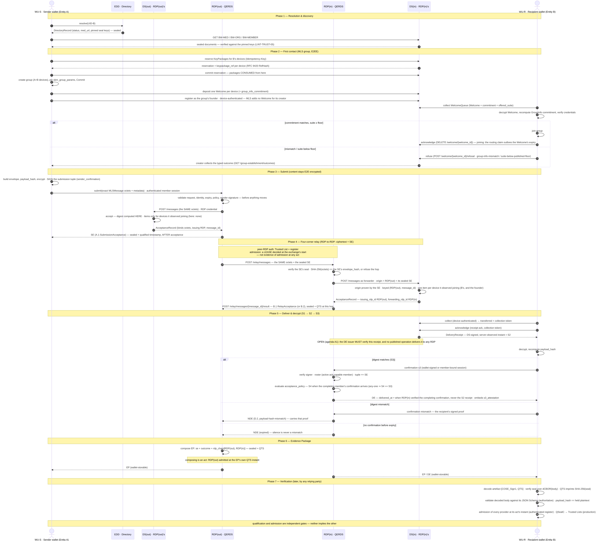

# Secure Business Messaging Profile

*An exploratory design study — not an official proposal.*

> **⚠️ Status — exploratory design study, not an official proposal.** This document is an independent technical exploration of how existing EU building blocks — the EUDI Regulation (Regulation (EU) No 910/2014) and its implementing acts, qualified electronic registered delivery (QERDS), IETF MLS, and the EUDI Wallet — *could* be composed into a secure business-messaging profile with registered-delivery legal effect. It is **not** an official proposal, deliverable, or position of the European Commission, any Member State, any supervisory or conformity-assessment body, or any standards organisation, and it confers no legal or regulatory status. RFC 2119 keywords (MUST/SHOULD/…) describe the internal requirements of *this design*, for the purposes of the exploration only. It is shared to invite technical discussion.

**Version:** 2.1 (confidentiality scopes — umbrella)  
**Date:** 2026-09-18  
**Supersedes:** v2.0 (2026-07-04)  
**What this document is for.** It specifies how two businesses exchange messages that are end-to-end encrypted AND carry registered-delivery evidence a qualified provider seals without ever seeing the content: who the parties are and how they are identified (§3–§4), how one finds and verifies the other (§5, §8), how the channel, the providers and the evidence fit together (§7), and who governs what (§13). The wire protocol is in the Internet-Draft and the qualified-service conformance layer is in the TS-shaped profile; the *Document map* below says which document, and which machine-readable artefact, governs which question.

**What it is not.** Not an official proposal of any institution. Not a statement that any provider is qualified, admitted, or legally effective — those are established by external authorities, never by this repository (the README's claim matrix says what a green conformance bar does and does not mean). Not a finished baseline for independent implementations: the open questions are listed, not hidden (`docs/REVIEW_AGENDA.md`).

**Who is involved.** The *entity* (a business, identified by its UID) and its *members* (people or agents, by MID) acting through enrolled *devices* (wallet instances); the *MSP* running each entity's MLS Delivery Service; the *RDP*, a qualified registered-delivery provider that seals the evidence; the *EDD* directory; the *Federation Authority*, which admits providers; the *design authority*, which owns the profile; and the EU Trusted Lists, which say who is qualified.

**Where to read first.** The *Document map*; §0 *Scope*; §7.1 *Technical architecture*; §9.4 on what conformance does and does not establish; §13.1 on the institutions. Then the Internet-Draft for the wire, and the TS for the qualified-service obligations.

*The edition-by-edition change history that used to open this document — some 3,900 words before the document map — is kept with the source repository of this study and is not reproduced in this snapshot; [`CHANGELOG.md`](CHANGELOG.md) records the artefacts' versions and what changed on the wire. It was moved out so that a reader meets the design before its history.*

---

---

## Document map

This profile is split across three documents; every normative **prose** requirement lives in exactly one of them. That is not the whole of what is normative, and saying it was hid the rest: the machine-readable artefacts below are normative too, each for what it describes.

| Concern | Document |
|---|---|
| Wire protocol — SM-MLS binding, application envelope, deterministic-CBOR canonicalisation (CDDL), message flows and delivery states, evidence objects and COSE packaging | **Internet-Draft** `ietf/draft-sbm-mls-erd-00.md` [I-D] |
| QERDS conformance — seal/SCD/cryptography (ACM), identity proofing and authentication binding, change indication, ETSI EN 319 522 event/semantics mapping, pilot/production profiles, Art. 44/CIR compliance, ICS pro forma (REQ-SMB) | **TS-shaped profile** `etsi/TS-SBM-QERDS-Binding-v0.1.md` [TS] |
| Identifiers, directory (EDD), roles, technical architecture (§7.1), MED/ORG/MEMBER, EUDI Wallet integration, governance | **this document** (umbrella) |

The conformance tools, schemas, samples and tests in this repository are shared artefacts referenced by all three documents.

**What governs what, and what happens when they disagree (normative).**

| What | Governed by | Status |
|---|---|---|
| The bytes of an artefact — the deterministic-CBOR body and its COSE packaging | the CDDL (`cddl/sm-mls-erd.cddl`) and the I-D's COSE rules | normative; the CDDL is the **structural outer bound** |
| The constraints on a decoded body — required fields, patterns, enumerations | the JSON Schemas (`schemas/*.json`) | normative and **authoritative over the CDDL** for body validation (the I-D, *Evidence Objects and COSE Packaging*) |
| Semantics — what a field means, what a rule requires | the one prose document that owns the rule (`docs/rule-ownership.md`) | normative |
| HTTP interfaces — operations, request and response shapes, errors | the OpenAPI contracts (`*-openapi.yaml`) | normative for the surfaces they define |
| Registered vocabularies — reason codes, content classes, cipher suites and their wire values | `registries/*.json` | normative; a registration is a registry action (§13.4) |
| What a conformance claim checks | the lint catalogue (`docs/lint-catalogue.json`) | normative for the reference tooling's claims |
| Everything under `docs/` except the catalogue and this map's targets | informative | explanation, never requirement |

**On disagreement**, nothing is resolved silently. Where a Schema and the CDDL disagree about a body, the
Schema decides validity and the disagreement is a defect in the CDDL. Where prose and a machine-readable
artefact disagree, the artefact governs the bytes or the wire it describes, the prose governs what they
mean, and the disagreement is a defect to be reported and fixed — not a choice an implementer is invited
to make. An implementer who finds one should report it rather than pick a side.

## 0. Scope

**Current versions.** Evidence objects **2.8** (octet-authoritative) · application envelope **1.2** · BW-MED **2.1** / BW-ORG **2.6** / BW-MEMBER **2.2** · status assertion **1.0** · roster snapshot **1.0** · EDD resolver contract **1.12.0** · federation register contract **3.0.0** · profile-2 companion contracts **9.0.0** · TS **v0.35** · umbrella edition **2026-09-18**. *(Every number in this paragraph is BOUND in `versions.json` and checked by `make versions` — it previously drifted six releases behind while the gate stayed green, because the paragraph carried no binding.)* The discovery documents and the EDD contract version independently of the evidence family (§9.3). The **agent profile** (Annex R, deployment profile 5) is OPTIONAL — a network **MAY** run evidence 2.0 without adopting it (it enrols no system member, and the agent-specific fields never appear). The four-corner **relay evidence** (`RelayEvidence-v1`) and the EP `rdp_chain[].evidence` reference are **profile-2** features, absent from a single-provider profile-1 deployment.

> **Minimum viable profile.** The profile can be understood — and piloted — with the **default scope alone**. Start with the README's [*Where to start*](README.md) path, deployment **profile 1** of Annex P (a static signed EDD, one co-located MSP/RDP, two wallets), and the four delivery states S1–S4 (the I-D [I-D], *Delivery State Model*). Everything else — confidentiality scopes, records recoverability, the production trust path — is layered on top and can be ignored on first contact.

This specification defines:

1. A **Unique Identifier (UID)** scheme for **Economic Operators (EOID)** and **Public-Sector Bodies (PSBID)**, assignable **only** by EU-listed QTSPs (QEAA) and PubEAA providers, including assignment to **non-EU** entities that participate in the EU Business Wallet ecosystem.

2. The **directory and resolution model** (EDD), including the **governance framework**, discovery endpoints, and linkages with **BRIS/EUID**.

3. A Business-Wallet messaging profile (**SM-MLS-1.0**) binding the IETF **Messaging Layer Security** protocol (RFC 9420) to the Business Wallet context, with **Registered Delivery Providers (RDPs)** operating under a defined **trust framework**, and a standardised **evidence model** (SE/DE/NDE/RE → EP).

4. **Integration points** with the EUDI Wallet Architecture Reference Framework (ARF), including UID as a QEAA carried directly as an MLS credential, and evidence as a wallet-storable artefact. OpenID4VP integration is OPTIONAL and supported only where wallet-level policy enforcement requires it.

5. Normative validation rules, conformance requirements, and interoperability test guidance.

**Non-goals:** This spec does not mandate a particular wallet implementation, PKI hierarchy, or storage technology. It focuses on identifiers, discovery, governance, messaging profile selection, and evidence semantics.

### 0.1 Design trade-offs (informative)

Six deliberate choices define this profile. Each is stated here once, with a pointer to where it is normative — this subsection is the reader's map of decisions, not a second statement of the rules.

**Delivery via wallet confirmation by default — availability only as a declared grade.** The legally operative act is, by default, authenticated verification and acceptance by an authorised endpoint, evidenced by a wallet-produced confirmation; deposit in an unauthenticated mailbox (S1) never establishes delivery. Availability-based delivery — which some legal contexts require, as in national certified-e-mail systems — exists **only as an explicitly declared per-content-class grade**, anchored on availability to an **authenticated** endpoint, never implicit (§8.3b, thirteenth-review revision). Normative: the I-D delivery state model and the TS [TS] clause 6; rationale and the three delivery grades: §7.1, §8.3b.

**A managed federation — instead of an open one.** Providers are admitted, qualified and supervised; membership is gated and rules are central, because the evidence layer's legal weight depends on who operates it. The open, e-mail-style alternative would surrender exactly the guarantees the profile exists to provide. Normative: §13 (governance); framing: the executive brief, `brief/executive-brief.md` §4.

**A new identifier (UID) — instead of direct reuse of EUID/LEI/VAT.** None of the existing identifiers is simultaneously universal, entity-faithful and cross-border resolvable, so the profile mints a routing and trust anchor and *links* it to the source registers rather than replacing them. Rationale: §3.7; linkage: §5.2, §6.

**A visible records leaf — instead of invisible archival access.** Where an organisation extends confidentiality to a records function, that function is a visible MLS roster member the counterparty can verify before sending — never a silent decryption capability. Normative: §8.3a (`recoverability`) and the I-D roster-transparency rule ("no invisible access").

**Optional scopes — instead of mandatory scoping.** Confidentiality scopes are an advanced capability an entity may adopt per use case; the profile is complete without them, which keeps the minimum viable deployment small (the box above). Normative: §8.3a; lifecycle guidance: the I-D.

**Pilot evidence separate from qualified evidence.** A pilot produces structurally identical but non-qualified evidence and must not claim the statutory presumption; qualification is a property of the operating providers, never of the protocol alone. Normative: §9.3 and the TS [TS] clause 9.

## 1. Normative language

The key words **MUST**, **MUST NOT**, **REQUIRED**, **SHALL**, **SHALL NOT**, **SHOULD**, **SHOULD NOT**, **RECOMMENDED**, **MAY**, and **OPTIONAL** in this document are to be interpreted as described in RFC 2119.

## 2. Terminology

- **UID**: Canonical, non-semantic identifier for a legal entity (EOID or PSBID).
- **EOID / PSBID**: UID schemes for Economic Operators / Public-Sector Bodies.
- **QTSP (QEAA) / PubEAA**: Qualified / Public Electronic Attestation of Attributes providers authorised to issue UIDs.
- **EDD**: European Directory of Entities (core registry + federated resolver layer).
- **EUID / BRIS**: Business Registers Interconnection System identifier and the BRIS network.
- **WU**: Wallet Unit (component inside a Business or EUDI Wallet).
- **MLS**: Messaging Layer Security protocol (IETF RFC 9420).
- **SM-MLS-1.0**: The Business Wallet messaging profile binding MLS to the BW ecosystem. Defines group topology, credential mapping, cipher suite requirements, and evidence integration. Replaces the earlier SM-DR-1.0 designation.
- **MLS Group**: An MLS group instance representing a secure communication channel between exactly two Business Wallet entities — the bilateral topology (the I-D [I-D], *Group Topology*); a conversation among three entities is three groups, not one.
- **MLS KeyPackage**: A pre-published bundle of cryptographic material enabling asynchronous addition of a client to an MLS group (analogous to Signal pre-key bundles, but standardised in RFC 9420 §10).
- **MLS Epoch**: A distinct state of an MLS group after a Commit operation. Each epoch has its own encryption keys.
- **RDP**: Registered Delivery Provider — a qualified trust service provider for electronic registered delivery (QERDS) under Regulation (EU) No 910/2014, Article 44 — that issues evidence about registered electronic delivery.
- **SE/DE/NDE/RE/EP**: Evidence objects — Sending / Delivery / Non-Delivery / Refusal / Evidence Package.
- **MED/ORG/MEMBER**: JSON documents for Messaging Entity Descriptor, Organisation Profile, and Member Binding.
- **JCS**: JSON Canonicalization Scheme (RFC 8785).
- **MID**: Member identifier (pseudonymous, for multi-user/device addressing within the entity).
- **ARF**: Architecture Reference Framework for the EUDI Wallet.
- **QEAA**: Qualified Electronic Attestation of Attributes (EUDI Regulation).
- **WIA / WTE**: Wallet Instance Attestation / Wallet Trust Evidence (ARF).
- **OpenID4VP**: OpenID for Verifiable Presentations (ISO/IEC 18013-7, OpenID Foundation).
- **DS**: Delivery Service — the MLS architectural component responsible for message routing and ordering (RFC 9750). Mapped to the MSP in this specification.
- **AS**: Authentication Service — the MLS architectural component responsible for credential validation (RFC 9750). Mapped to the QTSP/Trusted List infrastructure in this specification.

## 3. UID scheme (EOID / PSBID)

### 3.1 Syntax (canonical string)

The canonical string form of a UID is:

    EU-CC-SCHEME-PAYLOADC1C2

where:

- The separator is the **hyphen** character U+002D ("-"). All normative processing, serialisation, storage, and comparison **MUST** use this canonical form.
- **CC**: ISO 3166-1 alpha-2 country/area code of the entity's legal registration jurisdiction.
  - For EU/EEA Member States: the standard two-letter code (DE, FR, IT, etc.).
  - For non-EU entities with an ISO 3166-1 code: the entity's jurisdiction code (e.g., GB, CH, US). The issuing QTSP **MUST** document the due diligence basis for onboarding.
  - **XX**: **MAY** be used **only** when the issuing QTSP is authorised by its supervisory authority to onboard a non-EU entity whose jurisdiction does not have an ISO 3166-1 alpha-2 code or where no bilateral agreement exists. The issuer **MUST** record the rationale and the entity's actual jurisdiction in the EDD record metadata.
- **SCHEME**: `EOID` (Economic Operator) or `PSBID` (Public-Sector Body).
- **PAYLOAD**: 12 characters of **Crockford Base32** (§3.2). No embedded semantics.
- **C1 C2**: two **Crockford Base32** check characters — the two Reed-Solomon check symbols over GF(2⁵) of the 13 data symbols (scheme_code + PAYLOAD), where scheme_code = "E" for EOID and "P" for PSBID (§3.3, Annex F). The code is a distance-3 MDS code, so **any error confined to at most two symbols is detected** (every single error, every double error, hence all transpositions and twin errors). `CC` is **not** covered (§3.3).

**Regex (validation):**

    ^EU-[A-Z]{2}-(EOID|PSBID)-[0-9A-HJ-NP-TV-Z]{14}$

Note: The last 14 characters comprise PAYLOAD (12) + C1 (1, Base32) + C2 (1, Base32). Both check characters are Crockford Base32 symbols (the redesign, §3.3), so the character class `[0-9A-HJ-NP-TV-Z]{14}` is exact — this is the single canonical regex used by the ABNF (Annex A), the JSON Schemas, the OpenAPI parameter and the toolkit/linters.

**Examples:**

- `EU-DE-EOID-7K3D9W0Q2M5FW0`
- `EU-FR-PSBID-ZYWVTSRQPNM8M4`

### 3.2 Character set (Crockford Base32)

Alphabet = 0 1 2 3 4 5 6 7 8 9 A B C D E F G H J K M N P Q R S T V W X Y Z (32 symbols; no I, L, O, U).

Input **MUST** be normalised to upper case before processing. Implementations **SHOULD** accept lower-case input and convert before validation.

### 3.3 Check characters (normative)

The two UID check characters **C1 C2** are the check symbols of a **Reed-Solomon code over GF(2⁵)**, computed directly on the Crockford Base32 alphabet (each symbol is a field element by its Base32 index 0–31). The field, the generator polynomial, the encoding/verification pseudocode, and worked examples are **normative** and given byte-exact in **Annex F**; an independent implementation reproduces every check character from Annex F alone.

- **Data**: the 13 symbols (scheme_code + PAYLOAD), scheme_code = `E`/`P`.
- **C1 C2**: the two Reed-Solomon parity symbols of that data (systematic encoding, generator `g(x) = (x+α)(x+α²)`). Minimum distance **d = 3** (an MDS `[15,13]` code) ⇒ **any error affecting at most two of the fifteen symbols is detected**: all single errors, all double errors, hence all transpositions (adjacent or not) and all twin errors.
- **`CC` is deliberately not covered.** The country code uses ISO 3166-1 alpha-2 (26 letters); together with the digit-bearing payload alphabet this exceeds 32 symbols, so `CC` cannot be a GF(2⁵) symbol. A mistyped country code is caught by directory resolution (§3.5 step 3), not by C1 C2.

This replaces the earlier Luhn-32 (C1) + decimal-projection Verhoeff (C2): projecting each Base32 symbol to two decimal digits before Verhoeff meant Verhoeff's single-symbol/adjacent-transposition guarantees no longer held over the real Base32 alphabet. The Reed-Solomon code restores — and strengthens — those guarantees on the actual symbols. **This is a breaking change to the identifier scheme** (every UID/MID check character changes); it is an edition-level revision with no new wire field (the check characters are self-identifying by validation).

### 3.4 Generation

Issuers **MUST**:

1. Generate a cryptographically random PAYLOAD (12 Crockford Base32 characters, minimum 60 bits of entropy).
2. Verify uniqueness against the EDD core registry before publication.
3. Compute C1 and C2 as specified in §3.3.
4. Publish a signed directory record (QSealC) with status `active` and linkage fields (§6).

### 3.5 Validation (RPs and relying resolvers)

To validate a UID:

1. Match the regex (§3.1) — syntactic check.
2. Recompute C1 C2 (the Reed-Solomon check symbols, §3.3 / Annex F) — both **MUST** match. A checksum-invalid UID is rejected fail-closed (`discovery_lint` LINT-DISC-03).
3. Resolve via EDD and verify the directory record signature and status.

Steps 1–2 are offline-capable. Step 3 requires EDD connectivity (or a cached and signed resolver snapshot).

### 3.6 Member ID (MID) for multi-user/device addressing

A MID is 9 characters: 8-character Crockford Base32 payload + 1 **Reed-Solomon** check character (one GF(2⁵) parity symbol over the 8 payload symbols, §3.3 / Annex F; a distance-2 code detecting all single errors and all transpositions of distinct symbols). The check-symbol input domain is the 8 payload symbols only. A checksum-invalid MID is rejected fail-closed (`discovery_lint` LINT-DISC-06).

MIDs are **pseudonymous**, **entity-scoped** (unique within an entity's namespace, not globally), and **rotatable**. An entity **SHOULD** rotate MIDs periodically to limit cross-conversation linkability.

**Scoped identifiers are never principals on their own (normative).** Because a MID is unique only within its entity, and a device label only within its member, a component that authorises or keys by member or device **MUST** use the whole tuple — member `(UID, MID)`, device `(UID, MID, device_id)` — derived from the authenticated credential rather than from a request field. The labels are not redefined as global: two entities may both have a member `F1N2C3D4P`, and two members of one entity may both have a device `dev-01`. The Delivery Service contract states where each tuple is compared.

Example: `A1B2C3D4R`

### 3.7 Why a new identifier? (informative)

The inevitable objection: Europe already has entity identifiers — why mint another? Because none of the existing ones can serve as the wallet ecosystem's **routing and trust anchor**:

- **EUID** is BRIS-scoped. It exists to interconnect business registers: companies within the BRIS perimeter have one, but public-sector bodies, associations, foundations and many other entities that must send or receive registered communications do not, and its register-oriented format was never meant for runtime routing or key discovery.
- **LEI** is finance-centric. Coverage tracks financial-market participation (where it is mandated); elsewhere it is voluntary and fee-based. It is not universal across the entities this profile addresses, and it was designed for regulatory reporting — not as a messaging address or a trust anchor.
- **VAT identifiers** are neither universal (not every relevant entity is VAT-registered) nor entity-faithful (VAT groups, branches and fiscal representatives break the one-identifier-one-entity assumption).
- **National registration numbers** do not travel: format, semantics, uniqueness guarantees and register access differ per Member State, so they cannot anchor a cross-border protocol.

The UID is therefore exactly what those identifiers are not: a **uniform, checksummed, resolvable routing and trust anchor** for the wallet ecosystem — issued as a qualified attestation (§4.1, §10.1), bound to the entity's trust material, resolvable through the EDD (§5), and stable across the entity's provider changes. It is **not a substitute register**: the directory record *links* to EUID and LEI (§5.2, §6) rather than replacing them, and authoritative facts about the entity remain in the source registers. Where those registers evolve (e.g. future BRIS/EUID integration, Annex P), the UID's linkage absorbs the evolution without re-addressing the network.

## 4. Issuance, scope, and lifecycle

### 4.1 Issuers

Only EU-listed **QTSP (QEAA)** and **PubEAA** providers **MAY** issue or attest the **UID**. The issuing provider **MUST** be inscribed in the Trusted List of its Member State for the QEAA or PubEAA service type.

**MIDs are not issued by a QTSP/PubEAA.** A **MID** (§3.6) is an entity-scoped, pseudonymous, rotatable identifier **created and administered by the entity itself** — its wallet-administration function — under an accountable authorisation policy, and **published as a signed BW-MEMBER binding** (§8.4). Rotation and revocation of a MID are entity operations and do not involve the UID issuer. Resolution of a MID to an accountable authorisation event is available to the organisation, and to the RDP **only** under the documented dispute or supervisory conditions (the TS [TS], clause 6 — MID accountability).

### 4.2 Non-EU entities

Non-EU entities **MAY** be onboarded and issued a UID by an EU QTSP or PubEAA provider. The CC field reflects the entity's legal jurisdiction. Compliance due diligence **MUST** be documented by the issuer and **SHOULD** include: verification of legal existence, identification of authorised representatives, and an assessment of the entity's eligibility for participation in the EU Business Wallet ecosystem.

### 4.3 Lifecycle state machine

The following states and transitions are defined:

```
                    ┌─────────────┐
         ┌─────────│   active     │──────────┬──────────┐
         │         └──────┬──────┘           │          │
         │                │                  │          │
    reactivate       suspend              retire      merge
         │                │                  │          │
         │         ┌──────▼──────┐           │          │
         └─────────│  suspended  │───merge───┼─────┐    │
                   └──────┬──────┘           │     │    │
                          │                  │     │    │
                       retire                │     │    │
                          │                  │     │    │
                   ┌──────▼──────┐    ┌──────▼───┐ │    │
                   │   retired   │    │  retired  │ │    │
                   └──────┬──────┘    └──────┬───┘ │    │
                          │                  │     │    │
                        merge              merge   │    │
                          │                  │     │    │
                   ┌──────▼──────┐    ┌──────▼────▼────▼──┐
                   │   merged    │    │      merged        │
                   └─────────────┘    └────────────────────┘
```

*(`merged` is reachable **atomically** from `active`, `suspended` and `retired` — an operational merger begins from a live entity, and no path passes through a state lacking the redirect.)*

**Permitted transitions:**

| From | To | Condition |
|---|---|---|
| active | suspended | Issuer decision, supervisory order, or entity request. |
| suspended | active | Reactivation by issuer after resolution of suspension cause. **MUST** be published to EDD within 24 hours. |
| active | retired | Entity dissolution, issuer decision, or entity request. **Irreversible.** |
| suspended | retired | If suspension cause is not resolved within the period defined by the issuer (max 12 months). |
| active | merged | **Atomic merger from a live entity:** the entity is absorbed by another entity. The transition and the §5.6 **redirect record** are published in the **same signed act** — at no instant is the UID `merged` without its redirect. |
| suspended | merged | As `active → merged` — atomic, redirect published in the same signed act. |
| retired | merged | The entity has been absorbed by another entity. A **redirect record** (§5.6) **MUST** be published in EDD pointing to the surviving entity's UID. |

**Invariants:**

- Re-assignment of a retired or merged UID to a different entity **MUST NOT** occur.
- **MID non-reuse (normative).** Within a UID, a MID **MUST NOT** be reassigned to a member with a different accountability chain (a different `BW-MEMBER.accountability.authorisation_ref`) — permanently within the UID, or at minimum for the maximum evidence-retention period. A MID is carried in indefinitely-retained sealed evidence (recipient confirmations, quorum entries, `auth_context.mid`) and is the key that attributes an act to a member; reassigning it would silently re-attribute old confirmations to a different person or authorisation chain. `bundle_lint` **LINT-BND-23** rejects a UID whose MID is bound to two different `authorisation_ref` values.
- **MID rotation is atomic and history-preserving (normative).** Rotating a MID (minting a **new** MID for unlinkability — §3.6) is: **publish** the new-MID `BW-MEMBER` binding `active`, then **retire** the old-MID binding (`status` `retired`), with a bounded overlap window; **both** bindings are preserved and remain retrievable via the as-of read (below) for the retention period. This is distinct from **intra-MID device/key rollover** (device replacement or key refresh), which **re-publishes the same MID's** `BW-MEMBER` with updated `devices[]` and does **not** mint a new MID (Annex O). A verifier resolving an old confirmation **MUST** resolve its MID **as of** the confirmation's `verified_at` — `GET /.well-known/bw/member/{uid}/{mid}?as_of=<verified_at>` (§4.3 retrievability duty below; EDD contract) — so the confirmation resolves to the member and key valid at its event time, not to whatever the MID currently binds.
- Issuers **MUST** publish all lifecycle events to the EDD core registry with timestamps and QSealC signatures.
- The EDD **MUST** retain retired and merged records indefinitely for audit purposes.
- **Verification material remains retrievable (normative, R1/R2/CMP-1/CMP-2).** Verification at evidence time (TS clause 6, CMP-1/CMP-2) needs the *as-of-evidence-time* artefacts, not the current ones. The EDD **MUST** keep retrievable, for the evidence retention period (REQ-ERDS-5.4.1-07), the verification material each issued evidence object depends on: the **BW-ORG version** pinned by its `acceptance_policy_ref.doc_digest`, the **BW-MEMBER binding** of each confirming member as it stood at the confirmation's `verified_at` (its then-valid devices, `confirmation_key`s and status), and — since evidence 2.2 — the **MLS GroupContext and ratchet tree/GroupInfo** for every `(group_id, epoch)` referenced by issued evidence, so a verifier can recompute the `mls_state` commitment and verify the historical roster (the I-D, *MLS state retention and historical verification*; served through the deployment-defined DS surface). This material is served through the resolver's **content-addressed / as-of** reads (`GET /.well-known/bw/org/{uid}?doc_digest=…`, `GET /.well-known/bw/member/{uid}/{mid}?as_of=…`; EDD contract v1.4.0) **independently of the entity's or member's current lifecycle state** — these audit reads are served even where the current read fails closed (§5.7). Retention exists (above); this makes the *retrievability* of the specific verification artefacts a normative duty, not only an informative MWAP §3 expectation.

### 4.4 In-transit message handling during lifecycle transitions

- **active → suspended (hold)**: A **new** submission addressed to a suspended UID **MUST** be rejected at intake with **NDE-v1** `uid-suspended` (event `A.2`). A message **already in flight** — queued but not yet delivered at the delivery point applicable to its grade (§8.3b — authenticated **S2** at the availability grade, **S3** at the verification grade, **S4** at the acceptance grade; the I-D [I-D] state model) — is **HELD, not terminated**: the suspension **pauses** delivery, and **no legal-effect event may occur while it lasts** (the RDP **MUST NOT** issue DE-v1 — §5.7 gate). The hold resolves deterministically, to exactly one outcome per message:
  * **Reactivation before `expires_at`** → delivery **resumes** under the unchanged grade rules; the eventual DE-v1 is issued normally (its `delivered_at` is the real, post-reactivation event time — the I-D's event-time rule; a ten-minute suspension on a three-day TTL therefore delivers).
  * **`expires_at` passes during the suspension** → **NDE-v1 `expired`** (event `C.5`, `observed_at ≥ expires_at` — the authenticated deadline is the only clock that terminates a held message; a premature `expired` NDE fails `bundle_lint` LINT-BND-22).
  * **The suspension resolves to retirement** → **NDE-v1 `uid-retired`** (the transition below).

  A message that has **reached its grade's delivery point** before the suspension retains its DE-v1 — including an availability-grade message whose DE was issued at authenticated S2, even though S4 was never reached (using S4 as the universal test would wrongly treat a completed availability delivery as undelivered); at the boundary the tie rule (tie = delivered) applies. A held message is **not** a terminal outcome: `uid-suspended` is an **intake** reason, never the fate of an in-flight message (EP finality is untouched — nothing is issued at suspension start, so nothing conflicts with the single-terminal-outcome rule).
- **active/suspended → retired**: Messages in transit **MUST** result in **NDE-v1** with reason code `uid-retired`. The sender **SHOULD** be notified via the EP.
- **→ merged** (from active, suspended or retired): the EDD redirect record enables senders to discover the surviving entity's UID. **No component reroutes an in-flight message**: a resolver never handles payloads, and a PrivateMessage encrypted to the merged entity's MLS group **cannot** be delivered to the surviving entity's leaves nor legally re-addressed by anyone but the sender. An in-flight message to a merged UID yields **NDE-v1 `uid-merged`** carrying `redirect_uid` (the surviving UID — schema-REQUIRED for this reason); the **sender** resolves the redirect, creates or updates an MLS group with the surviving entity's fresh KeyPackages, and performs a **new submission with a new SE**. Only an authorised sender changes the legal addressee. The merged entity's old groups are closed by the MLS-group-impact rule below, and the closure is recorded in the organisational accountability log (§8.4).
- **MLS group impact**: When a UID transitions to `retired` or `merged`, all MLS groups in which the entity participates **MUST** be updated via an MLS Remove proposal for the affected leaf nodes, followed by a Commit, so a retired or merged entity can no longer authenticate to or send within an existing group regardless of any still-valid offline leaf credential. The surviving entity in a merge **MAY** be added to existing groups via an MLS Add proposal referencing its new UID KeyPackages.

## 5. Directory and resolution (EDD)

### 5.1 Governance model

The EDD operates as a **hybrid infrastructure** with two logically distinct layers:

**Layer A — Core Registry (centralised, EU-governed)**

The core registry is the authoritative source for UID records, lifecycle state, issuer attribution, and EUID/BRIS linkage. It is operated under EU governance — by the European Commission, an EU agency (e.g., eu-LISA), or a mandated body — with the following responsibilities:

- Accepting and validating UID record publications from authorised QTSPs and PubEAA providers via authenticated APIs.
- Enforcing uniqueness of UIDs.
- Publishing lifecycle events with qualified timestamps.
- Maintaining redirect records for merged entities.
- Providing a dispute resolution mechanism for conflicting claims (e.g., two QTSPs claiming to have issued a UID for the same entity).
- Guaranteeing availability: 99.9% uptime SLA, with geographically redundant deployment.
- Publishing signed snapshots of the registry for offline verification and audit.

**Layer B — Discovery Layer (federated, MSP-operated)**

The discovery layer provides real-time resolution of MED/ORG/MEMBER documents, MLS KeyPackage retrieval, and RDP endpoint discovery. It is operated by Messaging Service Providers (MSPs) and Registered Delivery Providers (RDPs) who publish their own endpoint metadata. The core registry references the discovery endpoints (med_url) but does not host the MED/ORG/MEMBER documents themselves.

The separation ensures that: (a) the core registry remains a compact, high-assurance, low-latency service; (b) the discovery layer scales horizontally with the number of MSPs/RDPs; and (c) MSPs retain operational control of their own metadata and MLS KeyPackage distribution.

**Liability:** The core registry operator is liable for the integrity and availability of the registry. MSPs are liable for the correctness and availability of their discovery endpoints and MLS Delivery Service functions. QTSPs remain liable for the accuracy of UID issuance and lifecycle events as per their obligations under Regulation (EU) No 910/2014.

### 5.2 Directory record (normative)

A core registry record includes:

- `uid`: canonical UID string (§3.1).
- `issuer_id`: UID or identifier of the issuing QTSP/PubEAA.
- `status`: one of `active`, `suspended`, `retired`, `merged`.
- `asserted_at`: ISO 8601 timestamp of record creation or last state change.
- `links`: object containing optional linkage fields:
  - `euid`: EUID/BRIS identifier (§6).
  - `lei`: LEI (Legal Entity Identifier) if available.
- `med_url`: URL to the entity's BW-MED-v1 document (discovery layer).
- `authorized_seal_keys`: the entity's authorized discovery-seal key-set, pinned by this (EU-governed) record to the record's own UID. A BW-MED/ORG/MEMBER document is authorised only when its seal key is in this set for its own UID — so a valid QSealC authorised for another UID **MUST NOT** be accepted as sealing this entity's discovery documents. Each entry pins a key (production: the QSealC `x5t#S256`; pilot: the raw seal-key `spki_sha256`), a `key_set_version` and a validity window; multiple entries provide rotation overlap and historical-artefact verification. OPTIONAL in the pilot profile, REQUIRED in production. A production verifier additionally validates that the pinned key's QSealC chains to an EU Trusted List and is qualified — that chain-building is a production-verifier duty, not established by the reference tooling (§9.4; `docs/production-verifier-architecture.md`). *[**TODO(legal/PKI):** the qualification clause (what makes a directory-pinned key an *authorised* seal key under the EUDI Regulation, and the QEAA-UID-in-certificate alternative) is an external-counsel item.]*
- `redirect_uid`: (only for `merged` status) the surviving entity's UID.
- `jurisdiction_note`: (only for CC = XX) free-text description of actual jurisdiction.
- `signature`: the record's QSealC seal — **one mandatory format, no alternative**: a **COSE_Sign1** whose payload is the **deterministic-CBOR (RFC 8949 §4.2) encoding of the record minus `{signature, timestamp}`** (embedded payload; a detached payload **MUST** be rejected). The protected header carries `alg` and `kid` (production: additionally `x5chain` chaining the key to the registry operator's QSealC); the algorithm allowlist is the profile's COSE set (EdDSA baseline; ES256 admitted) — any other `alg` **MUST** be rejected. The signed bytes are byte-reproducible by any implementation from the record content alone (dCBOR determinism); re-serialization under a different canonicalisation, a mutated protected header, or an alternative payload interpretation (e.g. signing the full record including `signature`) **MUST** fail verification. The reference Stage-1 registry (`samples/registry.stage1.demo.json`, Annex P.1.1) implements exactly this construction.
- `timestamp`: qualified timestamp (Regulation (EU) No 910/2014, Article 42) whose message imprint is **SHA-256 of the `signature` COSE_Sign1 bytes** — sign-then-timestamp, the same sequencing as evidence artefacts (the I-D, *Evidence Objects and COSE Packaging*): no signed-field exclusion, no imprint circularity.

### 5.3 Resolver API — one owner per endpoint (normative)

Every path has exactly **one authoritative operator, one data owner and one
access-control rule**; a component prohibited from storing a datum is never
described as returning it. The table is normative; `edd-resolver-openapi.yaml`
(companion bundle) is the full contract.

| Path | Authoritative operator | Data owner | Storage | Access |
|---|---|---|---|---|
| `GET /resolve/{uid}`, `GET /uid/{uid}/euid`, `GET /euid/{euid}` | **Core registry** | Registry (EU-governed records) | Registry stores | Public, cache-bounded (§5.7) |
| `GET /uid/{uid}/redirect` | **Core registry** | Registry | Registry stores | Public |
| `GET /uid/{uid}/status-assertion` | **Core registry** | Registry | Issued on demand, never stored long-term | Public (short-lived capability, D6) |
| `GET /uid/{uid}/rdp` | **Core registry** | Entity (via its sealed MED) | Registry mirrors the MED pointer | Public |
| `GET /.well-known/bw/med|org|member/…` | **Discovery layer** (entity or its MSP) | Entity (sealed documents) | Discovery layer stores the sealed artefacts | Public; production MAY authenticate |
| `GET /uid/{uid}/members` | **Discovery layer** | Entity | Non-authoritative mirror (§8.3a) | **Authenticated counterparty, REQUIRED** |
| `GET /uid/{uid}/roster-snapshot` | **Discovery layer** | Entity (sealed ROSTER-v1) | Stored for the retention period | Authenticated counterparty |
| `GET /uid/{uid}/keypackages` | **MSP** (the EDD serves a 302 pointer ONLY) | Entity/MSP | The EDD holds **no pool** | Authenticated requester (R7) |
| `GET /uid/{uid}/evidence/{message_id}` | **RDP** (the EDD serves a 302 pointer ONLY) | The composing sender-side RDP | The EDD stores **no evidence** | **Authenticated + authorised** (party to the message or supervisory); uniform 404 otherwise |

**Evidence pointer semantics (normative).** `{uid}` in
`/uid/{uid}/evidence/{message_id}` is the **sender-side subject**: the entity
whose sender-side RDP composed the Evidence Package (D2 — the composer is
always the sender-side RDP). A recipient-side party retrieves evidence through
its own provider's surface, not through this pointer. The response is a **302
redirect to the composing RDP's evidence endpoint or a 404 — never the
EvidencePackage itself**: the registry and discovery layers store no evidence,
and the contract no longer describes them returning any. **Anti-enumeration
(normative):** an unknown `message_id`, an unknown `{uid}` and an unauthorised
caller are indistinguishable — one uniform 404, no existence oracle.

### 5.4 WebFinger aliasing (optional; normative where used)

WebFinger (RFC 7033) aliases are **LOCATORS ONLY, strictly subordinate to the
authoritative DirectoryRecord**. Where a deployment offers them:

- **Namespace and governance**: `acct:` aliases under `bw.eu` are administered
  by the core-registry operator (issuance, uniqueness and revocation follow
  the registry's governance, §5.1); provider-operated domains **MAY** serve
  aliases for their own customers. An alias is never itself an identity.
- **Syntax**: exactly two link relations are defined — `urn:bw:uid` (the
  `bw:uid:` URI of the aliased entity) and `urn:bw:med` (the entity's BW-MED
  location). Unknown relations **MUST** be ignored.

```json
{
  "subject": "acct:operator@bw.eu",
  "links": [
    {"rel": "urn:bw:uid", "href": "bw:uid:EU-DE-EOID-7K3D9W0Q2M5FW0"},
    {"rel": "urn:bw:med", "href": "https://msg.example/.well-known/bw/med/EU-DE-EOID-7K3D9W0Q2M5FW0"}
  ]
}
```

- **Termination (normative)**: every alias resolution **MUST terminate in the
  retrieval and validation of the authoritative DirectoryRecord** for the
  resolved UID — its seal (§5.2) and its status (§5.7) — **and MUST NOT
  substitute either**: an alias authorises nothing.
- **Conflict**: where alias data disagrees with the DirectoryRecord (a
  different `med_url`, a different status), **the DirectoryRecord wins and
  the alias result is discarded**.
- **Caching**: an alias response **MUST NOT** be cached longer than the
  directory-record `max-age` (§5.7); alias caches confer no freshness on the
  underlying record.
- **Downgrade**: the absence of an alias implies **nothing** about the
  entity's existence or status — resolution proceeds via the registry.

**Security property:** compromise of an alias (or its zone) can
misdirect a *lookup attempt*, but **cannot authorise a provider, key or
endpoint** — every path terminates in the seal- and status-validated
DirectoryRecord, and nothing downstream trusts alias content.

### 5.5 DNS aliasing — removed (future study)

DNS-based aliasing (TXT/SRV/SVCB) is **NOT part of this profile version**: it
had no record formats, no owner-name derivation and no precedence rule, and an
under-specified parallel trust path is worse than none. It is recorded as
**future study**; adoption would require complete record syntax, owner-name
derivation, DNSSEC requirements and the same subordination-to-DirectoryRecord
property as §5.4.

### 5.6 Redirect records (merged entities)

When a UID transitions to `merged` status, the core registry **MUST** publish a redirect record containing the merged (source) UID, the surviving (target) UID, the date of the merge event, and the issuer's QSealC signature.

Resolvers **MUST** return the redirect record when queried for a merged UID. Resolvers **SHOULD** also return the current record of the surviving UID in the same response to avoid a second round-trip.

### 5.7 Caching, staleness and failure behaviour (normative)

**Cache TTLs.** Resolvers and senders **MAY** cache directory records and MEDs. A cached record's freshness is measured against its `asserted_at` (§5.2); the cache `max-age` for a directory record **MUST NOT** exceed **10 minutes**, and for a MED **MUST NOT** exceed the value in §8.1 (`max-age=300`, i.e. 5 minutes). A revocation or suspension **MUST** be propagated to resolvers within **5 minutes** of its publication to the core registry.

**Failure behaviour when the EDD core is unreachable.**

- **Send (fail-open, bounded).** A sender **MAY** rely on a cached record still within its `max-age` to submit a message; the record's `asserted_at` is the freshness basis.
- **Legal-effect gating (fail-closed, capability-bounded — D6, replacing the R5 age rule).** An RDP **MUST NOT** issue DE-v1 against a recipient UID unless it holds a **valid (unexpired) signed status assertion** for that UID with status `active` — the **STATUS-v1 capability** issued by the EDD core registry (`GET /uid/{uid}/status-assertion`, EDD contract v1.8.0; sealed under the registry's own key, pinned in `DirectoryRecord.registry_seal_keys`; body schema `status-assertion.schema.json`; reference check `discovery_lint` LINT-DISC-25). The assertion's validity **MUST NOT** exceed the suspension-propagation bound (5 minutes). A suspension, retirement or merger simply **stops new `active` assertions being issued**: when the held assertion expires, the RDP **MUST** fail closed and issue NDE-v1 with the corresponding reason per the reason/stage table (`uid-suspended` / `uid-retired` / `uid-merged` — or `recipient-unreachable` where the registry is unreachable and no status is assertable). The capability may be relied upon **offline** within its validity — this is what bounds an EDD outage (below).

  **Residual stale-status exposure (stated openly — D6).** A suspension that occurs immediately after an `active` assertion is issued **is concealed for the remaining validity of that assertion**: an RDP relying on it may issue a DE during that residue. This exposure is **bounded and disclosed** — at most the assertion validity (≤ 5 minutes) — and it is the accepted risk model of this profile: the hard expiry is what makes the bound real, because past it the RDP fails closed with no exception. Any dispute arising within the residue is handled under the dispute path (§13.2) with the assertion (its `assertion_id`, `issued_at`, `expires_at`) as the evidence of reliance. *(The 10-minute directory-record `max-age` governs caching for non-legal-effect reads only; DE issuance is governed solely by the capability. This is an RDP runtime property, not statically checkable over a single evidence artefact; the assertion object itself is statically checked — LINT-DISC-25.)*

  **EDD outage semantics (deterministic and bounded).** An RDP holding valid assertions **continues qualified delivery through a registry outage until they expire** — bounded offline operation; first contact and member enumeration continue from caches under their own `max-age`. An outage **longer than the assertion validity** has exactly ONE outcome per affected message: the RDP fails closed — the in-flight message is **held** (§4.4) and, if the outage persists past the message's `expires_at`, the outcome is NDE `expired`; a new submission is rejected `recipient-unreachable`. A regional outage therefore **cannot freeze qualified delivery federation-wide** (unaffected regions hold their own assertions), and **cannot silently permit stale-active delivery** (the expiry is hard). The maximum unavailability equals the outage duration; the maximum stale-status exposure equals the assertion validity — both disclosed above.

**Lifecycle transitions during a live flow.**

- **Suspension after group creation, before delivery.** If the recipient UID becomes `suspended` at delivery time, the RDP **MUST** issue NDE-v1 `uid-suspended` and **MUST NOT** issue DE-v1 (this makes the §4.4 rule decisive where evidence is involved).
- **Merger mid-flight.** For a UID that becomes `merged`, the resolver returns the redirect (§5.6) and NDE-v1 `uid-merged` points to the surviving UID. Where the surviving entity must take over an existing MLS group, the group **MUST** be rebuilt — Remove of the merged entity's leaves followed by Add of the surviving entity's leaves via fresh KeyPackages (§4.4).

## 6. EUID/BRIS linkage

### 6.1 Forward link (UID → EUID) — mandatory

The issuing QTSP **MUST** publish a signed EUID-LINK-v1 attribute with the UID's directory record when the entity has an EUID. The attribute contains the canonical EUID and a QSealC signature binding UID and EUID.

### 6.2 Reverse link (EUID → UID) — mandatory for participating jurisdictions

Member States participating in the Business Wallet ecosystem **MUST** expose `/.well-known/uid-mapping/euid/{canonical_euid}` via their national business register's API or via a designated intermediary, and register the mapping in the EDD core registry.

For Member States not yet providing native reverse lookup, the EDD core registry **MUST** maintain a fallback mapping table populated from forward-link data. This fallback is informative (not signed by the Member State register) and **MUST** be clearly marked as such in resolver responses.

### 6.3 Deprecated options

- Option B (privacy-enhanced transform): **NOT REQUIRED** in v1.1. Implementations **MAY** support it for future use.
- Option C (deterministic derivation of the PAYLOAD from the EUID): **MUST NOT** be used in production. The reasons are recorded with the identifier decision, `docs/adr/SBM-ADR-0001.md`, among the alternatives considered: the EUID does not exist for every entity the UID must name, it is not stable across register changes and restructurings, a derived value certifies nothing the issuer's sealed link does not already certify, and public, sequential register numbers would make every UID computable and every directory enumerable offline.
## 7. Messaging: SM-MLS-1.0 + Registered Delivery

This section specifies the end-to-end secure messaging profile used by Business Wallets and the normative model for **Registered Electronic Delivery**. The transport layer is based on **IETF Messaging Layer Security (MLS, RFC 9420)**, bound to the Business Wallet context as the **SM-MLS-1.0** profile.

### 7.1 Technical architecture (authoritative)

This clause is the authoritative technical-architecture description for the profile. It is informative as to requirements (the normative wire and QERDS requirements live in the I-D [I-D] and the TS [TS] respectively) but authoritative as to the architecture model.

**Actors.**

| Actor | Role | What it can see |
|---|---|---|
| **Wallet Units (WU)** | Business/EUDI Wallet instances on the entities' devices; the E2EE endpoints | Plaintext (their own messages) |
| **MSP** — Messaging Service Provider | Routes encrypted messages, stores-and-forwards, distributes key material (the MLS "Delivery Service") | Ciphertext and routing metadata only |
| **RDP** — Registered Delivery Provider | A QERDS-qualified trust service provider (Article 44); issues and archives the legal evidence | Ciphertext, metadata and content hashes; never plaintext |
| **EDD** — European Directory of Entities | Hybrid directory: EU-governed core registry of UIDs + federated discovery layer run by providers | Public entity records |
| **QTSP issuers** | Issue the entity identifiers (UID as a qualified attestation) and seal certificates; anchor the system in the EU Trusted Lists | Identity records |

The topology is a **four-corner federation**: each entity submits to, and receives evidence from, its own RDP; the RDPs relay the ciphertext with the sealed SE to each other, and each side's MSP is its local Delivery Service — the MSPs do not relay to each other. Group formation is the exception the figure draws: the wallet that creates a group reserves KeyPackages, deposits the Welcomes and registers as the group's founder at the **counterparty's** Delivery Service, and collects replies there; which Delivery Service routes a group whose devices span two, after formation, is open (review agenda A10). Wallets never connect peer-to-peer — that is what makes delivery asynchronous and evidence enforceable — but the *keys* are negotiated end-to-end, so the federation transports only ciphertext.


An informative end-to-end **sequence** for this four-corner case — resolution → first contact → send → four-corner relay → deliver/decrypt → Evidence Package → verification (verification-grade, with the digest-mismatch branch) — is shown below, rendered from the Mermaid source at [`docs/diagrams/federated-flow.mermaid`](docs/diagrams/federated-flow.mermaid).



It is illustrative only; the normative flow is the I-D [I-D] (*Message Flows and Delivery States*) and the TS [TS] (clauses 4.1, 6). The relay evidence it depicts — B.1/B.2/B.3 — is the **profile-2** four-corner target (TS [TS] clause 4.1), not exercised by the single-provider profile-1 PoC. A phase-by-phase walkthrough of the diagram is in [`docs/federated-flow-explainer.md`](docs/federated-flow-explainer.md) (informative).

**The stack.** The protocol is organised in four layers, each mapping onto an existing standard.


- **Layer 0 — Addressing and discovery.** Every entity holds a **UID** (§3), issued only by qualified providers and recorded in the **EDD** (§5). Members and devices carry pseudonymous **MIDs** (§3.6), so a message can target the entity, a member, or a role (`bw:uid:<UID>/r/<role>`). Discovery resolves a UID to provider endpoints, the signed MED (§8), and published MLS key material.
- **Layer 1 — End-to-end secure messaging (SM-MLS-1.0).** A profile of **MLS (RFC 9420)** — not "transport security": the security and legal claims rest on this end-to-end layer, not on the hop-by-hop TLS underlay. Each channel is an MLS group whose leaves are the devices of both entities; authentication happens inside the MLS handshake, anchored in qualified trust material and validated against the Trusted Lists. Forward secrecy, post-compromise security, and asynchronous operation via pre-published KeyPackages. The wire binding is normative in the I-D [I-D]. The profile is **fully functional with the default scope alone**; **confidentiality scopes** (§8.3a) are an **optional, advanced capability** that lets the boundary coincide with a role — one MLS group per (entity pair, scope) — so only role members' devices decrypt the designated content classes; the full set of communication scenarios is tabulated in Annex L.
- **Layer 2 — Application envelope.** Headers (`message_id`, `content_type`, `ttl`, addressing) and a sender-computed **content digest** (payload hashing over the transmitted octets; default `raw-sha256`, optional `jcs-sha256`). The digest is the hinge: it lets the evidence layer refer to content without seeing it. Normative in the I-D [I-D].
- **Underlay — transport.** Every interaction rides on ordinary HTTPS (TLS 1.3; mutual TLS for machine-to-machine). Transport security is hop-by-hop; content confidentiality never depends on it.
- **Layer 3 — Registered delivery.** QERDS-qualified RDPs issue COSE-sealed, qualified-timestamped evidence (SE/DE/NDE/RE → EP), binding to the message through the content digest, the digest of the transmitted ciphertext and the MLS session state — never through the plaintext. Normative wire packaging in the I-D [I-D]; QERDS requirements in the TS [TS].

**Delivery semantics — a deliberate design choice (informative).** **This profile is not encrypted certified e-mail: it is wallet-based registered delivery, where the legally operative act is — by default — authenticated verification and acceptance by an authorised endpoint; availability-grade delivery exists only where the recipient has expressly declared it for a content class, and then only to an authenticated endpoint.** "Delivery" hides three different acts, and this profile refuses to conflate them: **availability** (the message reached the recipient's provider or device — states S1/S2 of the I-D delivery state model), **access** (an authorised member decrypted and re-verified it in an authenticated session — S3), and **acceptance** (the entity's published acceptance policy is satisfied — S4). Each act corresponds to a **declared delivery grade** (§8.3b): `verification` and `acceptance` are the defaults, derived from the acceptance policy in force (`any-one` ⇒ verification-grade — S4 coincides with S3, handover/access events; `quorum:n`/`all` ⇒ acceptance-grade, `C.3-ConsignmentAcceptance` — §8.3), while `availability` is **never implicit**: it applies only to content classes the recipient has explicitly listed in its signed BW-ORG. The thirteenth review **revised** the earlier posture that excluded every availability-anchored delivery: some legal contexts — formal notices, regulatory filings — require legal effect upon availability, as in mailbox-based registered systems, and a recipient who never opens a message must not thereby block legal delivery. The availability grade serves exactly those contexts while keeping this profile's identification posture: it anchors not on mailbox deposit but on **availability to an authenticated endpoint** of the identified entity — an enrolled device, holding the group's MLS keys, in a session authenticated by its provider ("authenticated S2"; the I-D [I-D], the TS [TS] clause 6) — evidenced by a DE carrying `event` `D.1-ContentConsignment`, `delivery_grade` `availability` and `integrity_basis` `sender-declared-digest` (there is no recipient confirmation at this grade). Nor can a recipient who simply never connects leave the sender in limbo: expiry produces an NDE (`expired`, `C.5-AcceptanceRejectionExpiry`) at every grade — at availability-grade, only where no authenticated endpoint was reached within `ttl`. A fully implicit **handover-grade profile** — legal effect at S2 for every message, with no recipient declaration — remains **excluded**: availability-grade delivery exists only as an explicitly declared, per-content-class posture (§8.3b), preserving this profile's Article 44(1)(c)-aligned default.

**The protocol in brief.** The sender wallet resolves the recipient UID, retrieves the signed capability document and KeyPackages, and creates the MLS group (the MLS handshake performs the cryptographic mutual authentication). The sender computes the content digest, encrypts the envelope + payload as an MLS message, and submits it; the sender-side RDP issues Sending Evidence. The message is relayed and queued; by default — the verification and acceptance grades — delivery is evidenced only when an authenticated recipient has decrypted, re-verified the digest, and (at acceptance grade) the entity's acceptance policy is satisfied (states S1–S4, I-D). For content classes the recipient has **expressly declared availability-grade** (§8.3b), delivery is instead evidenced upon availability to an **authenticated endpoint** of the identified entity (authenticated S2), with sender-declared integrity basis and the verifiable grade commitment. Non-delivery, refusal, and — as a first-class case — a post-decryption digest mismatch produce Non-Delivery/Refusal evidence with normative reason codes.

#### 7.1.1 Federation trust model (normative)

The EDD is a **hybrid**: a centralised core registry under EU governance holds the authoritative UID records, while a federated discovery layer operated by each entity's MSP hosts that entity's MED/ORG/MEMBER documents and MLS KeyPackages (§5; EDD resolver contract). A two-provider deployment must therefore resolve a remote counterparty across provider boundaries, and the trust anchoring is as follows.

- **Location authority vs content authority.** The core registry's signed `DirectoryRecord` (`med_url`) authorises *where* to resolve an entity — it is the location anchor. The **entity's own seal** (the COSE_Sign1 seal artefact on BW-MED/ORG/MEMBER, §8) authorises *what* is served — it is the content anchor. A serving provider's discovery layer is **non-authoritative transport**: **no provider's key authorises another entity's content**, so a provider cannot substitute its own signature for the entity's seal. This answers "which key authorises a provider to serve a centrally-registered UID": none of the provider's — the entity's seal does, and the core `DirectoryRecord` authorises only the location.

- **UID→seal-key binding (normative).** *Which* key is the entity's authorised seal key is itself pinned by the EU-governed core registry: the `DirectoryRecord` carries the entity's `authorized_seal_keys` (§5.2), and a BW-MED/ORG/MEMBER document is authentic only when its seal key is in that pinned key-set **for its own UID**. A valid QSealC authorised for another UID (a certificate that chains to a Trusted List but is not the entity's) **MUST NOT** be accepted as sealing this entity's discovery documents. Both anchors are thus bound to the UID by the same record: `med_url` (location) and `authorized_seal_keys` (the authorised content key). `LINT-TRUST-05` enforces the pin fail-closed in the pilot layer against a directory-pin fixture; validating that the pinned key's QSealC chains to an EU Trusted List and is qualified is a production-verifier duty (§9.4).

- **Seal-verification on every relay (defence in depth).** A sender-side RDP resolving a remote recipient's MED/ORG/MEMBER **MUST** verify the entity seal over the deterministic-CBOR document body — decode-then-validate (freshness-bounded per the EDD contract) — **before** relying on it. The RDP↔RDP peer-authentication seal (TS clause 4.1, FC-3) secures the **channel**; it **does not** substitute for the resolved documents' entity seals. The two layers are independent and both required: channel authentication proves *who relayed*, the entity seal proves *what is authentic*.

- **Canonical roster answerer.** The entity's **owning** provider — the one named by the core registry's `med_url` → the entity's MED — is the canonical answerer for `GET /uid/{uid}/members` (§8.3a) and for that entity's discovery documents. A peer provider **MUST NOT** serve another entity's roster authoritatively. The BW-MEMBER **120 s** freshness bound (EDD contract) attaches to the **sealed** binding regardless of who relays it, so two providers that both surface a roster cannot diverge on trust-bearing content: the sealed, freshness-bounded BW-MEMBER is the single source of key-discovery truth.

This is a **resolution-flow** trust model verified at runtime against live, sealed artefacts; it is not a static property of a single archived bundle, so the flow itself carries no dedicated static linter (the seal-verification and freshness duties it invokes are the existing `LINT-DISC-01` / EDD-contract obligations). The UID→seal-key pin, however, **is** statically enforced: `LINT-TRUST-05` rejects a discovery seal whose key is not pinned for the document's own UID. The federation membership register and the independent qualification/admission gates are §13.1 — and the register is now an instrument with a contract: `federation-register-openapi.yaml` publishes one `MembershipRecord` per participant, sealed by the Federation Authority, carrying that participant's `status_history` and the `authorized_seal_keys` that may seal its own **provider descriptor** (`BW-PROVIDER-v1`, §8). The pin above and this one are the same rule at two levels: the core registry pins an ENTITY's seal keys to its UID (`LINT-TRUST-05`), the membership register pins a PARTICIPANT's descriptor seal keys to its `participant_id` (`LINT-TRUST-07`), and admission itself is evaluated at the instant of the act (`LINT-TRUST-06`, §13.1).

### 7.2 Roles (normative)

- **WU-S** (Sender Wallet Unit): prepares payload, computes canonical hash, sends via MLS group, triggers SE issuance via its outbound MSP/RDP.
- **WU-R** (Recipient Wallet Unit): receives MLS PrivateMessage, decrypts, validates, and (if applicable) acknowledges delivery to its inbound RDP/MSP.
- **MSP** (Messaging Service Provider) / **MLS Delivery Service**: HTTP(S) endpoints for MLS message routing (handshake and application messages), KeyPackage distribution, device sync, and queuing. The MSP does not access plaintext payloads (enforced by MLS encryption); the normative prohibition on intermediary plaintext access is stated once, in the Internet-Draft [I-D] (Object model / Delivery-Service mapping / Security Considerations). In the acceptance flow the MSP **collects and forwards** member confirmations and acknowledgement signals only; the evidence-authoritative policy evaluation belongs to RDP(in) alone (the TS [TS] clause 6; the table below).
- **RDP** (Registered Delivery Provider): a **QERDS-qualified trust service provider** (Regulation (EU) No 910/2014, Article 44) that issues evidence objects (SE/DE/NDE/RE) and EP, signs them (COSE_Sign1), timestamps them, and exposes retrieval APIs. See the TS [TS] for the RDP trust framework and qualification requirements. *[**TODO(legal):** the MSP is a federation participant in its own right, so a DE may come to rest on an observation made by an ADMITTED but NON-QUALIFIED participant. Whether the act of observation required by Article 44(1)(b) and (c) may be performed by a participant that is not itself a qualified provider — and, if so, what the qualified issuer must bind to make its seal cover what it did witness rather than what it was told — is an external-counsel item. Open, not answered here.]*
- **Resolver/EDD**: discovery of MSP/RDP, KeyPackage pointers, and linkage (no payload/evidence storage).
- **UID issuer (QTSP/PubEAA)**: issues or attests the **UID** (as a QEAA) and issues the **QSealC** credentials the entity uses in MLS leaf nodes; publishes UID and lifecycle records to the EDD core registry (§4.3). Does **not** issue MIDs and does **not** publish the entity's discovery documents (§4.1).
- **Discovery publisher (the entity, or its MSP acting for it)**: publishes the entity's **signed** MED/ORG/MEMBER discovery documents (§8) — the entity's wallet-administration function is the signer of BW-ORG and BW-MEMBER under the entity's QSealC (§8.3, §8.4).
- **Trust infrastructure / EU Trusted Lists**: the basis for MLS credential validation. The MLS **Authentication Service (AS)** function is realised by validating a leaf node's QSealC credential chain against the Trusted Lists — it is a validation *function*, not a single issuing actor.
- **RDP**: issues the registered-delivery evidence (see the RDP bullet above).

**Acceptance-decision responsibility (informative; the normative rule is the TS [TS] clause 6).** Exactly one component decides a DE:

| Step | Component | What it does | What it may NOT do |
|---|---|---|---|
| Collect | MSP / Delivery Service | Receives member confirmations and MLS acknowledgement signals; forwards them to RDP(in) verbatim | Validate, filter, count, or evaluate anything evidence-relevant |
| Validate | RDP(in) | Authenticates each confirmation (INTF-1/1a), resolves the member against the roster (INTF-2), checks the policy ref (INTF-3) | Rely on an MSP-side judgement |
| Evaluate | **RDP(in) — the sole decision-maker** | Evaluates the published `acceptance_policy` over the validated distinct-member set | Delegate the decision |
| Issue | RDP(in) | Seals the DE recording the evaluated kind and the contributing confirmations | — |

> NOTE — These are **logically distinct responsibilities**, not necessarily distinct organisations: a single provider **MAY** offer several of them in one deployment (e.g. a QTSP that is also the entity's MSP), but the roles remain distinct for conformance and liability. Deployments **MAY** colocate or separate MSP and RDP; the MSP **MAY** be non-qualified while the RDP **MUST** be QERDS-qualified. The logical separation and the evidence-observability rules (TS [TS]) remain normative regardless.

### 7.3 Messaging and evidence (Internet-Draft)

The SM-MLS-1.0 wire binding — MLS group topology, credential mapping (`x509` / `bw_uid_qeaa`), cipher suites, Delivery Service mapping, KeyPackage rules — the application envelope, canonicalisation and payload hashing — the octet-authoritative model (deterministic CBOR per the CDDL is authoritative, JSON a projection, JCS surviving only as the optional `jcs-sha256` mode; the I-D's *Canonicalisation and Payload Hashing*) — with the multipart manifest, the message flows and the S1–S4 delivery-state model, and the COSE evidence objects (SE/DE/NDE/RE/CE/EP) with their sign-then-timestamp sequencing and verification procedure, are specified normatively in the companion Internet-Draft `draft-sbm-mls-erd` [I-D]. The evidence JSON Schemas (§8.5, §11-of-the-repo `schemas/`) and the conformance validators (`scripts/evidence_lint.py`, `scripts/discovery_lint.py`) check those objects; the conformance definition is in §9.4.

### 7.4 QERDS conformance (TS-shaped profile)

The qualified-electronic-registered-delivery-service conformance layer — the advanced electronic seal and secure cryptographic device, cryptography per the ENISA/ECCG ACM, identity proofing and authentication binding with recipient-identification-before-delivery gating, change indication, the ETSI EN 319 522 event and evidence-semantics mapping, and the pilot/production conformance profiles — is specified in the companion QERDS-binding profile [TS]. Its **Annex A (ICS pro forma, REQ-SMB-NNN)** is the conformance index that ties every requirement to its home clause and verification method.

### 7.5 The wallet as evidence participant (informative)

The wallet is not merely the MLS endpoint: it is a **trust component of the registered-delivery process**. The recipient confirmation the RDP relies on to issue DE — decryption, digest re-verification, acknowledgement in an authenticated session — is *produced by the wallet* (the `s3_attestation` / `recipient_confirmation` objects, wallet-signed; the I-D [I-D]). A decision-maker evaluating the profile should therefore see exactly what is asked of the wallet, and what remains open. Each item below is tagged **[specified here]**, **[deployment requirement]**, or **[open item]** for implementers:

- **Which component produces confirmations — [specified here].** The recipient confirmation is computed over the canonical confirmation payload and wallet-signed (`wallet_signature_b64`; the I-D, *Canonicalisation and Payload Hashing*); SE/DE record `auth_context` — which identity was authenticated, by what method, at what level of assurance (the TS [TS], clause 6) — and the linters bind the confirmation to message, session and policy (LINT-DE-01..04, LINT-AUTH-01/02, §9.4).
- **Protection of the wallet↔RDP session — [specified here / deployment requirement].** What the session must establish is specified: DE issuance is gated on an authenticated recipient session with an approved `recipient_auth_method` recorded in evidence, and mere MLS decryption by a device is not sufficient (the TS [TS], clause 6). *How* the session is realised (channel binding, token lifetimes, the concrete authentication means) is a deployment requirement on the RDP/wallet pair, within the TS constraints.
- **Behaviour on wallet compromise — [specified here].** The revocation path is specified: suspending or retiring the member binding fails the member closed at the directory (§5.7; the resolver's member endpoint) and triggers MLS removal (the I-D, role lifecycle), and MLS post-compromise security bounds forward exposure. The **evidence-validity baseline** is specified in the TS [TS] clause 6 (CMP-1/CMP-2): evidence produced before the credential's suspension/revocation remains presumptively valid; evidence produced after it is invalid — the verifier evaluates credential validity *at evidence time* — and a claimed compromise predating revocation (the disputed window) is reviewed through the accountability log (§8.4) under the dispute path (§13.2).
- **Minimum guarantees for a participating wallet — [baseline named: MWAP].** The binding signals exist (`device_class`: software/tee/secure-element/hsm, §8.4; capability flags; KeyPackage lifetime bounds), and acceptance policies can require stronger devices (`device-class:<class>` — advanced profiles only, §8.3). The concrete assurance floor — key protection, device binding, confirmation-key lifecycle, compromise latency bounds, build/instance attestation — is profiled as the **minimum wallet assurance profile** (`docs/wallet-assurance-profile.md`, informative): REQUIRED from the production baseline onward, RECOMMENDED for pilots (Annex P).
- **EUDI Wallet certification vs a separate wallet profile — [framed by MWAP].** Whether a wallet participating in delivery evidence must be a certified EUDI Wallet instance, or may satisfy a narrower purpose-built profile, is a governance decision this profile does not pre-empt — but the narrower profile now has a name: a certified EUDI Wallet instance presumptively meets the MWAP, and a purpose-built wallet MAY meet it by assessment (`docs/wallet-assurance-profile.md` §6). No new certification requirement is introduced.

## 8. MED/ORG/MEMBER documents (discovery)

### 8.1 Retrieval and versioning

- **Locations**: Implementations **MUST** expose `.well-known` endpoints:
  - `GET /.well-known/bw/med/{uid}` → BW-MED-v1
  - `GET /.well-known/bw/org/{uid}` → BW-ORG-v1 (optional)
  - `GET /.well-known/bw/member/{uid}/{mid}` → BW-MEMBER-v1
  - `GET /.well-known/bw/keypackages/{uid}` → MLS KeyPackages for the entity's devices (NEW)
- **Content type**: `application/bw+json; profile="BW-MED-v1"` etc. *(Registration note: the `application/bw+json` media type is to be registered in the IANA media-types registry with this clause as its specification; not yet requested.)*
- **Registration.** The Well-Known URI suffix **`bw`** is to be registered in the IANA "Well-Known URIs" registry (RFC 8615) **with this clause and the EDD resolver contract as the defining specification** — the registration travels with the resource definitions, not with the transport I-D. Deployments **MUST NOT** introduce conflicting `/.well-known/bw/*` sub-paths. (No `/.well-known/rdp` registration is requested: that path appears only as a deployment example and is not defined by this profile. The Member-State `/.well-known/uid-mapping/*` surface (§6.2) is likewise registered with its defining clause if retained.)
- **Caching**: Servers **SHOULD** return `ETag`/`Last-Modified` with `Cache-Control: public, max-age=300`.
- **Integrity**: BW-MED-v1, BW-ORG-v1 and BW-MEMBER-v1 documents **MUST** be sealed as a **COSE_Sign1 artefact** (`sm_artifact_b64`) over their dCBOR payload; on the wire a sealed document is `{ sm_artifact_b64, projection }` — there is no in-document seal field.

### 8.2 BW-MED-v1 (Messaging Entity Descriptor) — normative

**Purpose:** Provide everything a sender needs to discover the entity's MSP, RDP, MLS capabilities, and KeyPackages.

**Required fields:**

- `type` = "BW-MED-v1", `version` = "2.1"
- `uid` = entity UID (canonical form)
- `protocols` = array, **MUST** include "SM-MLS-1.0"
- `msp` = base URL of the MSP (HTTPS)
- `rdp` = object: `discovery` URL, `evidence` URL template
- `mls` = object (NEW):
  - `cipher_suites` = array of supported MLS cipher suite identifiers (at minimum the REQUIRED baseline)
  - `keypackage_url` = URL to retrieve KeyPackages (`GET /.well-known/bw/keypackages/{uid}`)
  - `ds_url` = URL for the MLS Delivery Service endpoint (message submission). The **path** is deployment-defined (the Delivery-Service surface is deployment-defined, the I-D [I-D] *Deployment-Defined Interfaces*); the value in the samples (`…/msp/v1`, matching the reference MSP) is illustrative and not normative.
  - `scopes_supported` (OPTIONAL, v1.2) = boolean capability flag: `true` ⇒ the entity supports **confidentiality scopes** (§8.3a). Absent or `false` ⇒ default-scope only.
- `identity_credential` = object:
  - `type` = "x509" or "bw_uid_qeaa"
  - `x509_chain` = array of PEM-encoded certificates (entity QSealC + chain to Trusted List root), if type is x509
  - `qeaa_ref` = reference to UID QEAA (status_url or SD-JWT-VC), if type is bw_uid_qeaa
- `kid` = key identifier for the entity's current signing key
- `asserted_at` = ISO 8601 date-time of issuance
- `expires_at` = ISO 8601 date-time of next planned rotation
- **Seal** = **REQUIRED.** The document is sealed as a **COSE_Sign1 artefact** (`sm_artifact_b64`) over its dCBOR payload; on the wire a sealed BW-MED is `{ sm_artifact_b64, projection }` — there is no in-document seal field.

**Recommended fields:**

- `org` = URL to BW-ORG-v1
- `policy` = messaging limits (`max_payload_kb`, `ttl_max_s`)
- `wia_ref` = reference to the Wallet Instance Attestation

**Example (abbreviated):**

```json
{
  "sm_artifact_b64": "...",
  "projection": {
    "type": "BW-MED-v1",
    "version": "2.0",
    "uid": "EU-DE-EOID-7K3D9W0Q2M5FW0",
    "protocols": ["SM-MLS-1.0"],
    "msp": "https://msp.example.eu",
    "rdp": {
      "discovery": "https://rdp.example.eu/.well-known/rdp",
      "evidence": "https://rdp.example.eu/evidence/{message_id}"
    },
    "mls": {
      "cipher_suites": [
        "MLS_128_DHKEMX25519_AES128GCM_SHA256_Ed25519",
        "MLS_128_MLKEM768X25519_AES128GCM_SHA256_Ed25519"
      ],
      "keypackage_url": "https://msp.example.eu/.well-known/bw/keypackages/EU-DE-EOID-7K3D9W0Q2M5FW0",
      "ds_url": "https://msp.example.eu/mls/v1"
    },
    "identity_credential": {
      "type": "x509",
      "x509_chain": ["-----BEGIN CERTIFICATE-----\n...\n-----END CERTIFICATE-----"]
    },
    "kid": "qsealc-2025-01",
    "asserted_at": "2025-11-22T00:20:00Z",
    "expires_at": "2026-11-22T00:00:00Z"
  }
}
```

### 8.3 BW-ORG-v1 (Organisation Profile) — normative

**Purpose.** BW-ORG-v1 is the entity's **signed organisation profile**: the single published, versioned source of the entity's roles, acceptance policies, confidentiality scopes, delivery-grade declarations and messaging limits. This clause is **self-contained**: every field is defined here with its authority; no earlier revision is a normative baseline.

**Field definitions (v2.6).** Authority: the entity's wallet-administration function seals the document under the entity's QSealC (§8.1); each field's *semantic* owner is named where it is not this clause.

- `type` = `"BW-ORG-v1"`, `version` = `"2.6"` — the document stream's version (`versions.json`; §9.3).
- `uid` — the entity's UID (§3.1); the document describes this entity only.
- `policy_version` (REQUIRED) — monotonic identifier of this policy publication; `valid_from` (REQUIRED) — the instant it takes force. Together the versioning handle evidence pins (below).
- `display_name`, `legal_name`, `euid` — descriptive identification (informative to verifiers; the UID attestation is the identity anchor, §4.1).
- `roles[]` — the declared organisation-level roles (RoleName grammar, Annex A). Every role listed anywhere in this document MUST be declared here.
- `acceptance_policy` (REQUIRED, non-empty) — the **RoleName-keyed policy map**: each key is a RoleName, each value one of `any-one | all | quorum:n | device-class:<class>` (grammar and satisfiability below). The reserved key **`default` is REQUIRED** — it governs entity-addressed default-scope messages and its eligible set is the **entire active membership**. A BW-ORG without a non-empty map carrying `default` is rejected (`discovery_lint` LINT-DISC-24). Evaluation ownership: **RDP(in) alone** (the TS [TS] clause 6 owns the rule — the MSP collects and forwards, nothing more; the §7.2 responsibility table).
- `scope_map` (OPTIONAL) — the confidentiality-scope descriptors (§8.3a).
- `delivery_grades` (OPTIONAL) — the per-content-class grade declaration (§8.3b).
- `max_ttl` (OPTIONAL) — the entity's maximum accepted message TTL (ISO 8601 duration, default `P30D`, `bundle_lint` LINT-BND-27).
- `member_endpoint` — the member-enumeration surface (REQUIRED where a `scope_map` is published; §8.3a, F14).
- `privacy_url`, `terms_url`, `contact_url` — service metadata (informative).
- The Evidence Package composer is the **sender-side RDP, always** (D2; the TS clause 4.1 owns the rule) — the former optional third-party EP-authority designation field is REMOVED (BW-ORG v2.3): it contradicted the TS and added delegation machinery no use case requested. If a genuine need appears, it returns as a fully specified delegation, not an open field.

**Acceptance-policy selection (normative).** Exactly **one** `acceptance_policy` key governs every message, selected deterministically. **Precondition (normative):** selection runs over the BW-ORG version **in force at `sent_at`** — the version whose `valid_from` is at or before `sent_at` and which is the latest such version (a tie at the instant is in force). A message MUST NOT pin a version, or a scope entry (§8.3a), that takes force **after** the act it governs; `bundle_lint` LINT-BND-33 enforces both arms. Given that version:

1. **Scoped** message (`scope_ref.scope_id` ≠ `default`): the matched scope descriptor's `acceptance_policy_ref` key (§8.3a).
2. **Default scope, role-addressed** (`recipient_addr` = `bw:…/r/<role>`): the key `<role>` where it exists in `acceptance_policy`; otherwise `default`.
3. **Default scope, entity-addressed** (`recipient_addr` = `bw:uid:<uid>`): `default`.

**An address names the entity it addresses (normative).** `recipient_addr` MUST name `recipient_uid`, and `sender_addr` MUST name `sender_uid`. Selection reads the whole address, not its role tail: an address naming a DIFFERENT entity **MUST NOT** select a key from this entity's `acceptance_policy` map, and the mismatch is a violation (`bundle_lint` LINT-BND-24 for the recipient arm, **LINT-BND-37** for the sender arm, which did not previously exist). *Before this, `bw:uid:EU-DE-…/r/procurement` selected `procurement` from a French entity's policy map, because only the `/r/<role>` tail was read.* An earlier round made the address required and signed; this makes it mean something.

**Addressing is explicit (normative).** `recipient_addr` and `sender_addr` are **REQUIRED** on SE-v1, in the submission contract, and **inside the D4 tuple the sender signs**. A submission carrying neither is the typed intake rejection `unaddressed-submission`; it is **never** treated as entity-addressed. The distinction is the whole point: absence used to select `default` exactly as an explicit entity address did, so stripping the address from a role-addressed message silently substituted the weaker policy — and because `recipient_addr` was not a property of the signed tuple, the sender's own signature could not reveal the substitution. Entity addressing is now a decision that is written down and signed, not a state reached by omitting a field.

A tuple that selects no key is a **typed submission rejection**, never an implicit choice: an unmatched scope is `no-matching-scope` (§8.3a), an unresolvable role address fails `bundle_lint` LINT-BND-24. The reference implementation of this algorithm is `lint_cli.select_policy_key`; providers MUST implement it identically. The selected key is **recorded in evidence** as `acceptance_policy_ref.policy_key` (REQUIRED, evidence 2.4) and recomputed at verification (`bundle_lint` LINT-BND-30).

**Acceptance-policy publication and versioning (normative).** The acceptance policy is legally decisive, so it **MUST** be deterministic. BW-ORG-v1 **MUST** be **signed** (sealed as a **COSE_Sign1 artefact**, `sm_artifact_b64`) and **versioned** — `policy_version` (a monotonic identifier) and `valid_from` (the instant it takes force) — and published at the well-known BW-ORG location (§8.1). The policy version applicable to a message is **fixed at SE-v1 issuance (submission time)** and recorded in **SE-v1 and DE-v1** as `acceptance_policy_ref` = `{policy_version, doc_digest, policy_key}` — since evidence 2.4 the reference names the **exact key selected** (the selection above), so two keys in the same BW-ORG can never produce indistinguishable evidence; the selection is recomputed and enforced over a bundle (`bundle_lint` LINT-BND-30) and the sender's wallet signs it (the sender-signed tuple copies the ref). `doc_digest` is the **SHA-256 of the ORG's deterministic-CBOR body** (`hash_mode: raw-sha256`) — the bytes the discovery seal covers (§8.1) — so the reference is **stable across re-seals** of identical content and binds the evidence to the policy content, not to a particular sealing event (`bundle_lint` LINT-BND-10). A policy change after submission **MUST NOT** affect in-flight messages: RDP(in) evaluates acceptance against the `policy_version` referenced by SE-v1. **Maximality is provable, not asserted (normative).** BW-ORG-v1 carries `supersedes` — the predecessor's `policy_version` and its **content digest**. Windows are **half-open** `[valid_from, successor.valid_from)`, so an instant on a boundary belongs to exactly one version. **A published BW-ORG is IMMUTABLE:** its window is `[valid_from, successor.valid_from)`, **derived from the chain and never stored**, because writing an end date into a published document changes the deterministic-CBOR digest that evidence has already pinned to it. A verifier holding the chain checks that the pinned version's window contains `sent_at` and that the chain is unbroken: no duplicate boundaries, no gaps, no overlaps, each version naming its predecessor by content. The content digest makes a fork **visible when both documents are observed** — an entity cannot publish two different documents claiming the same predecessor without the disagreement showing. It does **not prevent** equivocation: detecting a fork requires seeing both, which is transparency, and remains the open key-transparency gap. `bundle_lint` LINT-BND-35 enforces this. **Omitting the history is not a way around maximality, and it is not a pass either:** a bundle with no chain yields `LINT-BND-I1` and the verification is reported **INCOMPLETE** — the verifier states that it could not establish a required property, does not print `[OK]`, and exits non-zero. *The previous sentence here claimed the pinned version's own `valid_until` was enforced with or without the chain. That was impossible: `valid_until` had been removed as a stored field, so there was nothing to enforce — and the tool meanwhile reported success while saying maximality was unproven.* **What a retained chain proves, and what it does not.** It proves **LINKAGE and IN-FORCE-AT-THE-ACT**: the pinned version's window contains `sent_at`, and the chain is unbroken back to a first publication — every `supersedes` resolving within the material supplied, so a PREFIX presented as a history is rejected rather than believed. *It does **NOT** prove maximality, and the previous wording here — 'the pinned version is the latest in force at the act' — claimed that it did.* The truncation that defeats maximality is a hidden **successor**, not a dropped predecessor: if the entity published a later version before the act and the claimant simply does not supply it, every backward link still resolves and the chain is still structurally perfect. **A complete chain and a successor-truncated chain are indistinguishable from inside the bundle.** A verification that establishes linkage and not maximality is reported **INCOMPLETE** (`LINT-BND-I3`), never as a pass. It does **not** prove that no *further* successor exists, because nothing in a prefix chain can — that needs an authenticated head, which is a log, which is the **same missing primitive as key transparency**. The residual is therefore recorded under the key-transparency gap rather than as a separate open mechanism. *Before this, `LINT-BND-33` could show only that a version was in force at the act — never that it was the LATEST such version — so a superseded policy with a valid signature and a valid `valid_from` governed a later act.* The chain is retained for the evidence-retention period, which is what lets a 2026 act still be verified in 2033 without any service being online. Symmetrically, a policy change **before** it takes force MUST NOT reach back: an entity **MUST NOT** publish a not-yet-effective BW-ORG at the current-document location (`discovery_lint` LINT-DISC-28 — a relying party fetching the current document cannot tell that a version does not yet bind, so pre-publication as current would let an act be evaluated under rules that were not in force). Announce a forthcoming version out of band and publish it when it takes force; no `as_of` retrieval API is defined.

**Acceptance-policy semantics — counting unit (normative).** The counting unit of an acceptance policy is the **distinct active member** (a party), not the device: a member acknowledges through any one of its acknowledgement-capable devices, and a member with several such devices counts **once**. The *eligible set* a policy ranges over is: for a policy referenced by a confidentiality scope's `acceptance_policy_ref` (§8.3a), the active members holding at least one of the scope's roles — evaluated within the scope (the TS [TS], SCOPE-8); for an `acceptance_policy` key that names an organisation-level role, the active members holding that role. **Human-in-the-loop (normative, Annex R/A3):** where a scope declares `human_acceptance: true` (§8.3a), **system members** (`member_type: system`, §8.4) are **excluded** from that scope's eligible set — an agent's acknowledgement does not satisfy a human-gated content class. A `human_acceptance` scope whose eligible set is entirely system members is **unsatisfiable** and the configuration **MUST** be rejected (`bundle_lint` LINT-BND-16). **Receive/verify vs legally accept (normative, A8):** a system member may reach **S3** (decrypt and re-verify the digest) but its eligibility for **legal acceptance (S4)** is governed by these eligible-set rules — where a scope declares `human_acceptance`, system members are excluded, so an agent's acknowledgement never satisfies that class (`bundle_lint` LINT-BND-18). `any-one` requires at least one eligible member with an acknowledgement-capable device. `quorum:n` requires n ≥ 1 and is satisfiable only where at least **n** distinct eligible members each have an acknowledgement-capable device. `all` ranges over the **entire eligible set**: the set **MUST** be non-empty — an `all` policy over an empty eligible set is ambiguous and the configuration **MUST** be rejected — and every eligible member **MUST** have an acknowledgement-capable device, otherwise acceptance is unreachable. `device-class:<class>` is recognised grammar, but **MUST NOT be used in baseline-profile deployments**: its semantics require attested device classes, which presuppose the minimum wallet assurance profile (MWAP, `docs/wallet-assurance-profile.md`) and device attestation — available from the production-advanced deployment profile (Annex P) onward. `bundle_lint` emits a **warning** (`LINT-BND-W1`) whenever a published acceptance policy uses `device-class:`; the full deterministic satisfiability semantics are deferred to the MWAP work. A published configuration whose acceptance policy is malformed or unsatisfiable **MUST** be rejected (`bundle_lint` LINT-BND-07..09).

Full field list (v2.6): `type`, `version`, `uid`, `policy_version`, `valid_from`, `supersedes` (REQUIRED from the second publication — the predecessor's `policy_version` and its content digest; there is deliberately NO `valid_until`, because a published BW-ORG is immutable and its window is derived from the chain), `display_name`, `legal_name`, `euid`, `roles`, `acceptance_policy` (REQUIRED — the RoleName-keyed **map** with the REQUIRED reserved `default` key; each value `any-one` | `quorum:n` | `all` | `device-class:<class>`), `scope_map` (OPTIONAL, §8.3a; each scope descriptor MAY carry `human_acceptance` (Annex R/A3) and, where `recoverability: records`, a `records_role` (F16)), `delivery_grades` (OPTIONAL, §8.3b), `max_ttl` (OPTIONAL), `member_endpoint`, `privacy_url`, `terms_url`, `contact_url`.

### 8.3a Confidentiality scope descriptor (normative where present)

A **confidentiality scope** is a named confidentiality boundary published by an entity so that only members holding a designated role (on their enrolled devices) can decrypt content classes designated for that role. The MLS topology generalises from one group per entity pair to **one group per (entity pair, scope)**; the current behaviour is the reserved `default` scope. Scopes are **OPTIONAL** and advertised via `BW-MED.mls.scopes_supported` (§8.2); an entity that publishes no `scope_map` operates default-scope only, unchanged from prior versions. The wire topology, the sender resolution flow, the roster-transparency rule and the role lifecycle are specified normatively in the Internet-Draft [I-D]; this clause defines the **descriptor**.

The `scope_map` (OPTIONAL) is carried inside the signed BW-ORG-v1 document and administered by the same authority that seals it (the entity's wallet-administration function; D3). It contains one or more **scope descriptors** and an OPTIONAL map-level `fallback`. Each scope descriptor **MUST** carry:

- `scope_id` — stable identifier (`default` reserved for the baseline scope);
- `version`, `valid_from` — versioned with the acceptance-policy machinery (§8.3): the descriptor version **in force at submission** is the one that governs a message and is echoed in evidence as `scope_ref`;
- `roles[]` — the roles whose members' devices are eligible leaves of this scope's group;
- `content_classes[]` — the envelope `content_class` values that route to this scope. Classes follow the **two-tier registry** of the I-D [I-D] (IANA Considerations): federation-governed **standard** classes, or entity-defined **private** classes under the mandatory `x-` prefix. A standard content class **MUST** be used where one applies; an entity-defined private class **MUST** carry the `x-` prefix, is opaque to counterparties unless bilaterally agreed, and **MUST NOT** be presented as interoperable (`discovery_lint` LINT-DISC-16);
- `recoverability` — **REQUIRED, with no default**, and part of the **sender's trust decision**, not a recipient-internal detail: `strict` limits confidentiality to the role members' devices; `records` **extends confidentiality to a declared organisational function** (a records/compliance leaf present in the group and, per the I-D roster rule, **MUST** be visible in the MLS roster). The sending wallet **MUST** be able to surface records access to the sending user or policy engine before submission (the published descriptor and the roster make it verifiable). *Future study:* a separate archival-envelope mechanism (distinct keys and policies outside the message group) as an alternative to the in-group records leaf — noted, not adopted;
- `records_role` — **which organisation role is this scope's records leaf** (F16). **REQUIRED where `recoverability: records`**, **FORBIDDEN where `recoverability: strict`**. It **MUST** be a declared organisation role and **MUST NOT** be one of this scope's own `roles[]`: the records function **recovers but is not an acceptance party** — SCOPE-8 counts scope-role holders only, so a `records_role` holder is not in the acceptance eligible set and its acknowledgement satisfies no acceptance policy. The records leaf's members are resolved via the member-enumeration surface (this clause, F14), and a `records`-scope roster is exactly **{devices of the scope-role holders} ∪ {devices of the `records_role` holders}**, no other non-role leaf. A `recoverability: records` scope whose `records_role` is unstaffed (no active holder) is rejected (`discovery_lint` LINT-DISC-21 for the descriptor, `bundle_lint` LINT-BND-17 for staffing). **Sender disclosure (normative, A10):** the `records_role` holders are part of the message's **effective audience**; a sending wallet **MUST** surface their presence in any roster display or trust decision before submission, extending the records surfacing duty above — a records leaf is a visible recipient, never a silent one;
- `acceptance_policy_ref` — the acceptance rule evaluated **within** the scope (quorum counts scope members only — the TS [TS], SCOPE-8; the counting unit and the `quorum`/`all` satisfiability rules are §8.3).
- `human_acceptance` — OPTIONAL boolean (default false; Annex R, A3): when true, **system members are excluded from the scope's acceptance eligible set** (§8.3), so an agent may receive and verify but **legal acceptance of the scope's content classes requires a human** role or quorum. A `human_acceptance` scope satisfiable only by agents is rejected (`bundle_lint` LINT-BND-16).

**Member-enumeration surface (normative, F14).** An entity that publishes a `scope_map` **MUST** advertise a **member-enumeration surface** in BW-ORG `member_endpoint`: the surface returns the entity's **active** members with their roles and, per device, the MLS leaf-node reference and capabilities (the EDD resolver contract `GET /uid/{uid}/members`), so that a counterparty can resolve the scope-eligible member/device set and a verifier can map the group's leaves to members and roles (the I-D [I-D] *Sender Resolution* / *Roster Transparency*). The surface is a **non-authoritative** discovery mirror: each member's individually sealed BW-MEMBER-v1 remains the key-discovery trust anchor, and a client **MUST** verify that sealed binding before keying to a member's devices (§8.4; `discovery_lint` LINT-DISC-01/06). A `scope_map` without a `member_endpoint` **MUST** be rejected (`discovery_lint` LINT-DISC-19). **Atomicity anchor:** the enumeration surface is a browsing MIRROR; the atomic, historically verifiable roster is the signed **ROSTER-v1 snapshot** — the entity's per-epoch manifest whose `member_doc_digest`s pin the exact sealed BW-MEMBER versions and whose `tree_hash` chains to the retained GroupContext the evidence `mls_state` commits to (served current and as-of by the EDD, contract v1.9.0; `discovery_lint` LINT-DISC-26 detects an omitted active member and a mixed-version enumeration). The listing exposes organisational structure (members, roles, device counts) but not natural-person identity — MIDs are pseudonymous (§8.4); access to the surface **REQUIRES an authenticated, authorised counterparty** (anonymous access is non-conformant; the EDD contract expresses the requirement as `counterpartyAuth`, bound by the deployment to a member-/entity-bound token or mutual TLS); responses are **minimised** to the requested relationship/scope where possible (the `scope_id` filter) and **bounded** (cursor pagination, server-side maximum); the operator **MUST** rate-limit and **MUST** log access for audit (the accountability log, §8.4); errors are privacy-safe (unknown and unauthorised are one uniform 404 — no existence oracle). *Compliance note:* the regulatory obligations of a pilot operator (data-protection registers, DPIAs, retention schedules) live in a separate, sourced compliance checklist — the protocol's access-control marker does not exhaust them.

**Fallback (normative).** A message whose `content_class` matches no scope is **refused at submission** with the reason `no-matching-scope` (the I-D [I-D]) **unless** the map declares `fallback: default` (map-level or on the matched scope descriptor), in which case it **MAY** use the `default` scope. A scope descriptor absent `recoverability` **MUST** be rejected. **Scope-map integrity (normative).** Within a `scope_map`: each `scope_id` **MUST** be unique; each `content_class` **MUST** route to at most one scope — routing is deterministic, so a content class listed under two scopes **MUST** be rejected rather than resolved by precedence; each `acceptance_policy_ref` **MUST** reference an existing `acceptance_policy` key; every role listed in a scope **MUST** be an organisation-level role; and `scope_id` `default` is **RESERVED** for the implicit baseline scope and **MUST NOT** be declared. A `scope_map` violating any of these **MUST** be rejected (`discovery_lint` LINT-DISC-10..14). The implicit `default` scope, having no descriptor, is **fixed at descriptor version `"1"`**: a `scope_ref` whose `scope_id` is `default` **MUST** carry `version` `"1"` — the value is constant and never redeclared (`bundle_lint` LINT-BND-05). A **sensitive** content class — one routed to a scope precisely to restrict who can read it — **SHOULD NOT** declare `fallback: default`: falling back would deliver it to the whole-pair group. Fallback is an explicit, per-class exception for low-sensitivity traffic, never a convenience default.

### 8.3b Delivery-grade declaration (normative)

A **delivery grade** states which act makes delivery of a content class legally operative: `availability` (availability to an authenticated endpoint — the I-D [I-D] authenticated-S2 rule; the TS [TS] clause 6), `verification` (authenticated decryption and digest re-verification — S3), or `acceptance` (the published acceptance policy satisfied — S4). BW-ORG-v1 (v1.4) **MAY** carry a `delivery_grades` map `{<content_class>: <grade>}` inside the signed document. **Defaults.** A content class with no declared grade takes the grade implied by the acceptance policy governing it: `any-one`/`device-class` ⇒ `verification`; `quorum:n`/`all` ⇒ `acceptance` — exactly the pre-declaration behaviour. **`availability` is never a default**: it applies only to a content class for which the recipient entity has **explicitly** declared it in the signed BW-ORG in force at submission (fixed by `acceptance_policy_ref`, §8.3); a sender, provider or verifier **MUST NOT** treat an undeclared class as availability-grade. A declared `acceptance` grade over a class routed to a scope whose policy is `any-one`/`device-class`, or a declared `verification` grade over a class routed to a scope whose policy is `quorum:n`/`all`, is incoherent and the configuration **MUST** be rejected (`discovery_lint` LINT-DISC-18). The DE records the grade in force as `delivery_grade` and its integrity basis as `integrity_basis` (the I-D [I-D]); coherence is machine-checked (`evidence_lint` LINT-DE-08..10, `bundle_lint` LINT-BND-11). **The declared-class binding is externally verifiable without trusting the issuer**: availability-grade SE/DE carry a salted **grade commitment** over (content class, published map version) whose salt travels only in the encrypted envelope — construction in the I-D [I-D] (*Grade Commitment*), reveal procedure in the TS [TS] clause 6 (`evidence_lint` LINT-DE-11; `bundle_lint` LINT-BND-11 performs the full verification where a reveal fixture is provided).

### 8.4 BW-MEMBER-v1 (Member Binding) — normative

**Purpose:** Bind a MID to device keys, capabilities, and MLS leaf node identifiers.

**Required fields:**

- `type` = "BW-MEMBER-v1", `version` = "2.2"
- `uid`, `mid` (9-char with Luhn-32 check)
- `member_type` ∈ { "person", "system" } (OPTIONAL, default "person"; A1/Annex R): a **system** member is an agent acting under a scoped mandate (`mandate_ref`, Annex R), never a natural person
- `status` ∈ { "active", "suspended", "retired" }
- **Seal** = the document's advanced electronic seal — a **COSE_Sign1 artefact** (`sm_artifact_b64`) over its dCBOR payload (**REQUIRED**; see Normative behaviour); on the wire a sealed BW-MEMBER is `{ sm_artifact_b64, projection }`, with no in-document seal field
- `accountability` = object binding the MID to an accountable authorisation event (the TS [TS], clause 6): `authorisation_ref` (opaque pointer, not personal data), `retention` (ISO 8601 duration), `access_conditions` (⊆ {`dispute`, `supervisory-request`}).
- **Confirmation-key uniqueness (normative).** A device's `confirmation_key` **MUST be unique per (mid, device_id)**: the same public key **MUST NOT** appear on two device records — not across the devices of one member, not across members, not across entities. Cross-context reuse collapses device-bound assurance to member-bound (or less) and makes attribution ambiguous — a signature must resolve to exactly ONE device record and its security class. **Intentional multi-device key sharing is PROHIBITED.** **Rollover** re-publishes the SAME device record with the new key; the as-of read serves the superseded key for historical verification — a rollover never moves a key to a different device. Machine-checked: `discovery_lint` LINT-DISC-27 (duplicates within one BW-MEMBER), `bundle_lint` LINT-BND-32 (duplicates across the bundle's member set).
- `devices` = array of device objects:
  - `device_id`, `added_at`, `last_seen`
  - `mls_leaf_node_ref` = reference to the device's MLS leaf node (key hash or index). NEW.
  - `capabilities` — the closed set `receive` | `ack` | `sign`, and each is an
    AUTHORISATION rather than a description (normative). `receive`: the
    device may be added to a group and take delivery. `ack`: the device may
    produce a RECIPIENT confirmation — the S3 attestation a DE is issued from.
    **`sign`: the device may produce the SENDER's advanced electronic signature
    — the D4 `sender_confirmation` that makes a submission an opposable act of
    the named sender.** A device that does not publish `sign` **MUST NOT** be
    accepted as the signer of a `sender_confirmation`, at intake or over a
    bundle (`bundle_lint` LINT-BND-41), however cryptographically valid that
    signature is. *Before this rule the enum existed with no stated meaning and
    nothing enforced it: the shipped samples signed the D4 tuple with a device
    published as `["receive", "ack"]`, and intake accepted it. A capability
    vocabulary nobody checks documents an intention; it does not impose one.*
  - `device_class` (RECOMMENDED vocabulary, ascending hardware-custody assurance: "software", "tee", "secure-element", "hsm"; a free string — deployments MAY define others). "secure-element" = a certified secure element (StrongBox / Secure Enclave), added in the twenty-third review (finding G).

**Recommended fields:**

- `roles`, `notifications`

**Normative behaviour:**

- **Member signature mandatory.** A BW-MEMBER-v1 document **MUST** be sealed as a **COSE_Sign1 artefact** (`sm_artifact_b64`, advanced electronic seal) over its dCBOR payload by the **entity's wallet-administration function under the entity's QSealC** — the same Trusted-List-anchored seal identity that authorises device-credential enrolment (the I-D [I-D], `CRED-1`), **not** the RDP. Unsigned BW-MEMBER documents **MUST** be rejected. This closes the key-discovery trust path: the device and MLS-leaf references a relying party uses are only as trustworthy as the binding that carries them.
- Each device listed in BW-MEMBER-v1 **MUST** have at least one published MLS KeyPackage available via the MSP.
- `device_class` is used for `device-class:<class>` acceptance policies.
- Member documents **MUST NOT** contain personal attributes beyond routing essentials.
- The `accountability` linkage **MUST** be resolvable by the organisation, and by the RDP **only** under the documented `access_conditions` (dispute or supervisory request); the authorisation record **MUST** be retained for the stated `retention` (the TS [TS].1; ACCT-1).
- **Organisational accountability log (normative).** For every active MID the organisation **MUST** maintain a verifiable chain of the authorisation events behind it — role assignments, device bindings and revocations — with a defined retention period. Storage and format are out of scope (Annex O gives informative guidance); the log substantiates the published `accountability` object and the MID-accountability duties of the TS [TS] clause 6.

### 8.5 Document schemas (normative)

JSON Schemas for BW-MED-v1, BW-ORG-v1, and BW-MEMBER-v1 are included in the companion bundle.

### 8.6 Security and privacy

- **Key pinning and rotation**: `kid`, `asserted_at`, `expires_at` govern entity-level key rotation. MLS leaf node keys rotate per epoch within groups.
- **Transport**: HTTPS **REQUIRED**. (DNS aliasing is removed — §5.5; no DNSSEC obligation remains in this profile version.)
- **Minimal data**: Documents **MUST** contain only entity/membership metadata and key references.
- **MED signature mandatory**: BW-MED-v1 **MUST** be sealed as a **COSE_Sign1 artefact** (`sm_artifact_b64`). Unsigned MEDs **MUST** be rejected.
- **KeyPackage integrity**: KeyPackages are self-signed by the leaf node's signature key (per MLS spec) and the credential chains to the Trusted Lists. In addition (the I-D [I-D]), KeyPackages are single-use with bounded lifetime, the credential is cross-checked against the EDD/MED at group creation and Add, reuse is rejected and alarmed (`keypackage-replay`). Key transparency (the additional control against an equivocating directory) is a **roadmap** item — not yet profiled and not claimed as a delivered production control (the I-D [I-D], T4; the TS [TS] clause 9 NOTE).

## 9. Conformance

### 9.1 Classes

- **UID issuer (QTSP/PubEAA)**: UID generation/attestation, QSealC issuance, and EDD **core-registry** publication of UID and lifecycle records (distinct from the entity's discovery-document publication — §7.2).
- **Core Registry**: EDD core API surface, uniqueness enforcement, redirect records.
- **Resolver/Directory**: API surface as in `edd-resolver-openapi.yaml`, including fallback EUID mapping.
- **Wallet**: UID/MID parsing, MLS client (RFC 9420 compliant), SM-MLS-1.0 profile, MLS credential validation against the EU Trusted Lists, RDP evidence handling. OpenID4VP support is OPTIONAL.
- **MSP / MLS Delivery Service**: MLS handshake and application message routing, KeyPackage distribution, no plaintext access.
- **RDP**: QERDS-qualified, evidence generation, COSE signing, qualified timestamps, retrieval API.

### 9.2 Testable requirements

Every testable requirement of the profile carries exactly one `REQ-SMB-NNN` identifier in the **ICS pro forma** (Annex A of the TS [TS]), which references its home clause, its verification method, and — where machine-checkable — the `LINT-*` / schema rule id enforced by the reference conformance tools (`scripts/evidence_lint.py`, `scripts/discovery_lint.py`). The original stable ids (UID-\*, SEAL-\*, DELIV-\*, LINT-\* …) are cross-referenced there, not renamed.

### 9.3 Evidence versioning and conformance profiles

**Versioning policy (normative).** The evidence `type` name denotes the **semantic family** of the object (e.g. `SE-v1` = Sending Evidence, object model v1); the `version` field denotes the **schema revision** of this profile (e.g. `"2.1"`). A schema-affecting change — a new required field, a changed field shape, or a change to the **shape or meaning of an existing enumerated field** (removing, renaming or re-semanticising a value) — **MUST** increment `version`. An **additive registration into an extendable registry** (§13.4) — for example a new NDE/RE `reason` code or a new `content_class` — that leaves every already-issued object valid and unchanged is a **registry action** governed by the registry lifecycle (§13.4), **not** a version-bumping change: it does not alter the shape or meaning of any existing field, so it does not increment `version`. Type names are **not** bumped for a schema revision, so `SE-v1` with `version`="2.1" is correct and intended. The evidence objects (SE/DE/NDE/RE/CE/EP) and the discovery documents (BW-MED/ORG/MEMBER) version **independently**.

**Verifier behaviour (normative).** A verifier **MUST NOT** grant legal effect to an evidence object whose `version` it does not implement; it **MAY** store the object verbatim for audit. The evidence schemas are closed (`additionalProperties: false`), so a producer **MUST NOT** emit fields not defined for the `version` it declares; any future addition of fields therefore necessarily increments `version`.

**Profiles.** A deployment operates under exactly one conformance profile (§13.3). Evidence **MUST** carry `profile` ∈ {`pilot`, `production`}; a consumer **MUST NOT** treat evidence lacking or not asserting `production` as carrying the Article 43(2) presumption.

**`production` is a claim, not proof (normative).** The value `production` is a **claim** by the issuer. A verifier **MUST NOT** treat the string alone as qualification; it establishes the Article 43(2) presumption only after independently validating, in conjunction: the **Trusted-List status** of `rdp_id` (QERDS-qualified), **federation membership at the instant of the act** — the `MembershipRecord` published by the membership registry (`federation-register-openapi.yaml`), resolved over half-open windows against the act's own instant and not against verification time (§13.1) — the evidence **certificate chain** and its object-level seal (§7.4), the RDP's **`policy_id`**, and the **qualified timestamp** (the I-D [I-D]). A `pilot`-profile deployment (the reference mock and samples emit `pilot`) makes no such claim. To make the certificate-chain validation possible, **production** evidence **MUST embed or reference the QSealC chain in the seal's COSE header** (the TS [TS]) and carry a resolvable TSA identifier, with no demonstration identifiers; `evidence_lint --profile production` (LINT-PROD-01..03) checks this.

### 9.4 Schema validity versus protocol conformance

> **Conformance definition.** An SM-MLS-1.0 evidence or discovery artefact is **conformant** only if it is all of: **(1) schema-valid** — validates against its JSON Schema; **(2) lint-clean** — no `evidence_lint` / `discovery_lint` violations, in the full `cbor2` mode; **(3) sealed over the dCBOR body** — the COSE_Sign1 payload equals the deterministic-CBOR body defined in `cddl/sm-mls-erd.cddl`, of which the JSON is a projection (LINT-PKG-06 / LINT-DISC-01); **(4) for an EVIDENCE artefact, timestamped over the seal** — the qualified-timestamp imprint is `SHA-256` of the seal, with full RFC 3161 / ETSI EN 319 422 validation by a production verifier. A DISCOVERY artefact carries no timestamp: it is the bare COSE_Sign1 (the I-D [I-D], *Evidence Objects and COSE Packaging*), and its validity is the window its own body states. This clause used to require a timestamp of "every evidence or discovery artefact", which no conforming discovery document has or may have; and **(5) verifiable against the declared trust material** — the seal signature verifies against the issuer's QSealC, and in the production profile that identity is embedded in the COSE header and chains to an EU Trusted List. Schema-validity alone is necessary but not sufficient. The reference `make lint` establishes the **structural** conditions (1)–(3) and the demo imprint of (4); cryptographic signature verification (5) against the **demo** keys is the `--verify-demo` mode, while the full RFC 3161/ETSI validation (4) and Trusted-List verification (5) are production-verifier obligations against real trust material — `make lint` alone does not establish them.

The `LINT-*` rules named in the conformance definition, and every rule the reference linters emit, are catalogued in `docs/lint-catalogue.md` (the normative lint catalogue): a single entry per rule giving its input, precondition, predicate, error outcome and profile applicability. That catalogue — not the Python — is the authority for what each rule checks; the scripts are its reference implementation, and `make lint-catalogue` fails closed if a rule is emitted without a catalogue entry.

**Schema-valid is necessary but not sufficient (normative).** Passing the JSON Schemas of §11 establishes that an evidence object is *well-formed*; it does **not** establish that the object is *protocol-conformant*. JSON Schema cannot express the cross-field invariants that bind an object to the message, session, policy and event it purports to evidence — for example, that a DE-v1 `s3_attestation.message_id` equals the DE's own `message_id`, that every EP-v1 outcome shares the enclosed SE's `message_id`, that a `quorum`/`all` acceptance produces a `C.3-ConsignmentAcceptance` event (the TS [TS].1), or that a multipart manifest is in canonical order. An implementation that only checks schema validity can therefore accept evidence that is well-formed yet self-contradictory.

**The conformance bar is: schema-valid AND lint-clean.** This profile defines a **semantic conformance validator** (`scripts/evidence_lint.py`) whose rules — each carrying a stable identifier `LINT-<AREA>-NN` — encode these invariants. A **conformant** producer or verifier **MUST** treat an evidence object as acceptable only if it both validates against its schema **and** is free of `evidence_lint` violations. The rule families are:

- **`LINT-DE-01..11`** — DE `s3_attestation` binds to the DE's `message_id`, `payload_hash`, `acceptance_policy_ref`, and (within an EP) the SE's `mls_group_id`/`mls_epoch`; `acceptance_policy_kind` ∈ {`quorum`,`all`} ⇒ `event`=`C.3-ConsignmentAcceptance`, {`any-one`,`device-class`} ⇒ a handover/access event; `quorum` ⇒ a non-empty `quorum` array. **Delivery grades (§8.3b):** `delivery_grade` present and coherent with the `event` (availability ⇔ `D.1-ContentConsignment`; verification ⇔ handover/access; acceptance ⇔ `C.3`) (08); availability ⇒ no `s3_attestation`, no `acceptance_policy_kind`/`quorum`, `integrity_basis`=`sender-declared-digest` (09); verification/acceptance ⇒ `s3_attestation` present, `integrity_basis`=`recipient-verified-digest`, kind matches the grade (10); the grade commitment exists exactly at the availability grade, well-formed and SE/DE-equal (11). **MLS binding (findings 2/3; byte-exact since evidence 2.2, R-02/D3):** within an EP the confirmation's `envelope_hash` (SHA-256 of the TLS-serialized RFC 9420 `MLSMessage` as transmitted) and `mls_state` (SHA-256 of the TLS-serialized §8.1 `GroupContext` — cipher suite, version and extensions inside the commitment) equal the SE's, so the delivered ciphertext and group state the recipient attests to are those the sender's evidence bound (**LINT-DE-16**).
- **`LINT-AUTH-01/02`** — `SE.auth_context.method` == `SE.auth_method`; `DE.auth_context.method` == `DE.recipient_auth_method` (X5).
- **`LINT-PROD-01..03`** *(only under `--profile production`)* — the seal's COSE header embeds a verifier-resolvable QSealC identity (COSE `x5chain`/`x5t`) (01); a TSA identifier is present (02); and no demo identifiers appear — no demo COSE `kid`, no `example.`/`MockEU` in `rdp_id`/`policy_id`/`tsa_id`, and `profile`=`production` (03). The default mode is `pilot`; production mode is exercised in CI against a purpose-built fixture (X7).

The **discovery** documents have a parallel validator, `scripts/discovery_lint.py` (X8), run by `make lint` alongside `evidence_lint`:

- **`LINT-DISC-01..18`** — the discovery artefact decodes to a COSE_Sign1 whose payload equals the dCBOR of the projection (01, decode-then-validate) with an allowlisted `alg` (02); `uid` is well-formed (03); BW-ORG carries `policy_version`/`valid_from` and a valid `acceptance_policy` (04); BW-MED has non-empty `cipher_suites`, `https` KeyPackage/DS URLs and an `expires_at` (05); BW-MEMBER has a well-formed `mid`, a seal, and devices with an `mls_leaf_node_ref` (06); the seal payload is embedded, not detached (07, parity with `LINT-PKG-06`). **Scope-map (§8.3a):** descriptor completeness + `recoverability` (08), `fallback` well-formed (09), unique `scope_id` (10), deterministic content-class routing (11), `acceptance_policy_ref` resolves (12), roles exist (13), reserved `default` not declared (14), content-class registry discipline — unprefixed ⇒ standard class, private ⇒ `x-` prefix (16); a `delivery_grades` map is well-formed — content-class keys, grade values in {availability, verification, acceptance} (17); a declared grade is coherent with the acceptance policy of the scope its class routes to (18); 15 is the demo-signer rule of the `--verify-demo` mode.
- **`LINT-EP-01..04`** — every outcome's `message_id` equals `se.message_id` equals the EP `message_id` (01); `rdp_chain` covers the `rdp_id`s appearing in `se`/`outcomes` (02); the EP carries its own `qualified_timestamp` (03, EPTS-1); each `states[]` entry is a non-operative state record carrying only {`state`,`event`,`at`,`mid`,`device_id`} and no delivery-establishing field (04, W8).
- **`LINT-MAN-01..03`** — manifest `part_id` uniqueness; byte-wise ascending order; nested-manifest depth ≤ 1.
- **`LINT-PKG-01..07`** — the evidence artefact `dCBOR([cose_sign1, qualified_timestamp])` decodes, its first element a 4-element CBOR COSE_Sign1 (01/02); `token_b64` decodes to a DER token (03); on reference-mock output the V1 sequencing is verifiable (re-derive the binding over the dCBOR body, timestamp imprint == `SHA-256` of the first artefact element; 04, SEAL-3/QTS-2); the COSE_Sign1 protected-header `alg` of every seal and of any `wallet_signature_b64` is in the allowlist {EdDSA(-8), ES256(-7), ES384(-35)} (05, CRYPTO-2); the COSE **payload** equals the deterministic-CBOR body of the projection, re-derived from the object by LINT-PKG-06 — a byte-for-byte binding that catches stale/tampered evidence (06, X1); and sample signatures verify against the published demo Ed25519 key (07, a test).
- **`LINT-PKG-11`** *(N1, projection integrity)* — the wire **projection MUST equal `decode(payload)` EXACTLY** (recursive equality; scalar type+value, array **length and order**, object key set) for **every** wrapped artefact — evidence, discovery, and each EP sub-artefact — so an extra, missing, reordered or mutated projection element that no signed artefact covers is rejected fail-closed (`lint_cli.projection_equals_decode`, run before reconstruction on both linters). Reconstruction is de-zipped and driven strictly from the authoritative payload, so a shorter/forged projection can never silently truncate the signed set; `LINT-EP-07` (at-most-one terminal outcome) consequently evaluates the true signed set.
- **`LINT-NDE-01..06`** — `payload-hash-mismatch` ⇒ `recipient_confirmation.result`=`mismatch` (01); `uid-merged` ⇒ a well-formed `redirect_uid` (02); the `recipient_confirmation` binds `message_id` (03) and, within an EP, the SE's `mls_group_id`/`mls_epoch` (04) and `acceptance_policy_ref` (05); its recipient-recomputed `payload_hash` **MUST differ** from the sender/SE hash the NDE carries (06).

The **cross-document coherence** of a published configuration (one BW-MED + one BW-ORG + the BW-MEMBER set + evidence) has a third validator, `scripts/bundle_lint.py`, run by `make lint` and CI over the bundle manifests in `samples/`:

- **`LINT-BND-01..11`** — MED `mls.scopes_supported` ⇔ ORG publishes a `scope_map` (01); every scope role is held by ≥ 1 active member (02); member device capabilities satisfy the scopes referencing them (03); every `acceptance_policy_ref` resolves — a scope's to a policy key, evidence's to the ORG `policy_version` in force (04); evidence `scope_ref` resolves against the ORG scope map — the implicit `default` scope fixed at version `"1"` (05); MED/ORG/MEMBER UID coherence (06); the acceptance policy is well-formed grammar with `quorum:n ≥ 1` (07); `quorum:n`/`any-one` is satisfiable — at least n (resp. one) **distinct** active, acknowledgement-capable members eligible (08); `all` is satisfiable — a non-empty eligible set, every eligible member acknowledgement-capable (09); evidence `acceptance_policy_ref.doc_digest` equals the **SHA-256 of the ORG's deterministic-CBOR body** (`hash_mode: raw-sha256`) (10); an availability-grade DE requires the referenced ORG version to declare `availability` for at least one content class — upgraded to the full grade-commitment verification (recompute + declared-class check) where a reveal fixture is provided (11). The counting-unit and eligibility rules are §8.3.

A conformance result requires the **full** linter: the COSE structural and algorithm checks (LINT-PKG-01/02/05) depend on a CBOR decoder (`cbor2`), so `evidence_lint` **exits with an error** when `cbor2` is absent unless an explicit `--dev-mode` flag is given; that degraded mode is **not** a conformance result and is never used by `make lint` or CI.

**Timestamp verification — two levels.** (a) *Structural* (LINT-PKG-03): `token_b64` decodes to a DER token. (b) *Imprint* (LINT-PKG-08): where the token is the recognisable demo/mock format, the message imprint is verified to equal `SHA-256(seal bytes)`. Neither is a substitute for **(c)** the **production-verifier obligation**: a verifier granting legal effect **MUST** perform full **RFC 3161 / ETSI EN 319 422** cryptographic validation of the qualified timestamp — verify the TSA signature and certificate chain to an EU Trusted List, confirm the token's `messageImprint` (algorithm + hash) equals the hash of the sealed evidence, and check the genTime against the token policy. This step is outside the linter's scope (it needs the TSA trust material) but is a normative requirement on production verifiers (the I-D [I-D]). The linter runs over every sample in **continuous integration** (`.github/workflows/ci.yml` runs `make test`, `make schema-smoke` and `make lint` on every push and pull request; all **MUST** be clean); the corresponding negative fixtures (mutations that **MUST** fail lint) are the executable statement of these requirements.

## 10. EUDI Wallet integration (NEW in v1.1)

### 10.1 UID as a Qualified Electronic Attestation of Attributes (QEAA)

The UID **SHOULD** be issued as a QEAA within the entity's Business Wallet or EUDI Wallet. This enables the UID to be presented in any wallet-to-wallet transaction and bound to the wallet instance via the WIA. Offline verification of the QEAA establishes **issuance** (a valid QTSP signature at issuance time) — it does **not** establish the UID's **current lifecycle status**: suspension, retirement and merger are authoritative only via the online EDD directory record (§4.3, §5.7), which the QEAA does not reflect. As an MLS leaf credential the UID-QEAA (`bw_uid_qeaa`) is **OPTIONAL and experimental**; the mandatory baseline leaf credential is `x509` (the I-D [I-D], *Credential Mapping*). *[**TODO(legal):** coupling the QEAA's own status/revocation to the UID lifecycle is an external-counsel item.]*

**UID QEAA profile (SD-JWT-VC):**

| Claim | Description | Selective disclosure |
|---|---|---|
| `vct` | `urn:eu:bw:uid:1.0` | No |
| `uid` | Canonical UID string (§3.1) | No |
| `uid_scheme` | "EOID" or "PSBID" | No |
| `jurisdiction` | ISO 3166-1 alpha-2 CC | **No** — transitively disclosed: the always-disclosed `uid` embeds the CC (§3.1), so withholding this disclosure hides nothing |
| `entity_name` | Legal name of the entity | Yes |
| `euid` | EUID/BRIS identifier (if available) | Yes |
| `lei` | LEI (if available) | Yes |
| `issuer_uid` | UID of the issuing QTSP | No |
| `status_url` | URL for status checking (EDD resolver) | No |
| `iat` | Issued at (Unix timestamp) | No |
| `exp` | Expiration (Unix timestamp) | No |

The UID QEAA **MUST** be signed by the issuing QTSP using a qualified certificate (QSealC).

When used as an MLS credential (the I-D [I-D]), the UID QEAA SD-JWT-VC is embedded in the MLS LeafNode's credential field using the `bw_uid_qeaa` credential type. This enables MLS-level authentication to be grounded directly in the EUDI Wallet attestation chain.

### 10.2 Optional OpenID4VP enhancement

In SM-MLS-1.0, mutual authentication is performed inside the MLS handshake using credentials carried by the leaf nodes (X.509 QSealC chains or `bw_uid_qeaa`, see the I-D [I-D]). For most B2B and B2G messaging scenarios this is sufficient: the trust chain terminates at the EU Trusted Lists, replay protection is intrinsic to MLS, and no additional protocol layer is needed.

OpenID4VP is **NOT REQUIRED** by this specification. Implementations **MAY** invoke an OpenID4VP-mediated authentication step in addition to MLS only when wallet-level policy enforcement requires capabilities that the MLS credential alone does not provide. Three illustrative scenarios:

- **Wallet Instance Attestation enforcement.** A relying party that needs to verify the counterparty is using a certified EUDI Wallet implementation (not a homebrew or unattested client) can request the WIA via OpenID4VP at session setup. Note that the same property can often be achieved out-of-band by having the issuing QTSP attest to the wallet instance at credential issuance time, or by carrying a WIA reference as an extension on the MLS credential — these alternatives avoid the protocol round-trips.
- **Sectoral or compliance attribute checks.** A recipient that wants to apply attribute-level policy beyond identity (for example, "only accept messages from entities holding a Tier-1 cybersecurity attestation") can request additional QEAAs via OpenID4VP. This is genuinely useful when the additional attributes are not part of the UID QEAA itself.
- **Human-mediated counterparty approval.** When onboarding a new high-stakes counterparty for the first time, a deployment may want a human user to consciously approve the new channel via the wallet UI. OpenID4VP provides a natural ceremony for this case.

For routine B2B traffic — recurring invoices, supply-chain notifications, automated unattended messaging — none of these conditions apply, and the additional protocol step is overhead without security benefit. Implementations **SHOULD** default to MLS-credential-only authentication and invoke OpenID4VP only when explicitly required by deployment policy.

**The ceremony is out-of-band; the binding is this profile's (normative).**
This profile defines **no OpenID4VP transport**: the messaging path is
asynchronous MLS via providers, direct wallet-to-wallet connections are
outside the architecture, and a recipient may be offline for the entire
message lifetime. A deployment that requires an OID4VP ceremony therefore
runs it **out-of-band, over a transport the deployment provides** — an
operator-to-operator online session, a wallet-mediated onboarding session —
**never over the messaging path**. The ceremony is a *pre-condition imposed
by policy* on a relationship, not a step of message submission; **skipping
it is the default**, and two wallets exchange messages without it unless a
deployment policy says otherwise.

What this profile DOES define is the **ceremony binding** — how a completed
ceremony attaches to the channel it authorises, and when the claim may be
made:

- The ceremony's OID4VP `nonce` **MUST** include the **`channel_id`** of the
  `(entity pair, scope)` the ceremony authorises (the deterministic channel
  key, the I-D *Channel identity and convergence* — computable before any
  MLS group exists, which is precisely what makes it usable here). A
  transcript whose nonce binds a different channel is a replay and
  **MUST NOT** support the claim.
- The deployment **MUST retain the ceremony transcript** (the Authorization
  Request, the VP Token, the validation result) for the evidence-retention
  period under the §4.3 duty — the transcript is the auditable basis of the
  claim.
- Only then may the `auth_method` of subsequent SE-v1 evidence carry the
  `+oidc4vp` suffix (`mls-x509+oidc4vp` / `mls-uid-qeaa+oidc4vp`). A
  `+oidc4vp` claim without a channel-bound, retained transcript is
  **unsupported and MUST NOT be made**. The suffixed methods are REGISTERED
  in `registries/auth-assurance.json`, so the reference linter
  assesses their LoA claims rather than treating them as unknown.

When OpenID4VP is **not** invoked, `auth_method` is `mls-x509` or
`mls-uid-qeaa` according to the credential carried in the MLS leaf node.
Both forms benefit from the legal presumption of Regulation (EU) No
910/2014, Article 43(2) when the underlying credentials are qualified; the
OpenID4VP extension does not strengthen the legal value of the evidence,
only the operational policy enforcement.

### 10.3 Evidence Package as a Verifiable Credential

EP-v1 **MAY** additionally be issued as an **SD-JWT-VC** for portability.
**The presentation is NON-SELECTIVE: every claim is disclosed.** The
mapping's purpose — and its `sm_artifact_b64` claim — is **standalone
verifiability**: the always-disclosed sealed EP artefact embeds the complete
EP body (both UIDs, the SE, every outcome), so ANY field of the EP is
**transitively disclosed** to every verifier regardless of which SD-JWT
disclosures are withheld. Earlier revisions marked `sender_uid` and
`recipient_uid` selectively disclosable — misleading, since withholding
their disclosures hid nothing; **no field of this presentation is claimed
hidden**. *Future study:* a privacy-preserving DERIVED presentation
(detached or derived claims with a byte-exact binding to the sealed source
— e.g. per-field commitments verifiable against the artefact) would be
required before any selective-disclosure claim can return; any future
mapping **MUST** re-evaluate every claimed-hideable field for transitive
disclosure through mandatory carriers (the lesson of this finding).

| Claim | Description |
|---|---|
| `vct` | `urn:eu:bw:ep:1.0` |
| `message_id` | Globally unique message identifier |
| `sender_uid` | Sender's canonical UID |
| `recipient_uid` | Recipient's canonical UID |
| `payload_hash` | Object: `{alg, hex, hash_mode}` |
| `se` | SE-v1 summary (sent_at, rdp_id) |
| `outcome` | Final outcome ("delivered" / "non-delivered" / "refused") |
| `outcome_at` | Timestamp of the final outcome |
| `rdp_chain` | Array of RDP identifiers |
| `sm_artifact_b64` | The sealed EP evidence artefact `[cose-sign1, qualified-timestamp]` for standalone verification — the source of the transitive disclosure above |
| `iss` | RDP identifier |
| `iat` / `exp` | Issued at / expiration |

### 10.4 Trust chain summary

```
EU Trusted Lists
    └── QTSP (QEAA / QERDS)
            ├── UID QEAA (entity identity)
            │       └── MLS Credential (x509 QSealC or bw_uid_qeaa)
            │               ├── MLS LeafNode (device/MID)
            │               │       └── KeyPackage (asynchronous session setup)
            │               └── MLS Group (pairwise entity channel)
            │                       └── PrivateMessage (E2E encrypted payload)
            └── RDP (QERDS)
                    ├── SE-v1 / DE-v1 / NDE-v1 / RE-v1 (COSE_Sign1)
                    └── EP-v1 (COSE_Sign1 + optional SD-JWT-VC)

EUDI Wallet (OPTIONAL enhancement layer)
    └── WIA (Wallet Instance Attestation)
            └── OpenID4VP authentication (only when policy requires it)
                    └── Additional credentials verified at session setup
```

## 11. Security and privacy

The consolidated Security Considerations — the MLS security properties, the E2EE design decisions (T1–T9), plaintext commitment, the attribution model (attribution, not deniability), key substitution and key loss — are in the **Security Considerations** of the Internet-Draft [I-D]. Identifier- and directory-level points that remain here: the UID payload is opaque and carries no personal data; directory records and MEDs are QSealC-signed and unsigned MEDs **MUST** be rejected; aliases are locators only and authorise nothing (§5.4); MID rotation **SHOULD** be supported to avoid cross-conversation linkability.

### 11.1 Metadata privacy threat model (informative)

E2EE protects content; it does not hide **that**, **when**, and **between whom** communication happens. This subsection states what the metadata can reveal, to whom, and what the profile currently does about it. No protocol change is attached to this analysis; roadmap items are marked.

**What the metadata can reveal.**

- **Relationship graph** — evidence objects and routing carry `sender_uid`/`recipient_uid`: who communicates with whom, first contact (group creation), and relationship termination.
- **Timing and volume** — `sent_at`/`delivered_at`, qualified timestamps, message sizes and cadence: activity patterns, deadlines being met (or missed), negotiation rhythms.
- **Organisational structure via `scope_ref`** — evidence echoes the resolved scope id (`scope_ref`, D6): an observer of a pair's evidence stream learns which named confidentiality boundaries (roles) the traffic touches. Scope ids are chosen by the publisher — a scope named `litigation-x` leaks; a neutral id does not.
- **Content-class inference** — `content_class` itself travels only in the MLS-encrypted envelope and is **never echoed in evidence** (the I-D; by design). But grade and scope patterns correlate: an availability-grade DE to a `legal` scope narrows what the message was.
- **Directory queries** — EDD resolution is itself a signal: who is about to message whom.

**Who observes what.** The **MSP** may observe UIDs, group ids, sizes, times (the I-D, DS mapping) — never plaintext or content class. The **RDPs** see the evidence fields they seal. The **EDD** sees resolution queries. The **TSA** sees timestamp requests (timing only, over seal hashes). An **EP verifier** sees everything the EP carries — evidence is designed for disclosure, so its fields are the ones minimised.

**Current mitigations (each anchored in the text):** pseudonymous MIDs on the wire, no personal data in evidence (§3.6; the TS clause 6); **opaque MLS group ids** (the I-D, Security Considerations); `content_class` confined to the encrypted envelope (the I-D, Application Envelope); MID rotation **SHOULD** be supported against cross-conversation linkability (§11); records-leaf visibility as transparency, not surveillance (§8.3a roster rule); evidence carries the scope **id**, not the member list.

**Residual risks and retention.** Cross-provider correlation (an MSP+RDP operator, or colluding providers, can join their views), long-retention evidence stores (retention duties per the TS make evidence metadata long-lived by design — access to stores, not their existence, is the control point: §8.4 accountability, §13.2 disputes), and traffic analysis below the protocol (IP-level metadata is out of scope; deployments SHOULD front services accordingly).

**Roadmap (non-normative):** neutral-id guidance for scope naming; padding/batching against size-and-cadence analysis; private or oblivious directory resolution; per-pair pseudonymous UIDs were **considered and rejected** — registered delivery requires the identified legal entity (§3.7); the mitigation belongs at the observer layers, not identity.

### 11.2 Agent security posture (normative NOTE, Annex R/A6)

Where a **system member** (an agent) reads and acts on messages, three properties are load-bearing and stated here as a normative NOTE:

- **Counterparty content is untrusted input.** Message content from an identified counterparty is still adversary-influenced input to the agent that reads it — the machine-speed analogue of a manipulated instruction (impersonated supplier, fabricated invoice, injected instruction). An implementation **MUST** treat received content as untrusted, and content received over the channel **MUST NOT** be able to escalate the agent's authority or cause it to act outside its mandate scope (Annex R); identified-sender + qualified evidence establish *who* sent *what*, not that the content is *safe to act on*.
- **Key isolation.** The agent never holds the channel's MLS or seal private keys; it instructs the wallet through the controlled wallet-agent interface (the I-D *Deployment-Defined Interfaces*), which enforces authentication, attribution and mandate scope. Compromise of the agent process therefore cannot forge channel authentication or evidence.
- **Mandate revocation propagates.** A revoked or expired mandate **MUST NOT** yield acceptance: mandate validity is checked at `sent_at` (Annex R/A2; `bundle_lint` LINT-BND-15), and the wallet-agent interface stops honouring an instruction once the mandate lapses.

This aligns with the European approach to governing consequential automated behaviour — **human oversight** operationalised by acceptance policies (a human role or quorum can gate a content class, §8.3/Annex R A3) and **traceability** operationalised by qualified evidence (the acting identity and mandate are on the evidence chain, A5) — without asserting conformance to any specific instrument.

**Agent-abuse threats and the profile's posture (normative NOTE, A5).** The enumerated threats and where each is addressed:

| Threat | Posture / control |
|---|---|
| **Prompt / content injection** from an identified-but-hostile counterparty | Untrusted-input posture (above): received content **MUST NOT** escalate the agent's authority or push it outside mandate scope. Whether a given payload is *safe to act on* is an **application-layer** responsibility. |
| **Malicious counterparty instructions** | Same untrusted-input posture + **mandate-scope enforcement** at the wallet-agent interface (Annex R.4). |
| **Mandate overreach** (agent acts outside its scope) | Wallet refuses out-of-scope instructions (Annex R.4); an **opposable** act's `mandate_commitment` makes overreach **provable** on reveal (A1). |
| **Replayed agent instructions / messages** | Global `message_id` uniqueness and intake replay rejection (TS clause 6 INTF-4) + MLS transport replay protection. |
| **Compromised agent process** | Wallet **key isolation** — the agent holds no keys, so a compromise cannot forge channel authentication or evidence — and **act-time mandate validity** (A2): a lapsed mandate stops yielding acceptance. |

**Over-claim guard (normative, A6).** The channel proves **identity, content, time and mandate**; it does **NOT** prove that the action the agent decided is correct, compliant, economically sound, or safe — those are application-layer concerns outside the profile's evidence.

## 12. IPR and licensing

The specification text and documentation are licensed under CC BY 4.0, and contributors grant a royalty-free (RAND-Z) patent commitment for conformant implementations; reference code and machine-readable artefacts (schemas, samples, the EDD OpenAPI definition) are under the MIT License — see the repository `LICENSE` (licensing overview), `IPR.md` (the RAND-Z patent commitment), and the canonical texts in `LICENSES/`. MLS (RFC 9420) is an IETF standards-track specification with IETF IPR policies; upon IETF submission the companion Internet-Draft is governed by BCP 78/79, and any ETSI adoption of the QERDS binding would be governed by the ETSI IPR Policy. © 2025–2026 Paolo De Rosa and contributors, in a personal capacity (independent technical exploration).

## 13. Governance summary

### 13.1 Institutional roles

| Role | Responsibility | Authority |
|---|---|---|
| EDD Core Registry Operator | UID record management, uniqueness, availability, dispute resolution | European Commission / eu-LISA / mandated body |
| QTSP (QEAA) | UID issuance, lifecycle events, UID QEAA issuance, MLS Authentication Service | National supervisory authority under Regulation (EU) No 910/2014 |
| QTSP (QERDS) / RDP | Evidence issuance, EP composition, qualified timestamps | National supervisory authority under Regulation (EU) No 910/2014 |
| Member State Business Register | EUID/BRIS reverse linkage | National authority per Company Law Directive |
| MSP / MLS Delivery Service | MLS message routing, KeyPackage distribution, no plaintext access | **Admission by the Federation Authority**, on the same terms as any other participant — the MSP is a federation participant, not a subcontractor of the RDP. TEXT ONLY IN THIS EDITION: the register's `role` enumeration is closed to `rdp` and the MSP has no identifier of its own on the wire yet, so nothing verifies this row today. It takes effect on the wire with the MSP identity; until then the operative arrangement remains contractual with entities, and this row records the decision rather than a deployed state |
| Wallet Provider | EUDI Wallet instance, WIA, MLS client implementation | Certification body per ARF |
| Federation Authority / Membership Registry | Admission, suspension, and exclusion of providers; maintains the federation membership registry | European Commission framework / mandated body |
| Design Authority | Owns and versions the profile, schemas, cipher-suite policy, registries (the I-D [I-D]), and the conformance suite; central change control and federation-wide migration windows | Mandated SDO / body under the Commission framework |

**Independent gates (normative).** Qualification (inscription in a Trusted List, the TS [TS]) and admission (entry in the federation membership registry) are **independent**: a QERDS-qualified provider is **not** thereby admitted to the federation, and admission **never** substitutes for qualification. A production-profile RDP **MUST** satisfy **both**. The ecosystem keeps four instruments distinct: the **EU Trusted Lists** (qualification), the **federation membership registry** (admission), the **EDD** (identity and discovery), and the **design authority** (profile change control). *[**TODO(legal):** the independence of the two gates is stated here as a governance rule, and its legal consequences are not. Whether an RDP that is QERDS-qualified but `excluded` from the federation retains any Article 43(2) presumption for evidence it issued DURING exclusion, and whether federation admission may be referred to in a conformity assessment at all, are external-counsel items. Open, not answered here.]*

**Admission is evaluated at the instant of the act (normative).** A verifier asks whether a provider was admitted **when it acted** — the SE's `sent_at`, the DE's `delivered_at`, the relay hop's own timestamp, and for an Evidence Package each `rdp_chain[]` entry's own `timestamp` — **never at verification time**. Composing the package is an act as well: its composer, the sender-side RDP, must be admitted at the instant the package's own qualified timestamp attests, separately from the acts the package records. The membership registry publishes each participant's `MembershipRecord` (`federation-register-openapi.yaml`) carrying a `status_history` of **half-open** `[from, until)` windows, the form this profile already uses for acceptance-policy versions (§8.3) and for DS receipt-key validity (the I-D [I-D]); the status attributed to an instant is the one whose window contains it. Evaluating admission at verification time would let a later suspension retroactively unmake an act that was properly admitted when it happened, and would make the same evidence verify differently on different days — the defect the credential-validity baseline already excludes by evaluating at evidence time (the TS [TS], clause 6). Where the registry attributes **no** status to a participant at that instant — it does not carry the participant at all, or the act precedes the first window — admission is **NOT** established: the registry vouches for nothing there, and silence is not admission. **An assertion speaks only up to the instant it was made (normative).** A `MembershipRecord` asserted at T authenticates the participant's history up to T and nothing after it; the last window is open-ended because the history records no later change, not because the Federation Authority vouches for the future. For an act after T the record establishes **nothing** — the verifier reports admission for that act as not established, never as admitted and never as a violation, and needs a record asserted after the act. This defeats replay: a genuine old `admitted` record cannot answer for an act that followed a later suspension, since the act lies past its assertion — while a historical positive survives a later suspension, because that suspension changes nothing at the instant of an earlier act. Signing the register proves **who** asserted the history; the coverage bound is what proves the history reaches the act. **Live use is a separate claim (normative).** Deciding whether to exchange with a peer *now* is not the historical question, and no record held before an exchange can cover it. A record therefore authorises live exchange as a **lease**: from its `asserted_at`, for the maximum assertion age the Federation Authority publishes for the federation (a governance parameter this profile does not fix — review agenda A2), decided at one instant, the start of the exchange, on the deciding provider's own clock. A live authorisation is never evidence of admission at an act; evidence produced in the exchange is verified afterwards against a record asserted after it. The register's `as_of` read **evaluates** a complete history at the requested instant and never truncates it. **The Federation Authority's anchor is configuration, never input:** a verifier verifies records against anchor keys it was configured with, selected by each record's own signing-key identifier and honoured only within that key's validity window at the record's `asserted_at`, so the authority can rotate its key without a flag day and a retired key cannot keep speaking. This is a property of the register, not of the evidence: the register is a **separate input** a verifier supplies alongside the evidence, and a verification performed without it has not established admission and **MUST NOT** report that it has.

### 13.2 Dispute resolution

Disputes regarding UID records are resolved by the EDD Core Registry Operator, with appeal to the issuing QTSP's national supervisory authority. Evidence disputes follow the QERDS provisions of Regulation (EU) No 910/2014. *[**TODO(legal):** with the MSP a participant rather than a subcontractor, a delivery failure that is a PROTOCOL artefact rather than a recipient's act has two admitted participants behind it and no allocation rule. How liability is allocated between an MSP and an RDP for such a failure is an external-counsel item; the protocol makes the failure attributable and stops there. Open, not answered here.]*

### 13.3 Conformance profiles (pilot and production)

The pilot and production conformance profiles and the transitional regime are specified in the TS [TS], clause 9. In summary: a deployment **MUST** operate under exactly one profile and mark evidence via the `profile` field; a pilot deployment **MUST NOT** present its evidence as qualified or claim the Article 43(2) presumption.

### 13.4 Registry operation (normative)

The profile maintains several registries; this clause states their **one** operational lifecycle, so it is written once rather than per registry. The registries, each with its content home:

| Registry | Content home |
|---|---|
| Content classes (standard tier + `x-` private tier) | **this clause**: the machine-readable registry artefact `registries/content-classes.json`, operated per the lifecycle below; the I-D [I-D] defines only the envelope field, the lexical value space and the `x-` private-use convention |
| NDE/RE reason codes and the reason⇒event bindings | **this clause**: the machine-readable registry artefact `registries/reason-codes.json` (the reference linters LOAD their recognized sets and event bindings from it, so a registration is a registry action — no schema, CDDL or lint-code change); the I-D [I-D] defines the fields, the lexical space and the unknown-code ingest rule; the TS [TS] clause 8.3 maps events |
| ERD event mappings and justified deviations | TS [TS], clause 8.1 |
| Evidence, discovery-document and EDD-contract versions | §9.3; the EDD OpenAPI `info.version`; `versions.json` |
| Delivery grades and acceptance-policy grammar | fixed by this specification (§8.3, §8.3b) — extension requires a specification edition, not a registry action |

**Lifecycle (normative, all registries).** A change follows the content-class template: **proposal** — open to any federation participant, stating semantics and distinctness from existing entries; **acceptance criteria** — distinct semantics, no overlap, cross-sector relevance for standard-tier entries; **collision handling** — first-registered semantics prevail, the design authority arbitrates; **private-to-standard migration** — `x-` promotion with an alias window; **deprecation** — never delete: a deprecated entry keeps its meaning for existing artefacts and carries a successor pointer. Registry actions **MUST NOT** change the meaning of already-issued evidence or already-sealed discovery documents; anything that would is a versioned specification change (§9.3), not a registry action.

**Who decides, at what cadence (normative).** The **design authority** (§13.1) operates every registry: it receives proposals, applies the criteria, arbitrates collisions and publishes decisions with effective dates. Review runs on a **quarterly cadence**; an **expedited path** exists for security-relevant entries (new reason codes needed to evidence an active failure mode), decided within the incident's handling and ratified at the next quarterly review. Decisions are recorded in the accountability trail the governance framework already requires (§13.1); disputes over registry decisions follow §13.2.

---

## Annex A — ABNF

The grammar is **RFC 7405 case-sensitive**: the canonical form is UPPER-CASE
(implementations MAY accept lower-case input and normalise before validation,
§3.2, but the canonical string is upper-case only).

```
UID       = %s"EU-" CC "-" SCHEME "-" PAYLOAD C1 C2
CC        = 2UALPHA
SCHEME    = %s"EOID" / %s"PSBID"
PAYLOAD   = 12BASE32
C1        = BASE32           ; Reed-Solomon check symbol 1 (Annex F)
C2        = BASE32           ; Reed-Solomon check symbol 2 (Annex F)
MID       = 8BASE32 BASE32   ; 8 payload + 1 Reed-Solomon check symbol (Annex F)
BASE32    = DIGIT / "A" / "B" / "C" / "D" / "E" / "F" / "G" / "H"
          / "J" / "K" / "M" / "N" / "P" / "Q" / "R" / "S" / "T"
          / "V" / "W" / "X" / "Y" / "Z"
DIGIT     = %x30-39          ; 0-9
UALPHA    = %x41-5A          ; A-Z (upper-case)
```

Note: The separator is the hyphen "-" (U+002D). The colon ":" is NOT valid in the UID canonical form. Both check characters C1 C2 are BASE32 (the Reed-Solomon redesign, §3.3); this ABNF, the JSON-Schema `Uid`/`Mid` patterns, the OpenAPI parameter and the toolkit/linters all accept the **same** language (a shared accept/reject corpus, `samples/id-vectors.json`, is exercised across them).

### `bw:` address and role grammar (normative)

`bw:` addresses (the envelope/SE `sender_addr`/`recipient_addr`) and BW-ORG role
names share one case-sensitive grammar (RFC 7405). A `role` token is the **same**
production wherever a role is written — a `bw:` role address, a BW-ORG `roles[]`
entry, an `acceptance_policy` key, a scope `roles[]` entry, or a `records_role` —
so **every declared role is addressable** and **every role address resolves**.

```
bw-address = %s"bw:uid:" UID [ "/" ( member-ref / role-ref ) ]
member-ref = %s"u/" MID
role-ref   = %s"r/" role
role       = 1*32 role-char                 ; 1..32 chars
role-char  = %x61-7A / DIGIT / "." / "_" / "-"   ; lowercase a-z, 0-9, "." "_" "-"
MID        = 8 BASE32 MIDCHECK              ; 8 payload symbols + 1 check (see Sec 3.6)
MIDCHECK   = BASE32
```

**Normalization and comparison (normative).**
- `bw:uid:`, `u/` and `r/` are lower-case fixed literals; the embedded `UID` is in
  UID canonical form (UPPERCASE, per the UID grammar above).
- The `role` token is **case-sensitive and lower-case only**; there is no
  case-folding — `Invoices` is not a valid role token and does not equal
  `invoices`. Roles are compared **byte-exact**.
- **Percent-encoding is not permitted.** The `role`/`MID` alphabets exclude `%`; a
  received address containing a `%`-sequence is **rejected**, never decoded.
- **Resolution (normative).** A `role-ref` MUST name a role declared in the
  addressed entity's BW-ORG; a `member-ref` MUST name a published member of that
  entity. An address to an undeclared role or unknown member is a resolution error
  (`bundle_lint` LINT-BND-24). The role/member address is an addressing handle; the
  delivery **scope** is selected from the envelope `content_class` (Sec 8.3a), not
  from the address role.

## Annex F — UID/MID check symbols: Reed-Solomon over GF(2⁵) (normative)

The UID check characters C1 C2 and the MID check character are Reed-Solomon check
symbols over GF(2⁵). This annex is byte-exact: an independent implementation
reproduces every check character from it alone.

**Symbol mapping.** Each Crockford Base32 character maps to a field element by its
index 0..31 in `0123456789ABCDEFGHJKMNPQRSTVWXYZ`. `scheme_code` is `E` (index 14)
for EOID, `P` (index 22) for PSBID.

**Field.** GF(2⁵) is GF(2)[x] / p(x) with primitive polynomial
**p(x) = x⁵ + x² + 1** (integer `0x25`). The primitive element is **α = x** (the
element `2`). The powers αⁱ (i = 0..30), which give the antilog table, are:

```
i : 0  1  2  3  4  5  6  7  8  9 10 11 12 13 14 15 16 17 18 19 20 21 22 23 24 25 26 27 28 29 30
αⁱ: 1  2  4  8 16  5 10 20 13 26 17  7 14 28 29 31 27 19  3  6 12 24 21 15 30 25 23 11 22  9 18
```

Multiplication: `gf_mul(a,b) = 0` if `a=0` or `b=0`, else `α^((log a + log b) mod 31)`,
where `log` is the inverse of the table above. (Equivalently: multiply by α by a
left shift, and if bit 5 is set, XOR with `0x25`.)

**UID — two check symbols.** Data = the 13 symbols `[scheme_code, payload₀…payload₁₁]`
(high-order first). Generator `g(x) = (x+α)(x+α²) = x² + g₁x + g₀` with
`g₁ = α ⊕ α² = 6` and `g₀ = α³ = 8`. Systematic encoding (LFSR):

```
p1 = p0 = 0
for d in data:                 # 13 data symbols, high-order first
    fb = d XOR p1
    p1 = p0 XOR gf_mul(fb, g1)  # g1 = 6
    p0 = gf_mul(fb, g0)         # g0 = 8
C1 = base32[p1] ; C2 = base32[p0]
```

The code is the MDS `[15,13]` code (d = 3): verification recomputes C1 C2 (or checks
that the 15-symbol codeword evaluates to 0 at α and α²); any error confined to ≤2
symbols is detected.

**MID — one check symbol.** Data = the 8 payload symbols. Generator `g(x) = x + α`
(`g₀ = α = 2`): `p0 = 0; for d in data: p0 = gf_mul(d XOR p0, 2)`; the check
character is `base32[p0]`. Distance-2: all single errors and all transpositions of
distinct symbols are detected.

**Worked examples.**
- UID, EOID, PAYLOAD `7K3D9W0Q2M5F`: data indices `[14,7,19,3,13,9,28,0,23,2,20,5,15]` → **C1 C2 = `W0`** → `EU-DE-EOID-7K3D9W0Q2M5FW0`.
- UID, PSBID, PAYLOAD `ZYWVTSRQPNM8` → **C1 C2 = `M4`** → `EU-FR-PSBID-ZYWVTSRQPNM8M4`.
- MID, PAYLOAD `A1B2C3D4`: data indices `[10,1,11,2,12,3,13,4]` → **check = `R`** → `A1B2C3D4R`.

The reference implementation is `scripts/id_grammar.py` (the single source; the
toolkit and linters import it). A shared accept/reject corpus with exhaustive
single-character mutations is `samples/id-vectors.json` (`tests/test_id_grammar.py`).

## Annex E — UID QEAA SD-JWT-VC example (informative)

```
eyJhbGciOiJFZERTQSIsInR5cCI6InZjK3NkLWp3dCJ9
.
eyJ2Y3QiOiJ1cm46ZXU6Ync6dWlkOjEuMCIsInVpZCI6ICJFVS1ERS1FT0lELTdL
M0Q5VzBRMk01RjgyIiwidWlkX3NjaGVtZSI6IkVPSUQiLC...}
.
<Ed25519 signature>
~<disclosure: jurisdiction = "DE">
~<disclosure: entity_name = "Beispiel GmbH">
~<disclosure: euid = "DEHRB12345.2025">
```

---

## Annex L — Communication scenarios (informative)

This annex maps the communication scenarios the profile addresses to their addressing, cryptographic boundary, evidence, and legal party, and marks each scenario's status. It is informative; the normative rules are in §7, §8.3a, the I-D [I-D] and the TS [TS].

| # | Scenario | Addressing | Cryptographic boundary (who can decrypt) | Evidence | Legal party | Status |
|---|----------|------------|------------------------------------------|----------|-------------|--------|
| 1 | Entity ↔ entity (baseline) | `bw:uid:A` → `bw:uid:B` | All `default`-scope devices of A and B | SE/DE/NDE/RE, entity-level | Entity A ↔ Entity B | Current |
| 2 | Role ↔ role (scoped) | `/r/<role>` + content class | Devices of members holding the mapped roles in the (A,B,scope) group, plus a declared `records` leaf if any | Unchanged; acceptance within scope; `auth_context` records the role; `scope_ref` echoed | Entity A ↔ Entity B | §8.3a / I-D |
| 3 | Member ↔ member, cross-entity | `/u/<MID>` | The (pair, scope) group the MIDs belong to — **not** the two individuals only; an individual-only boundary is a two-member scope | Unchanged | Entity A ↔ Entity B | Current (routing); scoped variant per §8.3a |
| 4 | Member ↔ member, same entity | — | Entity-internal; the entity administers all credentials | No QERDS evidence (no A↔B) | The entity itself | **Out of scope** — personal confidentiality belongs to the personal EUDI Wallet domain |
| 5 | Agent (system MID) ↔ entity/role | `/u/<MID>` or `/r/<role>` | As #2/#3; scopes can exclude agents from designated content classes | Unchanged; `auth_context` = system identity; mandate as attestation | Entity A ↔ Entity B | Specified — OPTIONAL deployment profile 5 (Annex R); the cross-deployment wallet-agent interface remains informative |
| 6 | Natural person (personal wallet) ↔ entity | future addressing | Person's devices ↔ entity scope | To design (person as Article 44 party) | Person ↔ Entity | Future study |
| 7 | Formal notice / regulatory filing at availability grade | `bw:uid:A` → `bw:uid:B` + declared content class | As #1/#2 (the grade does not change the boundary) | SE; DE `D.1-ContentConsignment` at authenticated S2, `integrity_basis` sender-declared; NDE `expired` only if never reached | Entity A ↔ Entity B | §8.3b / I-D / TS clause 6 |

**Global invariants (all rows):**

1. **Providers never decrypt.** No MSP or RDP can read content in any scenario; evidence is built on content digests, never on content.
2. **No invisible access.** Every device that can decrypt is a visible leaf in the MLS roster; a role-scoped message's audience is verified against its scope descriptor before sending (the I-D [I-D], roster transparency).

---

## Annex O — Organisational administration model (informative)

The concept-of-operations for an organisation adopting the profile: what its wallet-administration function actually runs, day to day. Everything here cross-references the normative clauses; nothing in this annex adds requirements beyond those it cites.

**Roles.** The organisation declares its role vocabulary in BW-ORG (`roles`, §8.3) — these are addressing and policy handles (`/r/<role>`, scope eligibility), not an HR system. Keep the vocabulary small and stable: every role named by a scope descriptor or an acceptance-policy key must exist here (LINT-DISC-13, LINT-BND-02).

**MID lifecycle.** A member joins by receiving a MID (§3.6) bound through a signed BW-MEMBER document (§8.4) — *creation* is the publication of that sealed binding, anchored to an internal authorisation event via `accountability.authorisation_ref`. *Rotation* (device replacement, key refresh) republishes the binding with updated `devices[]`; *revocation* sets `status` to `suspended`/`retired`, which fails the member closed at the directory (the resolver's member endpoint, §5.7/OpenAPI) and triggers the MLS Remove + Commit of the I-D role-lifecycle rules. The **accountability log** (§8.4, normative) is the thread through all of it: every assignment, binding and revocation is an event the organisation can replay on dispute.

**Device binding.** Each device entry carries its MLS leaf reference, capabilities and `device_class` (§8.4). Capabilities are load-bearing: acceptance needs `ack`-capable devices (§8.3 counting rules), so an onboarding checklist should verify that every member expected to acknowledge has at least one `ack`-capable device — `bundle_lint` (LINT-BND-03/08/09) checks exactly this over the published set.

**Records function.** Where a scope declares `recoverability: records` (§8.3a), the organisation operates a records/compliance leaf: the active members holding the scope's declared `records_role` (F16), enrolled devices visible in the roster — no invisible access — whose custody, access rules and retention the organisation defines internally. Treat it as an organisational function, not an individual: counterparties see and rely on its presence, resolved from the roster leaf to the `records_role` via the member-enumeration surface. The records role **recovers but does not accept** — it is not an acceptance party (SCOPE-8); staff it deliberately, and keep it out of the scope's own `roles[]`.

**Acceptance policies and quorum.** The `acceptance_policy` map (§8.3) is the organisation's published statement of *who must acknowledge what*. The counting unit is the distinct active member; publishing `quorum:n` requires keeping ≥ n eligible ack-capable members active (unsatisfiable policies are rejected — LINT-BND-08/09). Policy changes are versioned and take effect for new submissions only (`policy_version`, §8.3).

**Scope administration.** Scopes (§8.3a) are published in the same sealed BW-ORG document; administering them is: keep `content_classes` on registry discipline (standard or `x-`, LINT-DISC-16), keep scope roles staffed (LINT-BND-02), decide `recoverability` per scope deliberately (Q6 framing: it is part of the *counterparty's* trust decision), and declare `fallback` only as an explicit exception (§8.3a SHOULD). Group proliferation is handled by the lifecycle pattern of the I-D (lazy creation, idle expiry) — publishing scopes costs nothing until they are used.

**Agent accounts.** System members — agents acting for the entity under a scoped mandate — are specified in **Annex R (agent profile)**, the OPTIONAL cumulative **deployment profile 5** (Annex P). The four pieces named as future work are now in place: **system members** (`BW-MEMBER.member_type`, the `auth_context.identity=system` acting identity; §8.4, A1); **mandate attestations** (the standing `BW-MEMBER.mandate_ref` and the acted-under `SE.mandate_ref`; A2); **human-in-the-loop policy classes** (the `human_acceptance` scope flag excluding agents from a class's acceptance eligible set; §8.3/§8.3a, A3); and the **wallet-agent interface** (deployment-defined; the I-D *Deployment-Defined Interfaces*, A4). Agent non-repudiation is **layered** — the protocol provides verifiable evidence of an in-mandate act, the participation agreement establishes opposability to the entity, and the applicable framework governs final legal qualification (TS clause 6, A5) — and the agent security posture is §11.2 (A6). The profile is OPTIONAL and layered — the base profile is unchanged by it.

## Annex P — Deployment profiles and EDD staging (informative)

What it actually takes to stand this profile up — four deployment profiles, from a two-party pilot to full production, and the directory's institutional staging. For each profile: the components that must be real, the components that MAY be simulated, the evidence status, and the institutional prerequisites (who must exist and act).

### P.1 EDD staging

The directory is the profile's institutional centre of gravity, and it does not need to be built at full weight on day one:

| Stage | What it is | Governance weight |
|---|---|---|
| **Stage 1 — minimum viable core registry** | A signed registry (a static, sealed registry file or a single resolver instance, §5.3/OpenAPI) operated by the pilot's design authority; UIDs issued under pilot rules (§4.1) | A named design authority and its signing key — no EU institution required |
| **Stage 2 — production EU-governed EDD** | The hybrid EDD of §5.1: EU-governed core registry + federated, MSP-hosted discovery layer; qualified issuance; supervised lifecycle (§4.3, §5.7) | EU governance decision, supervisory arrangements, qualified issuers |
| **Stage 3 — register integration (future)** | BRIS/EUID and Member State register integration (§6): forward/reverse linkage served natively by the source registers | Cross-register agreements; out of this profile's control, absorbed via the UID linkage (§3.7) |
| **Federation Stage 1 — minimum viable membership register** | A signed **membership** register (a static, sealed file or a single service instance, `federation-register-openapi.yaml`) carrying one `MembershipRecord` per participant, sealed by the **Federation Authority** — a role §13.1 keeps SEPARATE from the design authority, so the two rows above and this one are not the same signer. The demo instance is `samples/federation.stage1.demo.json`. This rung runs BESIDE the directory stages, not after them: the directory answers *which entities exist*, the register answers *which providers are admitted*, and §13.1 keeps the four instruments distinct | A named federation authority and its signing key, DISTINCT from the design authority's — no EU institution required for the mechanism; admitting a real participant is an institutional act this rung does not perform |

### P.1.1 Stage-1 registry file convention

The Stage-1 "static, sealed registry file" has a concrete demo shape, so pilots do not each invent one: a JSON object `{"records": [DirectoryRecord…]}` whose records are exactly the `DirectoryRecord` component of the EDD resolver contract (`edd-resolver-openapi.yaml`) — the same record shape a Stage-2 resolver serves, so a pilot graduates from file to resolver with no record migration. Each record is **sealed individually**: `signature` is a COSE_Sign1 by the pilot's **design authority** (the named authority of the P.1 table; demo kid `design-authority`) over the deterministic-CBOR (dCBOR) record with `signature` and `timestamp` removed, and `timestamp` carries the qualified-timestamp token over the signature — the seal-then-timestamp sequencing of the I-D [I-D]. Per-record sealing keeps the file append- and update-friendly: adding or updating one entity re-seals one record, not the whole registry. The demo instance is `samples/registry.stage1.demo.json`, sealed with the demo `design-authority` key published in `samples/trust-store.demo.json`; `tests/test_registry_stage1.py` validates the records against the OpenAPI component and verifies the seals.

### P.2 The four deployment profiles

The four profiles are best read as increasing levels of **institutional risk proven**: each one retires a specific uncertainty a sponsor cares about — and, just as important, each one explicitly does **not** prove the next level's claim.

| | **1. Minimal pilot** | **2. Federated pilot** | **3. Production baseline** | **4. Production advanced** |
|---|---|---|---|---|
| **Institutional risk proven** | The round trip and the evidence model work | Independent providers interoperate | Legal effect and qualification hold | Full organisational capability operates |
| **Does not prove** | Legal effect or federation interop | QERDS qualification or legal effect | Role-scoped confidentiality at scale | Agentic mandate governance (deployment profile 5 — the agent profile, Annex R) |
| **Required** | Static signed EDD (a sealed registry file); **one co-located MSP/RDP**; two wallets; default scope only | **2+ independent MSP/RDPs**; an EDD resolver instance; default scope **+ ONE scoped use case**; normatively defined wallet↔RDP and Delivery-Service interfaces (the I-D [I-D], *Deployment-Defined Interfaces* — deployment-defined in profile 1) | **QERDS-qualified RDPs**; Trusted List validation; qualified timestamps; full UID lifecycle (§4.3); fail-closed directory (§5.7); **MWAP-conforming wallets** (`docs/wallet-assurance-profile.md`) | Production baseline **plus** confidentiality scopes (§8.3a), `records` recoverability, registered presentations (the roadmap's third phase, `brief/executive-brief.md` §5) |
| **MAY be simulated** | EDD (static file), QTSP issuance (demo keys, §9.4 lint modes), timestamps (mock TSA) | QTSP issuance and TSA (demo trust store, `--trust-store`); register linkage | Nothing on the trust path; register linkage MAY remain stage-1/2 | Nothing |
| **Evidence status** | **Pilot (non-qualified)** — structurally conformant (`make conformance`), no legal effect | **Pilot (non-qualified)** — plus cross-provider evidence exchange | **Qualified** (Article 44) — statutory presumptions attach | **Qualified** |
| **EDD stage required** | Stage 1 (static) | Stage 1 (resolver) | Stage 2 | Stage 2 (Stage 3 welcome) |
| **Institutional prerequisites** | A design authority (registry seal + UID allocation); two consenting entities | Design authority; 2+ provider operators; pilot governance charter (§13) | Qualified RDPs (QERDS status), qualified issuers (§4.1), supervisory body engagement, EU-governed EDD | As baseline, plus entities operating a records function and role governance (Annex O) |

**Profile 5 — agentic (OPTIONAL, cumulative).** Layered on the production profiles, profile 5 adds the **agent profile** (Annex R): system members acting under machine-verifiable scoped mandates, human-in-the-loop acceptance for designated classes, and the deployment-defined wallet-agent interface. It **proves** that agentic transactions carry the channel's guarantees with mandate governance and layered non-repudiation (verifiable in-mandate act → agreement establishes opposability → framework governs qualification); it **does not prove** anything about the base profiles it builds on, which stand alone. It is OPTIONAL — a deployment that never enrols a system member operates profiles 1–4 unchanged. Its wallet-agent contract is a profile-5 companion deliverable (as the wallet↔RDP contract is for profile 2).

From the **production baseline** onward, participating wallets conform to the **minimum wallet assurance profile** (MWAP, `docs/wallet-assurance-profile.md`); pilots are RECOMMENDED to. That obligation is imposed by the **deployment scheme / federation rule** — the governance instrument (§13.1) — not by this technical specification: the MWAP document itself is informative and defines *what* the baseline is; the scheme decides that it binds (the MWAP's own status note says the same). Profiles are cumulative: each strengthens the previous one without re-architecture — the components that were simulated become real, the artefacts and validators (§9.4) stay the same. The conceptual minimum for a reader is profile 1: one entity pair, the default scope, the S1–S4 states and one SE→DE/NDE round trip (README, "where to start").

### P.3 Profile-1 pilots on non-public hosts

`LINT-DISC-05` requires `https` KeyPackage and Delivery-Service URLs in sealed BW-MED documents — right for production, and deliberately unchanged for pilots: a sealed discovery document is a portable, long-lived artefact, and baking `http://localhost:…` endpoints into it would leak development topology into signed material and produce documents that can never graduate. A profile-1 pilot on a developer host therefore keeps **canonical `https` URLs in everything it seals** and maps them locally at the client: the reference pattern is a **wallet-side endpoint-override map**, applied after MED resolution to every resolved URL — including the `Location` targets of EDD redirects — so requests reach the local endpoints while the sealed documents, and their lint status, stay untouched. Where the pilot must exercise a real TLS stack end-to-end, the alternative is local TLS under a pilot-scoped demo CA trusted only by the pilot's wallets. Both patterns are pilot conventions, not profile features: nothing in the sealed artefacts records the override, and `make conformance` runs identically. (The endpoint-override pattern is implemented by the reference PoC.)

## Annex Q — Delivery semantics by use case (informative)

The bridge between the delivery-grade machinery (§8.3b, the I-D state model, TS clause 6) and the legal conversations it exists for: representative use cases, the recommended grade, what the expiry NDE is worth there, and the records posture. Recommendations, not requirements — the recipient's published BW-ORG decides (§8.3b); the sending party sees the declaration before submission and can decline to send.

| Use case | Recommended grade | Why | Expiry-NDE adequacy | Records considerations |
|---|---|---|---|---|
| **Invoice** | `verification` (default via `any-one`) | Commercial practice needs receipt-and-integrity, not counter-signature; a finance-role device verifying the digest is the meaningful act | Adequate: `expired` NDE evidences non-collection for payment-term disputes | Optional; `records` recoverability useful where bookkeeping law requires organisational archives |
| **Legal notice / diffida** | **`availability` (declare explicitly)** | The notice's legal effect must not depend on the addressee opening it — the mailbox-system requirement this grade exists for; authenticated-S2 anchoring preserves identification | Expiry now means "never reached an authenticated endpoint" — a strong, rare signal (device never connected within `ttl`) | RECOMMENDED `records`: the notice's content may need to be produced years later; pair with a scope routing `legal-notice` to the legal role |
| **Procurement order** | `acceptance` (`quorum:n`) | The order's acceptance is the contractually relevant act; quorum mirrors internal signing rules | Adequate: expiry evidences the counterparty's failure to accept in time | Scope + `records` per procurement-retention rules |
| **Regulatory filing** | **`availability` (declare explicitly)** | Filing deadlines turn on when the filing was made available to the authority, not on the authority's internal processing | Expiry NDE is the sender's proof of attempted, failed availability — decisive for deadline disputes | The authority side typically operates `records` recoverability by default |
| **Employment notice** | `verification`; `acceptance` (`all`) for collective acts | Individual notices need authenticated access by the addressee role; collective instruments may need every eligible member | Adequate; for `all`-policies watch satisfiability (§8.3, LINT-BND-09) | `records` + a dedicated scope: employment classes are sensitive — never `fallback: default` (§8.3a) |

Reading the table: **`availability` is for messages whose legal clock must start without recipient cooperation**; `verification` for messages whose value is authenticated receipt of intact content; `acceptance` for messages whose value is the recipient's organisational act. The declared grade is part of the recipient's published posture — counterparties can read it (and its expiry semantics) before sending, which is precisely the transparency mailbox-based systems lack.

## Annex R — Agent profile (normative where a deployment adopts it)

The **agent profile** lets a **system member** — an agent (software acting for the entity, not a natural person) — participate on the channel under a machine-verifiable, scoped mandate, inheriting the channel's guarantees (identified parties, verified content, certain time, qualified evidence). It is the OPTIONAL cumulative **deployment profile 5** (Annex P): layered on the production profiles, it changes nothing for a deployment that does not adopt it. Its pieces reuse existing machinery — roles, scopes, acceptance policies, deployment-defined interfaces — rather than adding a parallel model. An informative walkthrough (purpose, design, use cases, a worked example) is `docs/agent-profile-explainer.md`.

**R.1 System members (A1).** A BW-MEMBER declares `member_type` ∈ {`person`, `system`} (default `person`, §8.4); a `system` member is an agent. Evidence in which an agent is the acting identity records `auth_context.identity` = `system` and the acting `auth_context.mid`; that MID resolves to an active `member_type=system` BW-MEMBER of the acting entity (`bundle_lint` LINT-BND-14). Recording *when an agent, not a person, acted* is the accountability anchor.

**R.2 Mandate attestations (A2).** An agent's authority is a **scoped mandate** issued as an EAA / verifiable credential — a payload the channel carries end-to-end. Only the **reference** is published where a counterparty checks it before treating the agent's messages as binding: the system member's **standing** `BW-MEMBER.mandate_ref` (`issuer`, `id`, `scope` — the content classes it may act on —, `valid_from`, `valid_until`), and the **acted-under** `SE.mandate_ref` (`issuer`, `id`) recording the mandate invoked for a given message. An agent-sent SE (`identity=system`) MUST carry a `mandate_ref` (`evidence_lint` LINT-DE-14) that matches the member's standing mandate and is in validity at `sent_at` (`bundle_lint` LINT-BND-15); a `system` member MUST publish a `mandate_ref` (`discovery_lint` LINT-DISC-20). **`opposable` (defined here):** a submission is *opposable* when the sender intends its in-mandate character to be **assertable against the principal** in the evidence chain. The **protocol effect** is exactly one rule, owned by the I-D (*Mandate Commitment*) and referenced by the TS clause 6: an opposable agent SE **MUST** carry the salted `mandate_ref.mandate_commitment` (salt confined to the E2EE envelope), so a verifier can confirm the acted-under scope covered the content class without the mandate or the class leaking — the reveal mirrors the grade commitment. The **default is `true`** (an absent `opposable` field means opposable — matching the schema); `opposable: false` marks an informative agent act whose mandate reference is contextual only: the commitment is then **forbidden**, and mandate-scope conformance is establishable only by internal audit, payload reveal or the dispute path. The **legal weight** of opposability remains the agreement/framework layer (R.5, the three-layer rule) — the protocol makes the act verifiable, never automatically binding. Enforcement: `evidence_lint` LINT-DE-15 and the SE schema reject an opposable submission without its commitment identically.

**R.3 Human-in-the-loop policy classes (A3).** A scope descriptor MAY declare `human_acceptance: true` (§8.3a): system members are then **excluded** from that scope's acceptance eligible set (§8.3), so an agent may receive and verify a designated content class but legal **acceptance** requires a human role or quorum. A `human_acceptance` scope satisfiable only by agents is rejected (`bundle_lint` LINT-BND-16).

**R.4 Wallet-agent interface (A4).** Agents never hold the channel's MLS or seal keys; they instruct the wallet through a controlled, deployment-defined interface (the I-D *Deployment-Defined Interfaces*) whose REQUIRED properties are: the agent authenticated to its wallet in a session bound to the system member; **key isolation** (no key extraction); **attributability** of every instruction to the system member; and **mandate-scope enforcement** at the interface. **Profile-5 cross-deployment interoperability REQUIRES the wallet-agent companion contract to be normatively defined** (the TS clause 4.1 companion-contract enumeration), exactly as profile-2 interoperability requires the wallet↔RDP contract; until it is, a deployment MAY operate the interface internally but **MUST NOT** claim profile-5 interoperability on the base documents alone. An informative **outline** of the contract — its operations and required properties — is `docs/wallet-agent-interface.md`; the full OpenAPI is the profile-5 companion deliverable.

**R.5 Accountability and non-repudiation (A5).** The evidence chain records **who acted** (the acting MID, resolvable to the `accountability` event, §8.4) and **within which mandate** (the `mandate_ref`). Non-repudiation is **layered** (A3): **(1)** the protocol provides **verifiable evidence** that an agent MID acted under a mandate valid at act time; **(2)** whether that evidence is **opposable to the entity** is established by the **federation / participation agreement** (§13.1), not by the protocol; **(3)** the **final legal qualification** depends on the applicable legal framework. The protocol makes the act *verifiable* — the precondition for the agreement and the law to attach effect — not automatically binding (the TS clause 6).

**R.6 Security posture (A6).** Counterparty content is untrusted input to the agent that reads it and MUST NOT escalate the agent's authority or push it outside its mandate scope; key isolation (R.4); mandate revocation propagates (a revoked/expired mandate does not yield acceptance). The full threat table (prompt/content injection, malicious instructions, mandate overreach, replay, compromised agent) and the profile's posture on each are §11.2. **Over-claim guard:** the channel proves **identity, content, time and mandate**; it does **NOT** prove that the action the agent decided is correct, compliant, economically sound, or safe — those are application-layer concerns outside the profile's evidence.

**R.7 Agent identity matrix (informative).** The agent profile keeps several distinct roles from collapsing into one loose notion of "the agent". Who is who:

| Party | Role in an agent act |
|---|---|
| **Legal entity** (UID) | *Who is bound* — the party to which the act may be opposed (A3, via the participation agreement and the law). |
| **System-member agent** (MID) | *Who acted* — the addressable, accountable agent identity recorded as `auth_context.identity=system` / `mid`. |
| **Wallet** | *Who performed the cryptographic act* — holds the MLS/seal keys; the agent instructs it and never holds keys (R.4). |
| **Mandate issuer** | *Who authorised the scope* — an internal org authority (entity QSealC) or an external QTSP (Trusted List), naming the agent's authorised classes (A2). |
| **RDP** | *Who issued the evidence* — the QERDS sealing SE/DE/EP and applying the qualified timestamp. |
| **Counterparty** | *Who relies* — verifies the agent's authority (the mandate) and its exercise before treating the act as binding. |

"Agent authority" (the mandate), "wallet authentication" (the cryptographic act), and "entity accountability" (opposability) are therefore three different things, carried by three different parties. An informative walkthrough is `docs/agent-profile-explainer.md`; worked scope-resolution cases are `docs/scope-resolution-examples.md`.

*Annexes A (ABNF), E (UID QEAA example), L (communication scenarios), O (organisational administration), P (deployment profiles), Q (delivery semantics by use case) and R (agent profile) are retained here. The former Annexes B/C/D/F (algorithms, SM-MLS summary, JCS, MLS group creation) are in the Internet-Draft [I-D]; Annexes H/I/J/K (external registrations, EN 319 522 mapping, E2EE decisions, compliance matrix) are in the I-D and the TS [TS] as noted in the Document map.*
