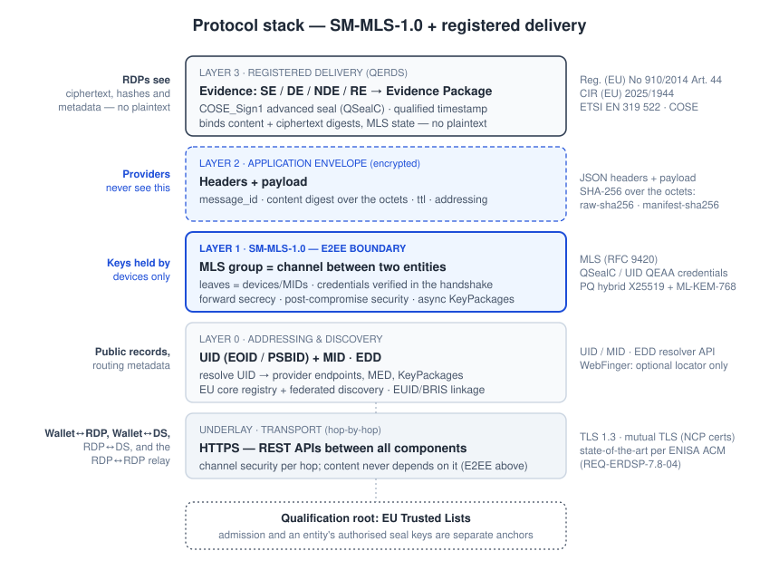

# A Secure Communication Channel for the European Business Wallet
## Executive Brief

**Date:** September 2026 · **Audience:** executive and policy readers · **Full brief:** ~12 minutes · **Core argument (§§1–3):** ~5 minutes

> **Disclaimer — exploratory exercise.** This document, and the design study it summarises, is an **independent exploratory exercise**: not an official proposal, deliverable or position of the European Commission, of any Member State, or of any standards body, and it confers no status. Its purpose is to give the newly established expert group evaluating candidate solutions for the **secure communication channel of the European Business Wallet** a clear, concrete input: a worked example of what a solution can look like, the requirements the study started from, extracted from the applicable law and standards, and executable artefacts against which any candidate — including this one — can be tested.

---

## 1. What this is, in one paragraph

A design study for a business-to-business messaging system in which **qualified registered delivery and end-to-end encryption coexist**. Businesses are addressed as verified legal entities, not mailboxes; message content is encrypted between the parties' wallet devices so that no intermediary — including the service providers — can read it; and qualified providers issue sealed, time-stamped evidence of sending and receipt, designed clause-by-clause against the requirements Regulation (EU) No 910/2014 sets for qualified electronic registered delivery (Articles 43 and 44). The two properties are usually presented as a trade-off. The study's central claim is that they are not: evidence can be built on **cryptographic fingerprints of the content rather than the content itself**. That claim is concrete and executable; whether the statutory presumption attaches to evidence built this way is a legal question the study states and does not answer.

## 2. The system in action — a worked example

*Rossi Meccanica S.r.l.*, a Milanese manufacturer, must terminate a supply contract with *Bergmann Stahl GmbH* of Dortmund — a notice with deadlines attached, where proof of delivery matters as much as the content is commercially sensitive.

**Finding the counterparty.** Rossi's Business Wallet looks up Bergmann in the directory of entities by its entity identifier — a canonical identifier issued as a qualified attestation and linked to the German business register, not an e-mail address someone typed years ago. The directory returns Bergmann's published profile: its providers, its devices' encryption keys, and its declared communication policy, which says that contractual notices are received by the *legal-affairs role* and accepted only by that role.

**Sending.** Rossi's wallet establishes an encrypted channel whose members are, verifiably, the enrolled devices of the two companies' relevant roles — it *checks the roster before sending*, so the audience is verified, not assumed. It computes a digital fingerprint of the notice, encrypts everything end-to-end, and submits the ciphertext, signed, to Rossi's **registered delivery provider**, a qualified trust service provider. That provider verifies the submission, hands the ciphertext to Rossi's local **messaging service** (the delivery service that carries encrypted traffic to and from Rossi's devices), and issues **Sending Evidence**: who sent, to whom, when, and the fingerprint. It never sees the notice, and neither does the messaging service.

**Relaying.** Rossi's provider relays the ciphertext, with the Sending Evidence beside it, **provider to provider** to Bergmann's registered delivery provider, which seals evidence for its own hop and hands the ciphertext to Bergmann's messaging service. Each provider attests what it observed; the two hops are bound into one package.

**Receiving.** Bergmann's messaging service queues the ciphertext for the legal-affairs team's devices. For a contractual notice — a content class this recipient has declared at *verification* grade — queueing, and even a device collecting the bytes, are not yet delivery. A member of the legal-affairs role authenticates at the required assurance level; her wallet decrypts the notice, recomputes the fingerprint, confirms it matches, and sends that confirmation, signed, to Bergmann's provider. Only then is **Delivery Evidence** issued (the grades are explained in §4). Both parties receive a sealed, timestamped **Evidence Package**, stored in their wallets.

**Eighteen months later**, the termination date is disputed. Rossi produces the Evidence Package — sealed, qualified-timestamped evidence of the integrity of the data, the identity of sender and addressee, and the time of sending and receipt, the elements Regulation (EU) No 910/2014 addresses for registered delivery — and the fingerprint in it matches the notice Rossi holds. No provider, directory or intermediary ever saw a word of the notice. Meanwhile the two companies' procurement systems exchange routine order confirmations over the same channel through software agents under scoped, verifiable mandates: same identities, same encryption, same evidence, no human in the loop where none is needed.

## 3. Why this is needed

**The gap.** European businesses have no common channel that is at once legally effective, confidential and cross-border. National registered e-delivery systems (PEC, De-Mail and their counterparts) provide legal evidence but are domestic silos, identify mailboxes rather than legal entities, and let the provider read every message. Modern messengers offer strong encryption but nothing of what a qualified registered-delivery service confers: no verified legal-entity identity behind an account, no qualified evidence of sending and receipt, no statutory presumption of integrity, sender, addressee and time.

**The timing.** The EUDI Regulation has put every missing building block on the table — qualified electronic registered delivery with statutory presumptions, qualified attestations for identity, the Digital Identity and Business Wallets, the EU Trusted Lists as a common trust root — and its implementing act for QERDS (CIR (EU) 2025/1944) is in force. What is missing is the composition of these blocks into one system.

**The horizon.** Legally significant machine-to-machine exchange is growing — orders, invoices, mandates, regulatory submissions — and AI agents are beginning to transact on businesses' behalf, over rails not built to provide verified legal-entity identity and opposable evidence. Whoever provides the accountable channel for that traffic will define the terms of European agentic commerce; if no open, governed infrastructure exists, it will consolidate on proprietary platforms.

## 4. The shape of the solution

**A managed network.** Not an open federation like e-mail, and not a single EU platform: a **European Registered Delivery Network**, with operations decentralised across competing providers, membership gated by two independent doors — qualification under the Regulation, then admission to the federation under a governance framework — and the protocol owned and versioned by a central **design authority**. Providers compete on service and price, never on the rules. Four instruments with four functions: the Trusted Lists (who is qualified), the federation membership register (who is admitted), the directory of entities (who exists and how to reach them), the design authority (what protocol everyone runs).

**Architecture.** A four-corner model: each business talks to its own **registered delivery provider** — a qualified trust service provider — which carries encrypted traffic to and from its devices and cannot read it, verifies submissions, seals the evidence, and **relays the ciphertext** to the provider on the other side, each attesting its own hop. The delivery service a business's devices talk to is that provider's own function, not a participant in its own right: separating the two was decided in September 2026 and **withdrawn on 6 October**, because the party that observes a handover and the party that attests to it should be one accountable, qualified, supervised provider. Where the picture leaves an interface unresolved — how the evidence issuer obtains the handover receipt, and which service routes a group once its devices span two — the study says so rather than drawing a solution: open questions A1 and A10 on its review agenda.

The stack has four layers over ordinary HTTPS: **addressing and discovery** — a canonical entity identifier linked to the business registers, deliberately new because the existing identifiers are register- or sector-scoped, resolved through an EU-governed core registry with federated discovery and no alias *trust* layer; **end-to-end secure messaging**, a profile of IETF Messaging Layer Security (RFC 9420); an **application envelope** carrying content digests; and the **registered-delivery evidence layer**, sealed, time-stamped evidence objects aggregated into a wallet-storable Evidence Package. Why the identifier is new rather than borrowed is recorded, with the alternatives weighed, in the study's decision records.

### The key design moves

**Delivery is distinct from technical availability.** This is *not* certified e-mail re-platformed. By default, the act that delivery evidence attests is authenticated verification and acceptance by an authorised endpoint: evidence is issued only once an *authenticated* recipient has decrypted the message, re-verified its digest and satisfied the organisation's published acceptance policy — a role, or a quorum; human-in-the-loop is native. What the device reports is attributable to it by its signature; that an honest implementation performed the check is an assumption about the endpoint, which the study's wallet assurance profile makes explicit.

**The required grade is declared per content class**, along a ladder of ascending recipient involvement: **availability**, **verification** (the default), **acceptance**. *Availability* issues delivery evidence when the sealed content has reached a credential-bound device of the addressee and that device has acknowledged the handover, with no obligation to open it — the contexts mailbox-based systems are built for, such as formal notices and regulatory filings, where a recipient who never opens must not defeat delivery. It applies only where the recipient has expressly declared it for a content class, so the addressee is always identified and authenticated before delivery, as Article 44(1)(c) requires, even at the lightest grade. At this grade the evidence rests on the messaging service's observation of the handover; who should observe it is one of the open questions above.

**The declared grade is checkable, and what a check discloses is bounded — but the bound is not secrecy of the class.** The evidence carries only a cryptographic commitment to the content class, bound to the recipient's published declaration, so **that field** discloses nothing: a reader cannot test a guess against it. The bundle as a whole discloses more, and this brief would mislead if it stopped here. The routing scope reference travels in clear, and the map that gives it meaning is part of the recipient's signed, published organisation document — so a reader of the evidence learns the **set** of content classes that scope covers, and a scope covering one class discloses that class. What this does not establish is that the sender actually encrypted a document of that class. Separately, the content digest is unsalted, so a party holding the evidence can confirm a guess about low-entropy content; whether to salt it is an open question for the expert group (A12) and nothing here claims it is closed. Checking that the grade applied was the one declared requires the commitment to be **opened** — a *reveal*, produced and signed by the recipient's device, disclosing that one message's class to the parties of the dispute and to nobody else. What the reveal proves is an *attributable statement* by that device; that it truthfully describes the encrypted content is not proven by the cryptography, and the specification says so.

**Confidentiality boundaries can coincide with organisational roles**, so only the designated function within a company can read designated content classes — with the audience *cryptographically verified* before sending, and every device that can decrypt visible to both parties.

**The identity model distinguishes the legal entity, the person or system acting for it, and the device** — the structure needed to host software agents under scoped, verifiable mandates. **An agent's act is bound to the mandate it acted under** by the same commitment technique, so it is attributable to the entity, and in a dispute the mandate's scope can be opened to the parties in the same bounded way. Where the law or the organisation wants a human in the loop, the policy says so: an agent may verify a message but cannot perform the acceptance itself.

**What it rests on.** Standards all the way down — MLS, COSE, deterministic CBOR, HTTPS, the ETSI EN 319 522 series, the EUDI Wallet stack — and no new cryptography: the contribution is composition and profiling, built clause-by-clause against Article 44 and CIR (EU) 2025/1944, with a compliance matrix and a conformance-statement pro forma prepared for assessment bodies, which retain the assessment itself. And it is executable: the specification set ships with JSON Schemas, CDDL, a published catalogue of 161 rules enforced by semantic linters, companion API contracts, cryptographically real sample evidence and continuous integration, so "conformant" is machine-checkable today and any competing candidate can be measured against the same artefacts.

### What exists today, at a glance

Terms used throughout this document, with the meaning the technical documents give them, so that "specified" is never mistaken for "running in production":

| State | Means |
|---|---|
| **Specified** | Defined normatively, with machine-readable schemas and conformance rules that a third party can run |
| **Exercised** | A reference implementation performs it end to end and passes the specification's own conformance gates, unmodified, at the specification edition it is pinned to |
| **Pinned to an earlier edition** | The reference implementations target a previous evidence edition; re-alignment to the current one is the next implementation step |
| **Independently interoperable** | Two independently developed implementations exchange messages and evidence — **not demonstrated** by anything in this package |
| **Qualified** | A status an operating provider holds, granted by a supervisory body — **not established** by anything in this package |
| **Optional profile** | Cumulative and opt-in — a deployment that does not enable it is unaffected (the agent profile is the only one) |
| **Future study** | Named, scoped, and deliberately not designed yet |
| **Open question** | A point at which an architectural choice has not been made; listed with the assumption it rests on in the repository's review agenda |
| **External residual** | Requires a decision or an artefact this study cannot produce: legal counsel, production PKI, an operated federation register, an ETSI review, or key transparency. Listed in `OPEN-ITEMS.md` |

**Nothing here is qualified, and nothing is in production.** The evidence in the reference artefacts is cryptographically real but marked non-qualified, and its key material is demonstration-grade.

## 5. Supported communication scenarios

Each pattern has an explicitly declared confidentiality boundary (who can decrypt) and evidence semantics. Two invariants hold in every row: **providers never decrypt anything**, and **every device that can decrypt is visible to the parties** — no invisible access.

| Scenario | Who can read | Status |
|---|---|---|
| **Business ↔ business** (baseline) | The enrolled devices of both entities in the channel | Specified · exercised at an earlier edition |
| **Role ↔ role** (e.g. legal affairs to legal affairs) | Only devices of members holding the designated roles. A compliance-records function may be included, but only if the organisation *names that role* in its published policy, so the sender can resolve it before sending and the records function recovers content without being an acceptance party. | Specified · exercised at an earlier edition |
| **Employee ↔ employee, different companies** | The role or scope group their organisations configured; a two-person boundary is a configuration choice, not a default, and members act *for* their organisation. | Specified |
| **Employee ↔ employee, same company** | Internal to the organisation, which administers all credentials | Out of scope — personal confidentiality belongs to the personal EUDI Wallet domain |
| **Software agent ↔ business/role** | As per the scope it operates in; scopes can exclude agents from sensitive content classes; each act is bound to the agent's mandate; a policy can require a human to perform the acceptance | Specified · optional profile; the agent–wallet interface between deployments is informative only (open question A7) |
| **Natural person ↔ business** | Person's wallet devices ↔ the business's scope | Future study (the person as a party in their own right) |

**Beyond plain messaging.** The same channel and evidence machinery are the base of a phased *registered interaction layer*: after entity messaging, registered attestation exchange — mandates, powers of representation and compliance attestations delivered with a legal receipt; a registered presentation profile — qualified evidence that a credential was presented between two identified parties, which the EUDI ecosystem does not yet have; and governed agentic interactions, of which the optional agent profile is the first subset. None of the later phases is required to adopt the first, and none is designed here.

## 6. Weaknesses and open risks

| Risk | Why it is real |
|---|---|
| **Technical questions still open** | How the evidence issuer obtains the messaging service's handover receipt across providers (A1); who observes that handover, and what a messaging service acting alone could make a provider attest (A9); which service routes a group once its devices span two (A10); who publishes a group's retained state (A5); the messaging service's identity on the wire (A6, decided and not implemented); the agent interface between deployments (A7); the exact proof a device gives when it refuses an invitation (G1); and whether the digest that binds evidence to content should be salted, since an unsalted one confirms a guess about low-entropy content to anyone holding the evidence (A12). These are architecture questions, not institutional prerequisites, and they are what the study most needs expert input on. |
| **Ecosystem prerequisites** | The directory of entities, the federation authority, the design authority and entity-identifier issuance do not exist yet; the Business Wallet itself is still maturing. |
| **Uncharted conformity path** | The messaging binding is new to the ETSI registered-delivery framework; the first conformity assessment will set precedent, and the legal argument that the presumption holds over ciphertext-plus-digest, while carefully constructed, is untested. The study's mapping of a relay-stage rejection onto EN 319 522 is its own reading, not confirmed by the standards owner (A8). |
| **Interoperability is asserted by nobody** | One codebase has run the confirmation-signature test vectors; no independently developed implementation has exercised the published contracts. Two provider *instances* from one codebase are not two implementations. |
| **Operational maturity at B2B scale** | MLS is standardised with solid implementations, but large-scale operation of the delivery service and of key-transparency infrastructure in a business federation has little production precedent, and key transparency is an external residual of this design. |
| **Incumbency, adoption, governance** | National registered-mail systems have entrenched user bases and simpler (weaker) models; a network needs a critical mass of providers and at least one committed Member State or sector to start; gated admission, a membership register and central change control require institutional will the technology does not substitute for. |

## 7. Feasibility

**The technical primitives exist; the institutions do not; and the design has open questions of its own.** MLS has mature open-source implementations; COSE signing, qualified timestamps and certified cryptographic hardware are routine for qualified trust service providers; transport is ordinary HTTPS; identity reuses the wallet ecosystem's attestations. But "the protocol is ready and only the institutions are missing" would overstate it: until the architecture questions in §6 are settled, the profile is a review draft, not a frozen baseline for independent implementations.

**What exists.** Edition 2026-09-18 of the specification set: an umbrella specification, an IETF Internet-Draft and an ETSI-style conformance profile with a conformance-statement pro forma, plus five published API contracts — directory resolver, wallet-to-provider, delivery service, provider-to-provider relay, federation membership register — and an executable conformance bar of more than two thousand automated checks across fourteen gates, all in continuous integration under a REUSE-compliant licensing and IPR framework. The external residuals — legal counsel, production PKI, ETSI review, IANA and key transparency — are marked as such in the normative text, and the properties the reference verifier cannot establish from retained material are reported as unproven rather than passed, pinned by tests so that neither can lapse quietly.

**What has actually run.** Two proof-of-concept codebases, by the same author as the specification, each pinned to an earlier edition whose linters, schemas and samples it consumes unmodified as its acceptance bar: `sbm-poc`, a Rust wallet on a real MLS implementation (OpenMLS) with Python provider services and a signed directory, pinned to the specification at `52f6ebd` (21 July 2026), which exercised deployment profiles 1 and 2 end to end — first contact, delivery through the four states, evidence issuance, failure paths, a four-corner exchange between two provider instances, role-scoped confidentiality and the agent profile; and `sbm-services`, a deployable, database-backed provider and directory on containers, pinned to the specification at `088e5d4` (13 July 2026), which ran the same two profiles on real containers. Each passed the pinned edition's conformance gates; each was reproduced by the author and by nobody else. This establishes that the profile as it stood in July 2026 could be built and run end to end, and that building it found real under-specification, each instance resolved with a machine check and a byte-exact sample. It does not establish conformance to the current edition, interoperability between independently developed implementations, or anything about qualification.

**What comes next, in dependency order.** Adoption is staged by deployment profile — a *minimal pilot* with a static signed registry and one co-located provider pair; a *federated pilot* with several providers and a resolver; a *production baseline* with qualified providers and Trusted List validation; *production advanced* with confidentiality scopes; and the *agent profile*, optional on top of any of them — each a level of institutional risk proven, and each declaring what it does not prove. The gating item is settling the open architecture questions of §6 with the expert group's input and freezing an edition independent implementers can build against; its duration depends on the group more than on engineering. Then a multi-provider pilot under the transitional regime the design foresees — evidence marked non-qualified, two or three providers, at least one independently developed — and, in parallel, the standards and qualification track: the Internet-Draft to the IETF, the conformance profile towards ETSI TC ESI, and conformity assessment with a pilot assessment body, driven by institutional calendars more than by engineering. The long pole is not code; it is the open questions, then governance and conformity assessment.

## 8. What the expert group can take from this study

Four things, usable regardless of which solution is ultimately selected.

1. **The requirements the study started from**, distilled from Regulation (EU) No 910/2014, CIR (EU) 2025/1944, the ETSI EN 319 522 series and the Business Wallet proposal, each with its source and the study's own requirements told apart from the external ones: [`brief/requirements.md`](requirements.md).
2. **A worked candidate architecture** arguing that the E2EE-versus-evidence trade-off is false, with the difficult questions — delivery semantics, identity binding, key discovery, digest verification, failure evidence — answered concretely where they are answered, and named as open where they are not.
3. **A set of questions every candidate has to answer.** The requirements list and the review agenda are the same questions this study answers or leaves open; a comparison of candidates on those terms is for the group to make, and this package does not make one.
4. **Executable artefacts** — schemas, conformance linters, signed samples and a test suite — that turn evaluation claims into checkable facts.

### Three questions we would put to the group

- **Is the baseline right?** The requirements list is our reading of the law and the standards. If a requirement is missing, mis-scoped, or over-read, that correction is worth more to the group than anything else in this document.
- **Is the evidence argument sound?** Registered-delivery evidence resting on content digests rather than on content is the load-bearing claim, and it is untested. Where would it fail — legally, or in a conformity assessment?
- **Which way on the open questions?** The observer of the handover, the receipt's path to the evidence issuer, the routing of a group across two services: the study analyses the alternatives and chooses none. The group's view on them is worth more than another round of the author's.

The study is offered in that spirit: not as the answer, but as a concrete, falsifiable input that raises the floor of the discussion. The complete specification set and conformance tooling are in the accompanying repository — documents under CC BY 4.0, code and machine-readable artefacts under MIT.
