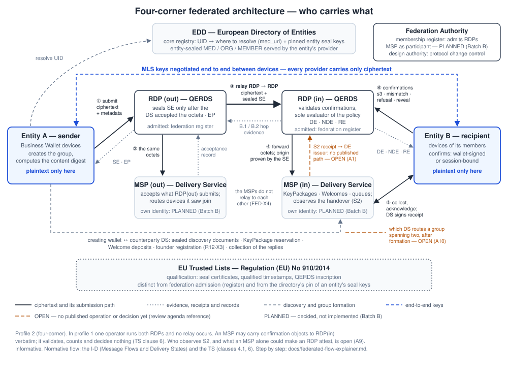
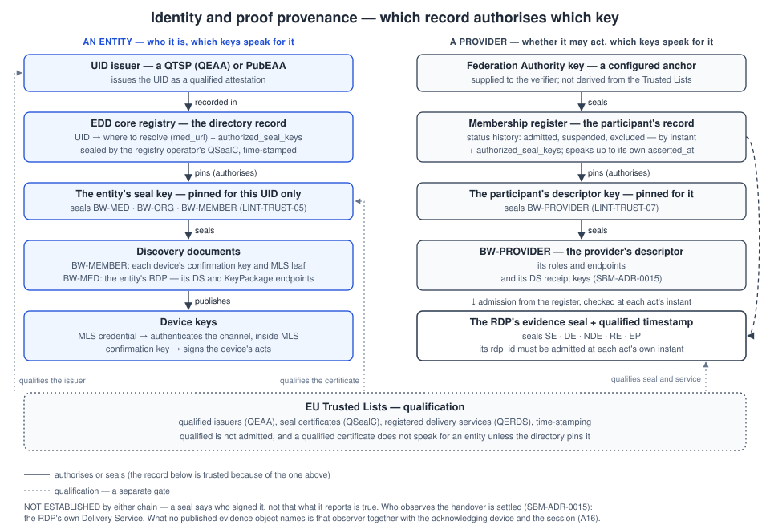

<!-- SPDX-FileCopyrightText: 2025-2026 Paolo De Rosa and contributors -->
<!-- SPDX-License-Identifier: CC-BY-4.0 -->

# Architecture, identity and trust

**Status:** informative companion · **Applies to:** the specification set at the versions in the README's version table (not restated here, so they cannot drift) · **Audience:** reviewers who need the model before the rules

> **Exploratory design study — not an official proposal.** This note assembles what the normative documents already say; it adds no rule. In any conflict they prevail: the umbrella §7 (architecture and roles), §5 and §8 (directory and discovery), §13 (governance); the TS clause 6 (evidence duties); the companion contracts.

The question this note answers: **who does what, who talks to whom, and why is any returned key or claim trusted?** It keeps apart five things a verifier asks separately, because the design depends on none of them standing in for another.

---

## 1. Who does what

Each entity runs **wallet devices**, the only place plaintext exists. Its **Delivery Service**, operated by its RDP, holds its KeyPackages and queues and observes the handover of bytes to a device. Its **Registered Delivery Provider** (the RDP, a qualified trust service provider) seals the evidence. A message goes from the sender's wallet to its RDP, which gets its own Delivery Service to accept the exact octets before it seals the Sending Evidence, then relays the ciphertext **with that SE** to the recipient's RDP. That RDP hands it to its Delivery Service with the origin proven, and the recipient's devices collect it there. The recipient's confirmations reach its RDP, the **sole** evaluator of the acceptance policy (TS clause 6). The Delivery Service may carry them, verbatim; it decides nothing. There is no Delivery-Service-to-Delivery-Service relay: the one relay in the profile is the RDP-to-RDP hop described above.

In the minimal deployment (Annex P profile 1) a single RDP serves both entities, and no relay occurs. Group formation is the exception to "each side talks to its own providers": the creating wallet reserves KeyPackages, deposits Welcomes, registers as the group's founder and collects replies at the **counterparty's** Delivery Service. Which Delivery Service routes a group whose devices span two, after formation, is open ([A10](REVIEW_AGENDA.md)). The phase-by-phase version is [`federated-flow-explainer.md`](federated-flow-explainer.md).

## 2. Two chains of trust

**An entity** is trusted through its identifier. A qualified issuer issues the UID. The EDD core registry's **directory record**, sealed by the registry operator, says where to resolve the entity and **pins the keys that may seal its documents** (umbrella §5.2). A document sealed by any other key — even a qualified certificate issued to another entity — is not the entity's (`LINT-TRUST-05`). The pinned key seals BW-MED, BW-ORG and BW-MEMBER, and BW-MEMBER publishes each device's confirmation key and MLS leaf.

**A provider** is trusted through its admission. The Federation Authority's key is an anchor the verifier is **configured** with; the membership register's record, which that key seals, gives the provider's admission history and pins the key that seals its descriptor, `BW-PROVIDER` (`LINT-TRUST-07`). An RDP's evidence counts only if the RDP was admitted at the instant of **each** act. The register answers two different questions, and one never stands in for the other. *Was it admitted when it acted?* is answered later, by a record asserted after the act, which speaks for the history up to its own `asserted_at`. *May it exchange now?* is a live **lease**, decided once at the start of an exchange against a fresh record; it authorises that exchange and is not evidence of admission at any act in it.

The **EU Trusted Lists** sit beneath both, and establish only qualification. "Everything chains to the Trusted Lists" is not a trust model: a qualified certificate does not speak for an entity unless the directory pins it, and a qualified provider is not thereby admitted (umbrella §13.1).

## 3. Five questions a verifier keeps apart

| Question | What answers it | What it cannot answer |
|---|---|---|
| **Authenticity** — did this key sign these bytes? | the signature | whether the key was entitled to sign |
| **Authorisation** — does this key speak for this entity or provider? | the directory pin; the register's pin | whether the provider may operate |
| **Admission** — was the provider allowed to act *then*? | the register's status history, at the act's instant | whether it is qualified |
| **Qualification** — is the provider or certificate qualified? | the Trusted Lists | whether it is admitted, or authorised for an entity |
| **Observation** — who witnessed the event, and is their report true? | the party that observed it, identified in the evidence | the truth of an observation the sealer did not make |

The last row is where a seal stops. An RDP's seal proves the RDP made a statement; at the availability grade that statement rests on the Delivery Service's signed receipt of the handover, which the RDP does not re-witness. The event is **attributed** to the Delivery Service, not independently established. Who observes S2 is **settled** ([A9](REVIEW_AGENDA.md), [SBM-ADR-0015](adr/SBM-ADR-0015.md)): the RDP, which operates the Delivery Service as part of its qualified service. What remains is the trust the design already placed in that provider — no resistance to a malicious one is claimed. The withdrawn alternative was to separate the roles, which would have made a false observation attributable — not impossible.

**One provider role is not one provider per message.** Where the two correspondents are customers of different providers, the handover is observed by the **recipient's** provider, while the message's origin is the sender's. [SBM-ADR-0016](adr/SBM-ADR-0016.md) therefore has the receipt name **both**: `issuing_rdp_id`, the origin, proven by the message's Sending Evidence; and `observed_by`, the provider whose Delivery Service observed and signed. The field name is SBM-ADR-0004's, which SBM-ADR-0015 withdrew — it returns for a different reason, not to attribute a false observation to a party outside the provider, but to say which of two qualified providers observed, so that the right key can be found.

## 4. Which key does what

| Act | Key | Authorised by | Checked by |
|---|---|---|---|
| Authenticate inside the MLS group | the device's MLS credential | the Trusted Lists, and the device's leaf in BW-MEMBER | the other devices, inside MLS |
| Authenticate an API session (HTTPS) | the scheme the contract names — a device or member credential, mutual TLS between providers | the contract | the server of the operation; distinct from the MLS credential |
| Sign the sender's submission | the sending device's confirmation key | BW-MEMBER, sealed by the pinned entity key | RDP(out) at submission, before it issues the SE; any verifier later |
| Sign a recipient's message act — an `s3` confirmation, a mismatch proof, a message refusal, a reveal | the device's confirmation key | BW-MEMBER, sealed by the pinned entity key | RDP(in) at intake (INTF-1a); any verifier later |
| Refuse a Welcome before joining | the private key of the KeyPackage the invitation consumed | the device's own KeyPackage | the Delivery Service, against the leaf signature key the consumed package carries — RFC 9420 §5.1.2 `SignWithLabel` over typed content including the single-use `refusal_nonce` the Welcome delivered ([G1](REVIEW_AGENDA.md)) |
| Seal evidence | the RDP's seal (QSealC), plus a qualified timestamp | the Trusted Lists (qualification) and the register (admission at the act) | any verifier |
| Sign the S2 receipt | the OBSERVING provider's receipt key — the one the receipt names in `observed_by` — valid at the receipt's `server_time` | BW-PROVIDER, sealed by the provider's own descriptor key: SBM-ADR-0015 moved the key off the customer's BW-MED, [SBM-ADR-0016](adr/SBM-ADR-0016.md) says **whose** descriptor it is | the DE issuer — through no published path yet ([A1](REVIEW_AGENDA.md)) — and the retained verifier (`LINT-BND-38`) |
| Seal an entity's documents | the entity's seal key | the directory record | any resolver |
| Seal a provider's descriptor | the participant's descriptor key | the register | any verifier |
| Assert admission | the Federation Authority's key | configuration — a trust anchor | any verifier holding that anchor |

## 5. Claims, observers and limits

| Claim | Observed by | Attested by | Independently checkable | Whose honesty still matters |
|---|---|---|---|---|
| The sender submitted these octets | RDP(out), in an authenticated session | the SE, and by default the sender's own signature | seal, timestamp, and the signature against the device's published key | RDP(out) for `sent_at`; the signature shows the device's act, not the entity's intent ([L4](REVIEW_AGENDA.md)) |
| The octets reached the recipient's RDP unchanged | RDP(in) recomputes the digest against the SE | the hop evidence (B.1) | the digest relation, by anyone holding the octets; the hop evidence's seal and timestamp | RDP(in)'s — that it received these octets at the hop's instant is its own report, like every observation in this table |
| A device collected and acknowledged them (S2) | the Delivery Service | its signed receipt | the signature and the key's validity at `server_time` | the Delivery Service's — the event is its own observation, and that service is the qualified provider's own ([A9](REVIEW_AGENDA.md), resolved by SBM-ADR-0015) |
| A member decrypted and the digest matched (S3) | the recipient's device | its confirmation, wallet-signed or session-bound | wallet-signed: the signature against the device's published key; session-bound: only through RDP(in)'s record | the device's, in both modes — a signature attributes the statement to the device, it does not show that an honest implementation decrypted and checked (the wallet assurance profile is where that assumption lives); and RDP(in)'s, for a session-bound confirmation |
| The acceptance policy was satisfied (S4) | RDP(in), on receiving the completing act | the DE | re-evaluation over the retained policy and confirmations | that no later policy existed is unproven ([A3](REVIEW_AGENDA.md)) |
| The provider was admitted at the act | the Federation Authority | its record | yes, with the configured anchor | the Authority's — two contradictory histories stay an open transparency gap |
| The provider is qualified | the supervisory body | the Trusted List | by a production verifier | not established in this repository ([P1](REVIEW_AGENDA.md)) |

## 6. Who sees what

The umbrella's metadata-privacy inventory (§11.1) is the authority; this is its shape by actor.

| Actor | Plaintext | Ciphertext | Identity and routing metadata | A dispute reveal |
|---|---|---|---|---|
| Wallet devices of the two entities | yes — their own | yes | yes | disclose it, or receive it |
| The RDP's Delivery Service | never | yes | UIDs, group ids, device principals, sizes, times — **and, on the forwarding path, the evidence fields of the origin's sealed SE**, including `payload_hash` and `scope_ref`, which it decodes and verifies to prove the origin namespace | no |
| RDPs | never | yes — they relay it and hash it | the evidence fields they seal, including `scope_ref` | when presented in a dispute |
| EDD | never | no | resolution queries | no |
| Time-stamping service | never | no | timing, over seal hashes | no |
| A later verifier of an Evidence Package | only if it holds it | no | everything the package carries | if presented |

The content class never appears in evidence; a reveal discloses one message's class to the parties of that dispute. Who retains what, and for how long, is set for evidence by the TS; for the other actors it is part of the deferred implementer guide ([G4](REVIEW_AGENDA.md)).

## 7. What is planned, and what is undecided

- **Withdrawn ([A6](REVIEW_AGENDA.md), [SBM-ADR-0015](adr/SBM-ADR-0015.md)):** a separate transport provider with its own identity on the wire, its admission, and the DE's binding to the observation it rests on. Decided, not implemented. The `observed_by` field is **not** withdrawn with it: [SBM-ADR-0016](adr/SBM-ADR-0016.md) restored it on the **receipt**, where it names which of two qualified providers observed — a different question from the one it was first planned for.
- **Resolved ([A9](REVIEW_AGENDA.md), SBM-ADR-0015):** the S2 observer is the RDP, which operates the Delivery Service as part of its qualified service. Three models were analysed in [SBM-ADR-0004](adr/SBM-ADR-0004.md), *Alternatives considered*, and the decision takes the third — *the handover inside the RDP's trust boundary*. The first form of this line said the question was resolved and that **none is selected** in the same sentence, which are not both true. What stands unchanged is the limit: nothing here claims resistance to a malicious provider, because the party that observes and the party that attests are the same qualified one.
- **Open ([A1](REVIEW_AGENDA.md), [A10](REVIEW_AGENDA.md)):** how the DE issuer obtains the S2 receipt; which Delivery Service routes a group after formation.
