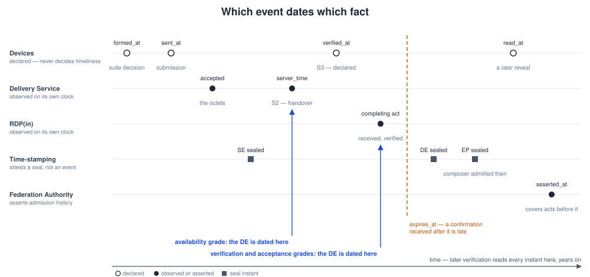

# The Evidence Layer of the Secure Business Messaging Profile
## A detailed explanation

**Status:** informative companion, draft for discussion · **Applies to:** Secure Business Messaging Profile (SBM) spec set, at the versions in the README's version table (not restated here, so they cannot drift) · **Audience:** technical, legal and standards readers

> **Exploratory design study — not an official proposal.** This document explains the evidence layer of an independent technical exploration; it is not a position of the European Commission, any Member State, or any standards body, and confers no status.

---

## In brief — what each grade and proof establishes

*The short version: the grades, what each proof shows and does not show, and which instant dates what. Everything after it is the detail, for a second reading.*

A registered-delivery provider (RDP) seals evidence about a message it never reads: it binds to a **digest** of the content, a digest of the transmitted ciphertext and the MLS group state. Sending Evidence (SE) records an authenticated submission; the recipient side's Delivery Evidence (DE), Non-Delivery Evidence (NDE) or Refusal Evidence (RE) records the outcome; the Evidence Package (EP) bundles them. Each object is a seal over deterministic-CBOR bytes plus a qualified timestamp over that seal. What a DE *means* depends on the **delivery grade** the recipient declared for the content class.

| Grade | The DE is issued when | Dated by | It establishes | It does not establish |
|---|---|---|---|---|
| **verification** (the default) | RDP(in) has verified an eligible member's confirmation that the digest matched — S3, which is S4 under `any-one` | RDP(in)'s receipt of that confirmation | an authenticated **assertion** by a member's device that it decrypted the content and re-verified its digest — attributable to the device's published key when wallet-signed, and only through RDP(in)'s session record when session-bound; the truth of the assertion rests on the endpoint | acceptance by the entity under a quorum; anything about what the content means |
| **acceptance** (`quorum:n`, `all`) | the confirmations of distinct eligible members satisfy the policy — S4 | RDP(in)'s receipt of the completing confirmation | the entity's published policy was satisfied | that no later policy existed ([A3](REVIEW_AGENDA.md)) |
| **availability** (declared per class, never implicit) | a device of the addressee took the bytes and acknowledged them in an authenticated session — S2 | the Delivery Service's receipt (`server_time`) | handover to an authenticated endpoint, with the sender-declared digest; after a reveal, that the class was declared for this grade | recipient-side verification; acceptance; the handover beyond the Delivery Service's own observation ([A9](REVIEW_AGENDA.md)) |

| Proof | Made by | Shows | Does not show |
|---|---|---|---|
| SE, with the sender's signature (the default) | RDP(out); the sending device | these octets were submitted by an authenticated sender, as RDP(out) reports, and accepted by the Delivery Service before sealing; the signature attributes the submission to the device | delivery; the entity's legal intent ([L4](REVIEW_AGENDA.md)) |
| The Delivery Service's receipt | the Delivery Service | a device of the addressee took these octets at `server_time` | that anyone decrypted them; that the observation is true (A9) |
| A member's `s3` confirmation | the member's device | an authenticated assertion that the member decrypted and the digest matched — attributable to the device key when wallet-signed, to the session when session-bound | that the assertion is true, which rests on the endpoint; the entity's acceptance, unless it completes the policy |
| A mismatch proof | a member's device | an attributable claim that the digest failed; it ends the message with an NDE | why — corruption, error or attack |
| A refusal | a member | an attributable decline; it ends the message with the member's RE | its legal weight ([L4](REVIEW_AGENDA.md)) |
| A reveal of a grade commitment | either party | a matching reveal: the sealed commitment opens to that class | a failing reveal proves nothing alone — it starts a dispute; neither changes the outcome |

A terminal outcome is final: acts arriving after it are retained and change nothing. Whether and how the Article 43(2) presumptions attach to any of this is a legal question this study does not answer (review agenda, *Legal*).

### Which event dates which fact

Five clocks stay apart: what a device **declares**, what the Delivery Service and RDP(in) **observe**, what a timestamp **attests** about a seal, and the **deadline** the SE carries. Declared instants never decide timeliness; the seal instant is never the event. The [message lifecycle](message-lifecycle.md) walks the same instants through the public operations.

---

## 1. What the evidence layer is for

The Secure Business Messaging Profile carries messages between legal entities over an end-to-end encrypted channel (a profile of IETF MLS) in which no intermediary — not the messaging providers, not the delivery providers — can read the content. On its own, that gives confidentiality but no legal weight. The **evidence layer** is what supplies the legal weight: a set of signed, time-stamped records, issued by qualified providers, that attest *who* sent something, *to whom*, *when*, under *which policy*, and *with what outcome* — all without the issuer ever seeing the content.

The design turns on a single idea that recurs throughout this document: **evidence binds to a cryptographic fingerprint of the content, never to the content**. Providers certify events, identities, timestamps and digests; the plaintext stays between the endpoints. This is what lets the profile claim, simultaneously, the statutory presumptions of Regulation (EU) No 910/2014, Article 43(2) — integrity, sender, addressee, time — and genuine end-to-end confidentiality, two properties normally presented as a trade-off.

The evidence layer is Layer 3 of the stack, sitting above addressing/discovery (Layer 0), the MLS end-to-end layer (Layer 1) and the application envelope (Layer 2). It is realised by **Registered Delivery Providers (RDPs)**, which are qualified trust service providers for electronic registered delivery (QERDS) under Article 44.

## 2. The actors that touch evidence

- **The sender wallet** computes the content digest over the plaintext, and (for availability-grade delivery, §7) the grade commitment. It never issues evidence, but it supplies the inputs only it can know.
- **The recipient wallet** is a *trust participant*, not just an endpoint: after decrypting, it recomputes the digest and produces a **recipient confirmation** — wallet-signed or bound to an authenticated session — that the recipient-side RDP relies upon to issue Delivery Evidence (§6).
- **RDP(out)** — the sender-side provider — issues Sending Evidence and, in the single-provider case, composes the Evidence Package.
- **RDP(in)** — the recipient-side provider — issues Delivery, Non-Delivery or Refusal Evidence.
- **The MSP** (Messaging Service Provider / MLS Delivery Service) routes ciphertext and issues no evidence object. It is nonetheless an **observer** the evidence can rest on: at the availability grade, the Delivery Service's signed receipt of a device's acknowledged handover (S2) is what dates the DE (§6). The receipt's signature can be checked by anyone holding the Delivery Service's key; the event it reports is the MSP's own observation, which the RDP seals without re-witnessing it — attributed, not independently established. Who observes S2, and what an MSP alone could make an RDP attest, is open (review agenda A9). Its other signals appear in the package, if at all, as non-operative state records.

In the minimal deployment (Annex P profile 1) RDP(out) and RDP(in) are co-located; in the federated case (profile 2) RDP(out) relays the ciphertext with the sealed SE to RDP(in), and the two exchange per-hop relay evidence, under the four-corner requirements.

## 3. The evidence objects

There are six object types. Five are individual, per-message records; the sixth aggregates them.

**SE — Sending Evidence.** Issued by RDP(out) when it accepts an authenticated submission. It records `message_id`, `sender_uid`, `recipient_uid`, the MLS session (`mls_group_id`, `mls_epoch`), the `payload_hash`, `sent_at`, the authenticated `auth_method` and `auth_context`, the ETSI event `A.1-SubmissionAcceptance`, the applicable `acceptance_policy_ref` and `scope_ref`, and — for availability-grade content classes — the `grade_commitment`. It is the anchor for sender attribution, and by default it carries two proofs, not one: the RDP's record of the authenticated submission session, AND the sender's own `sender_confirmation` — a wallet signature by the sending device over the exact submission tuple, so the sender independently signs the transmitted octets and who they are addressed to (`origin_proof` `sender-signed`, the default). The narrower `provider-attested` mode, for constrained senders, proves that the provider attested a submission — not that the named sender authorised those octets — and every claim derived from it is narrowed accordingly.

**DE — Delivery Evidence.** Issued by RDP(in) when the event its grade requires has been established (§6) — the acknowledged handover, the verified confirmation, or the satisfied policy. It records `delivered_at`, the `recipient_auth_method` and `auth_context`, the `delivery_grade`, the `integrity_basis`, the ETSI event, and — for confirmation-bearing grades — the recipient's `s3_attestation`. It carries the same `payload_hash` as the SE, binding delivered content to sent content.

**NDE — Non-Delivery Evidence.** Issued when delivery does not occur: expiry, unreachable recipient, suspended identifier, a routing failure, or — as a first-class case — a post-decryption digest mismatch. It carries a `reason` and an ETSI `event` that must be consistent with it (§8).

**RE — Refusal Evidence.** Issued when the recipient explicitly refuses (for example, an out-of-scope content class), event `C.4-ConsignmentRejection`.

**CE — Change-Indication Evidence.** Issued when a transformation *needed for sending or receiving* occurs — permitted only on the envelope/metadata, never the content, since E2EE forbids content transformation. It satisfies Article 44(1)(e). Records the `transformation` and `changed_at`.

**EP — Evidence Package.** The aggregate: the `se`, one or more `outcomes` (DE/NDE/RE), the `rdp_chain` (both RDPs in the four-corner case), optionally `changes[]` (CE records) and `states[]` (non-operative state records, §6). It is the wallet-storable, independently verifiable artefact a party produces in a dispute. It carries at least one outcome by construction — it is the *final* package, composed once an outcome exists.

Every object carries, in common: `type`, `version` (`"2.11"` at this edition — bound to `versions.json` with every other statement of it), `profile` (`pilot` or `production`), `evidence_id` (unique per object, distinct from `message_id`) and `policy_id` (the RDP's issuance policy). On the wire the object travels as a sealed **evidence artefact** `[cose-sign1, qualified-timestamp]` — the COSE_Sign1 seal and its qualified timestamp are the artefact's two elements, not body fields.

## 4. How an object is sealed and time-stamped

This is the most subtle part of the layer, and it is deliberately ordered to avoid a circular dependency.

The **signed payload** of an evidence object is the **deterministic-CBOR (RFC 8949 §4.2) encoding** of the body — the structure defined in the CDDL (`cddl/sm-mls-erd.cddl`); the body carries no seal field, so there is nothing to exclude. The COSE_Sign1 over those bytes is the **authoritative artefact**; its JSON form is a **non-authoritative projection** = `decode(payload)`. The RDP then, in a fixed sequence:

1. computes the signed payload and produces the **COSE_Sign1 advanced electronic seal** over it → the artefact's **first element**;
2. obtains a **qualified electronic timestamp** whose message imprint is `SHA-256` of those exact COSE_Sign1 octets → the artefact's **second element**;
3. assembles the wire artefact `dCBOR([cose-sign1, qualified-timestamp])`.

So the seal covers neither itself nor the timestamp, and the timestamp attests the seal. Had the timestamp lived inside the signed bytes while claiming to cover the signature, the construction would have been circular; this sequencing removes that. A deployment that additionally wants the timestamp itself sealed does so in a *second, outer* envelope — it must not re-inline the timestamp into the signed payload.

**Verification is decode-then-validate**: decode the artefact → `(cose-sign1, qualified-timestamp)`; **verify the COSE_Sign1 over its dCBOR body payload** (there is no JSON re-canonicalisation); then verify that the timestamp imprints `SHA-256` of the first element. The Evidence Package is sealed the same way as its own artefact, its qualified timestamp attesting the time of bundle composition.

The seal is an **advanced electronic seal of the QTSP** within the meaning of Article 44(1)(d), supported by a QSealC that chains to the Trusted List entry under which the RDP is inscribed as a QERDS. The COSE algorithm is one of EdDSA (-8), ES256 (-7) or ES384 (-35); Ed25519 is mandatory to implement, and production deployments may use ECDSA where the qualified certificate, the certified device and the ENISA Agreed Cryptographic Mechanisms permit. The timestamp is a qualified electronic timestamp (Article 42), an RFC 3161 or ETSI EN 319 422 token, from a time-stamping service inscribed in a Trusted List.

## 5. The digest: how evidence refers to content it cannot see

The `payload_hash` is a `{alg, hex, hash_mode}` descriptor. The sender computes it over the plaintext's **transmitted octets**: `raw-sha256`/`raw-sha512` over those bytes directly, or `manifest-sha256`/`manifest-sha512` for multipart messages, where the digest is taken over a deterministic-CBOR manifest of parts, each with its own media type, length and digest — and each part's digest is again over that part's own octets. A digest in this profile is never a property of semantic content: an application that keeps a structured payload parsed and re-serialised, its original octets gone, cannot recompute the digest and must retain those octets. The `Hash` type is self-consistent: SHA-256 forces a 64-hex-character digest and a `*-sha256` mode; SHA-512 forces 128 and `*-sha512`.

Because the RDP handles only ciphertext, it *cannot itself verify* the plaintext digest. The layer closes this gap on the recipient side: the recipient wallet recomputes `payload_hash` after decryption and confirms the match; its acknowledgement is the attestation. The same digest travels in the application envelope (Layer 2) as `content_digest` and in the evidence as `payload_hash`, and the two **must be equal** for the same message. If the recomputed digest does not match, the recipient must not acknowledge, and the responsible RDP issues an NDE with reason `payload-hash-mismatch` — a first-class failure, not ordinary non-delivery, carrying audit obligations, because a mismatch may indicate corruption, an implementation error or an attack.

## 6. Delivery is not availability: the four states and the recipient confirmation

The layer refuses to conflate "the message arrived somewhere" with "delivery occurred". It distinguishes four recipient-side states:

- **S1** — made available to the recipient *provider* (accepted into the MSP queue);
- **S2** — the **acknowledged handover**: an enrolled device collected the bytes in an authenticated session and acknowledged them, and the Delivery Service signed a receipt with the instant it observed (retrieval alone is not S2);
- **S3** — decrypted and **digest-verified** by an authorised wallet within an authenticated session;
- **S4** — **accepted** under the entity's published acceptance policy (a single authorised member, a role, or a quorum) — each member's confirmation one act, counted once.

S1 and S2 are, by default, non-operative: they may be recorded as `states[]` in the Evidence Package (mapped to the ancillary ETSI events `B.1-RelayAcceptance` and `D.1-ContentConsignment`) but they do not establish delivery. For the default verification and acceptance grades, Delivery Evidence is issued at S3/S4; where the recipient has declared availability-grade delivery (§7), it is instead issued at authenticated S2. **Each grade is dated by its own event**: the S2 receipt's `server_time` dates the availability grade only; at the verification and acceptance grades `delivered_at` is the instant the recipient-side RDP received and verified the confirmation that completed the policy, so no act the DE rests on is later than it.

For confirmation-bearing grades, the **recipient confirmation object** (`s3_attestation`) is the artefact the RDP relies on. It is bound tightly: it carries `message_id`, `mls_group_id`, `mls_epoch`, `acceptance_policy_ref`, `payload_hash`, `result` and `verified_at`, and it is **authenticated** in one of two ways — either a recipient **wallet signature** (an advanced electronic signature — a COSE_Sign1 over the **deterministic-CBOR encoding** of the confirmation body with the signature field removed), or delivery within a **recipient session authenticated to the wallet and cryptographically bound to the confirming member**, recorded as `session_authenticated`. Before issuing evidence from it, the RDP verifies that proof, that the MLS session and policy reference match the SE, and — security properties the reference implementation surfaced and the profile then made normative (INTF-1..3) — that the confirming `(mid, device_id)` is an *active, acknowledgement-capable member* of the SE's recipient, and that a session-authenticated confirmation is corroborated by a member- or device-level authenticated session (a self-asserted `session_authenticated` flag on a channel that is not authenticated and member-bound is *not* accepted; the interface binding requires a credential whose subject resolves to the confirming member — member-bound mutual TLS or a member-bound token). A confirmation that carries **neither** proof, or refers to an unknown, invented, retired or suspended member, or carries a different policy reference, is rejected: it cannot satisfy even an `any-one` policy. This is what stops a party who merely reads the openly served SE from forging a delivery.

The acceptance policy itself is published in the recipient's signed, versioned BW-ORG document; the version applicable to a message is fixed at SE issuance and recorded in both SE and DE as `acceptance_policy_ref = {policy_version, doc_digest, policy_key}` — `policy_key` naming the exact key of the policy map the submission selected, so the evidence says which rule governed and not only which document — where `doc_digest` is the **SHA-256 of the ORG's deterministic-CBOR body** (`hash_mode: raw-sha256`) — content-addressed and reseal-stable. A policy change after submission does not affect in-flight messages.

## 7. Delivery grades: availability, verification, acceptance

Not every legal context wants delivery gated on the recipient opening the message. Formal notices and regulatory filings, in mailbox-based systems, take effect on availability. The layer accommodates this with three **delivery grades**, declared per content class in the recipient's BW-ORG `delivery_grades` map:

- **verification-grade** (the default) — DE at S3: the recipient decrypted and digest-verified;
- **acceptance-grade** — DE at S4: the organisation's acceptance policy (role/quorum) is satisfied, event `C.3-ConsignmentAcceptance`;
- **availability-grade** — DE when the recipient's **enrolled device has collected the bytes and acknowledged the handover** in a device-authenticated session: the Delivery Service records the transfer, the device acknowledges with its collection token, and the DS signs a receipt whose **server-observed** instant is the delivery time (S2). Making the content merely *available* is not enough, and neither is a timestamp the device supplies. Event `D.1-ContentConsignment`.

Availability-grade is **never implicit** — it applies only where the recipient has expressly declared it for a content class. An availability-grade DE carries `integrity_basis = sender-declared-digest` and *no* recipient confirmation object: it attests availability to an authenticated endpoint of the identified addressee, plus the sender-declared digest — not recipient-side integrity verification, and not acceptance. The design anchors *later and stronger* than a mailbox: at handover into an authenticated session of a credential-bound device, not deposit into a provider-side inbox. What is relaxed relative to the other grades is only the recipient *confirmation*; the identification and authentication of the addressee — the Article 44(1)(c) substance — remain fully gated. Mere possession of group keys, or a decryption event without an authenticated provider session, identifies no addressee and does not satisfy the grade.

### 7.1 The grade commitment — verifiable without revealing the content class

Availability-grade raises a verifiability problem. To protect privacy, the content class is *not* placed in the evidence. But availability is only lawful for classes the recipient declared availability-grade — so an external verifier of an availability DE could otherwise not check that the message really belonged to such a class, and would have to trust the RDP's correct issuance.

The layer solves this with a **grade commitment**: the sender wallet computes a salted hash commitment binding the content class to the referenced BW-ORG `delivery_grades` entry (tied to the same `acceptance_policy_ref.doc_digest`, so it commits to the published map version). The RDP echoes it verbatim into SE and into the availability-grade DE as `grade_commitment`, and must not issue an availability-grade DE without one. The salt travels only in the end-to-end-encrypted envelope, so both endpoints hold it while providers and external verifiers learn nothing about the class **from the commitment**. That is a statement about this field and not about the bundle: where the recipient publishes a scope map, the `scope_ref` the evidence echoes resolves to the set of content classes that scope covers, and a scope covering one class resolves to that class (§11.1 of the umbrella).

In a dispute, either party **reveals** `(salt, content_class)`; any verifier then recomputes the commitment against the referenced BW-ORG version and checks (a) equality with the sealed `grade_commitment`, and (b) that the revealed class maps to `availability` in that document. A **matching** reveal of a declared class establishes, for any verifier, that the commitment opens to that class. A **failing** reveal establishes nothing on its own — inequality can be manufactured by inventing a salt — so what a recipient can produce is an *attributable* signed assertion (a GCM), which starts a dispute rather than settling it; whether the delivery evidence may be relied upon is decided through the dispute path (TS clause 6). A reveal discloses that one message's class to the parties of that dispute and nothing else. What it verifies without trusting the issuer is the grade's *eligibility* — that the sealed commitment opens to a class declared availability-grade; the handover the DE dates remains the Delivery Service's observation (§6, review agenda A9).

## 8. The ETSI event model: why the event is not just a label

Under CIR (EU) 2025/1944, the presumption of compliance rests on the evidence semantics of the ETSI EN 319 522 series. Each evidence object therefore carries three EN 319 522-2 clause 8 components as required fields — `event` (the clause 6 event code), `evidence_id` (unique per evidence), `policy_id` (the issuance policy) — and the objects map onto the EN 319 522-1 clause 6 event set: `A.1-SubmissionAcceptance` (SE), `A.2-SubmissionRejection` (NDE, pre-submission failures), the `C.x` acceptance/rejection family, the `D.x` consignment family, `E.1-ContentHandover`, and the `B.x` relay family for the four-corner case.

The event is a component of the legal semantics, not decoration, so the layer enforces **reason-to-event consistency** (lint rule LINT-NDE-07): `expired` ⇒ `C.5-AcceptanceRejectionExpiry`; the pre-submission rejections (`malformed-envelope`, `policy-block`, `quota-exceeded`, `unknown-uid`, `unsupported-protocol`, `no-matching-scope`, `duplicate-message-id`, and pre-submission `scope-violation`) ⇒ `A.2`; `recipient-unreachable`, `mls-group-invalid`, `payload-hash-mismatch` ⇒ `D.2-ContentConsignmentFailure`; `routing-failed` ⇒ `B.3` when relay to the peer provider fails, or `D.2` when consignment to the recipient fails. A recipient's explicit refusal of an out-of-scope class is an RE (`C.4`), distinct from a pre-submission scope rejection.

`duplicate-message-id` deserves a note: `message_id` is globally unique per issuing environment (it is the evidence handle and the key of the evidence-retrieval endpoint), not a per-recipient-queue key. An exact retry — same `message_id`, recipient and payload — is handled idempotently; a submission that reuses a `message_id` for a *different* recipient or payload is a collision, rejected at intake with this reason.

SM-MLS is a *new binding* in the sense of EN 319 522-4 (it binds ERD messages and evidence to MLS-over-MSP transport), so the presumption is argued on the preserved *semantic* layer, with CAB confirmation of the profile as the second leg.

## 9. Verifiability: schema-valid is necessary, not sufficient

The layer draws an explicit line between two levels of validity. **Schema-valid** means an object is well-formed against its JSON Schema — necessary, but it cannot express cross-field and cross-object invariants. **Lint-clean** is the conformance bar, enforced by semantic validators that check what schemas cannot: that the seal's decoded COSE payload equals the object's **deterministic-CBOR body** (so a re-edited object with a stale seal is caught); that the timestamp imprint matches the seal; that the recipient confirmation's `message_id`/session/policy match their SE; that an availability DE carries a well-formed grade commitment; that within an Evidence Package the outcomes share the SE's `message_id` and the `rdp_chain` covers the issuing RDPs; and the reason-to-event consistency of §8. A cross-document `bundle_lint` extends this to a whole MED + ORG + MEMBER + evidence set, checking, for example, that a quorum policy has enough active acknowledgement-capable members to be satisfiable, and that every confirming member and quorum acknowledger is an active, acknowledgement-capable member of the recipient entity.

For **production** verification, the linters are explicitly *not* legal qualification: a separate production-verifier obligation covers building the QSealC chain to the EU Trusted Lists, the RDP's qualification scope at evidence time, the TSA chain, and — decisively — evaluating certificate and credential validity **at evidence time, not at verification time**. This last point governs the credential-compromise baseline: evidence whose confirmation was created *before* a wallet/device credential's suspension or revocation stays presumptively valid (rebuttable only through the dispute path); evidence whose confirmation was created *after* it is invalid — the instant checked is the confirmation's, never the seal's, so a confirmation at 10:00, a suspension at 10:05 and a seal at 10:10 is valid evidence; a disputed window (claimed compromise predating formal revocation) is reviewed against the organisation's accountability log.

## 10. A worked trace

A verification-grade message, end to end:

1. Sender wallet builds the envelope, computes `content_digest` over the plaintext, encrypts as an MLS PrivateMessage, submits to RDP(out) with the submission metadata.
2. RDP(out) verifies the authenticated sender session and hands the same octets to the Delivery Service, which accepts them and computes their digest itself; only then does RDP(out) issue **SE** (`A.1`), seal it and time-stamp the seal.
3. In the four-corner case RDP(out) relays the ciphertext **with the SE** to RDP(in), which checks the octets against the SE and forwards them to the recipient's Delivery Service. The DS queues them for the recipient's devices (S1); a device collects them and acknowledges the collection, and the DS signs a receipt of the instant it observed (S2 — the acknowledged handover; retrieval alone is not S2). At this grade neither is delivery.
4. The recipient wallet decrypts, recomputes the digest, matches it, and returns a **confirmation** (S3) — wallet-signed or bound to an authenticated, member-bound session.
5. RDP(in) verifies the proof, the session, the policy reference and the member's roster status; the acceptance policy is satisfied (S4); it issues **DE** (`E.1` or `C.3`), sealed and time-stamped, embedding the confirmation as `s3_attestation`.
6. The EP authority composes the **EP** — SE + DE (+ any CE/states) + `rdp_chain` — seals and time-stamps it. Both parties store it.

Eighteen months later, in a dispute, a party produces the EP. A verifier decodes each artefact's signed payload, verifies the seals against the RDP's QSealC (chained to the Trusted List), verifies each qualified timestamp against its seal, confirms the digest in the evidence matches the plaintext the party holds, and confirms the confirmation binds to the SE's session and policy. These are the checks the profile designs the Article 43(2) presumptions to rest on; whether and how the presumptions attach is a legal question this study does not answer (review agenda, *Legal*). Throughout, no provider ever saw the content.

## 11. Summary

The evidence layer's coherence comes from a few decisions held consistently: bind to digests, never content; seal then timestamp, never the reverse; make delivery an authenticated, evidenced act rather than a queue state, with a declared grade for contexts that need availability; keep privacy by commitment rather than by trust; and make conformance machine-checkable, with production verification a defined and separate obligation. Together they let qualified registered-delivery evidence and end-to-end encryption hold at the same time — the property the whole profile exists to demonstrate.

## Corrections, for readers of earlier editions

Earlier editions of this document said four things it no longer says. They are kept here, out of the reading path, so a reader who remembers them can see what changed and why.

- §3 said sending evidence derives "not from a content signature by the sender"; since evidence 2.3 the sender's signature is the default.
- §3 stated the common `version` as `"2.1"` for six evidence versions; the value is now bound to `versions.json`.
- §7 said availability was the moment content was "made available to (or retrieved by)" a recipient endpoint, which is broader than the event the protocol records.
- §7.1 said a recipient "proves misuse" by a failing reveal; a failing reveal is an attributable assertion that starts a dispute.

---

*Normative sources: the SBM specification set — umbrella `Secure-Business-Messaging-Profile`, the Internet-Draft `draft-sbm-mls-erd`, the TS-shaped `TS-SBM-QERDS-Binding` — with the JSON Schemas and conformance tooling in the specification repository. This document is informative and, in any conflict, the normative documents prevail.*
