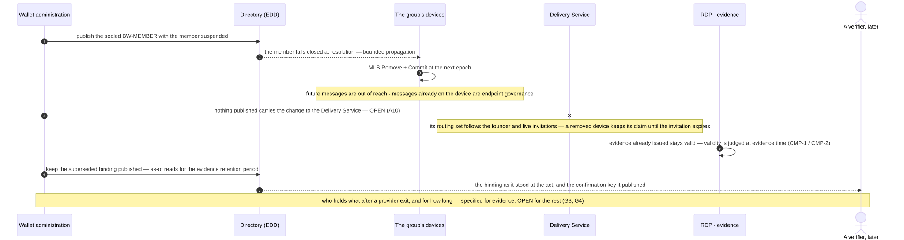

<!-- SPDX-FileCopyrightText: 2025-2026 Paolo De Rosa and contributors -->
<!-- SPDX-License-Identifier: CC-BY-4.0 -->

# Lifecycle and custody — what changes, and who keeps what

**Status:** informative companion · **Applies to:** the specification set at the versions in the README's version table (not restated here, so they cannot drift) · **Audience:** reviewers and operators asking what happens after the first message

> **Exploratory design study — not an official proposal.** This note assembles rules that live in the umbrella (Annex O, §4.3, §5.7, §8.4), the Internet-Draft (*Role Lifecycle*, *Scoped-Group Lifecycle*), the TS (clause 6, and the ICS retention rows) and [`wallet-assurance-profile.md`](wallet-assurance-profile.md). It adds none, and it chooses no retention period and allocates no liability — those are marked open where they arise.

People join and leave, devices are replaced and compromised, policies change, providers are swapped. The question this note answers: **what changes at each of those moments, what happens to traffic and to evidence already issued, and who is left holding what?**

Two rules make the rest legible:

- **A sealed published binding is the trigger.** A member's BW-MEMBER binding — its devices, capabilities and confirmation keys — is what the directory serves and what the MLS group follows: a binding change is the authoritative trigger for the group's Add or Remove and its Commit (I-D, *Role Lifecycle*), and every assignment, rotation and revocation is an event in the organisation's accountability log (§8.4).
- **Evidence is judged at the act's instant.** Suspending a member, retiring a key or excluding a provider does not unmake evidence issued before it (TS clause 6, CMP-1/CMP-2). That is exactly why the material a verifier needs must **outlive** the party: the superseded binding stays published, as-of, for the evidence retention period.

---

## 1. The changes

| The change | What changes, in signed records | New traffic | Messages in flight | Evidence already issued |
|---|---|---|---|---|
| **A member joins** | a sealed BW-MEMBER binding: the MID, its devices, capabilities and confirmation keys, anchored to an internal authorisation event | the member is addressable, and countable for acceptance where ack-capable | — | — |
| **A device is replaced** | the binding republished with new `devices[]`: a **new enrolment** — new leaf, new KeyPackages — never a key transfer | the new device is invited into the groups (Add + Commit) and routed once its invitation is live | items already queued for the old device stay queued | unaffected; the old confirmation key stays published |
| **A role changes** | the binding, and with it scope eligibility | only the scope groups whose descriptors name the role change; the default group does not | already-delivered content is on the device — endpoint governance, not a protocol property | acceptance is evaluated over the roster **as of the act** |
| **A member is suspended, retired or compromised** | `status` → `suspended`/`retired`; the directory fails the member closed, and the group commits a Remove | the member is out: it cannot be addressed, and cannot satisfy an acceptance policy | see §2 — the Delivery Service is not told | stays valid; a disputed window is reviewed through the accountability log under the dispute path (§13.2) |
| **The acceptance policy changes** | a new sealed BW-ORG version; a published version is **never** modified, and its window ends where its successor begins | governs new submissions only | a message keeps the version it pinned | a verifier needs the chain, and can never establish that no later version existed (`LINT-BND-I3`) |
| **A group falls idle** | no discovery-binding change is implied: lazy creation, idle expiry — closed by a final MLS Commit — and renewal with fresh KeyPackages | re-contact re-creates the group under the descriptor version then in force | — | unaffected: evidence binds digests and session state, not a live group |
| **The entity changes provider** | the directory record's `med_url`, and the seal keys it pins if they change; the **UID is stable** | resolution follows the record to the new provider | — | unaffected — but see §3: handing custody of retained material over is not a published operation |
| **The entity's own status changes** | `active` → `suspended` → `retired`, or `merged` with `redirect_uid` (§4.3, §5.2) | fails closed at resolution | **held** on suspension, with no legal-effect event, and **resumed** under the original deadline on reactivation; `expired` if the deadline passes during the hold; `uid-retired` on retirement; `uid-merged` with `redirect_uid` on a merger — nothing reroutes, the sender resubmits; a delivery already completed at its grade is preserved (umbrella §4.4) | remains verifiable through as-of reads |

## 2. Cryptographic membership is not the routing set

A removal takes effect **in the group**: the remaining devices commit it, and the removed device cannot read what follows. It does not take effect **at the Delivery Service**, whose routing set is the group's founder plus the devices whose invitations are live. Nothing published carries a removal to it, and expiry is not the cleanup path: an *open* invitation expires on the Delivery Service's clock, but acknowledging is joining and preserves routing, and the founder is routed for the group's life — so a removed device that had joined, or founded the group, keeps its routing claim, and no removal-driven termination of that claim is published. It collects ciphertext it can no longer decrypt, and no acknowledgement of its own makes that a delivery event for the entity. Which service routes a group at all, once its devices span two, is the same open question ([A10](REVIEW_AGENDA.md)). An **Add** has a path and a removal does not, which is the asymmetry to keep in view.

## 3. Who keeps what

| Material | Held by | For how long |
|---|---|---|
| Plaintext messages, and the records a scope's records leaf recovers | the entities' own wallets and systems; a records leaf is a **visible** roster member, never a silent capability | the organisation's own duty — not set by this profile ([G4](REVIEW_AGENDA.md)) |
| Evidence objects and packages | each party's wallet copy; the issuing RDP | the evidence retention period, a QERDS duty; this profile does not choose the period |
| Public verification material — the superseded BW-MEMBER and BW-ORG versions, the confirmation keys they published, the directory record and its pinned seal keys | the entity, served through its provider's discovery surface | as-of retrieval **for the evidence retention period, including for retired members** (TS ICS 146; MWAP §3) |
| Retained MLS state — the GroupContext and group info for every evidenced epoch | the recipient's provider | the retention period (TS ICS 163); which operation publishes those bytes is open ([A5](REVIEW_AGENDA.md)) |
| Authority history — the register's status windows, the acceptance-policy chain | the Federation Authority; the entity | for as long as acts of that period can be verified |
| The commitment salts that open a grade or mandate | the endpoints only, inside the encrypted envelope | until revealed, in a dispute, to that dispute's parties |

## 4. What is not decided

Each of these is a question, not an implied implementation:

- **Provider exit and migration.** A UID survives a provider change, and the directory record moves — but **no operation is published** for handing over retained evidence, retained MLS state or discovery history when a provider exits, nor a rule for who serves as-of reads afterwards. Part of the deferred implementer guide ([G3](REVIEW_AGENDA.md)).
- **Retention periods.** Named as duties; the numbers belong to the applicable regime, and this profile does not set them.
- **Telling the Delivery Service about a removal** ([A10](REVIEW_AGENDA.md)), and **publishing retained group state** ([A5](REVIEW_AGENDA.md)).
- **Liability** between an MSP and an RDP for a failure that is a protocol artefact rather than a recipient's act: an open counsel item (§13.2, `TODO(legal)`), noted here and not answered.
