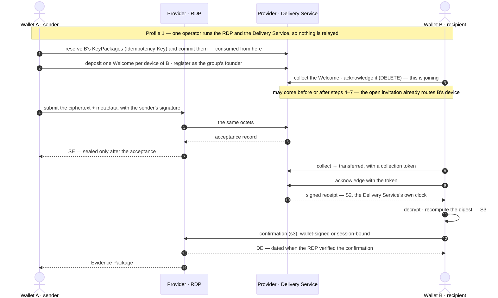

<!-- SPDX-FileCopyrightText: 2025-2026 Paolo De Rosa and contributors -->
<!-- SPDX-License-Identifier: CC-BY-4.0 -->

# Message lifecycle — how the public operations compose

**Status:** informative companion · **Applies to:** the specification set at the versions in the README's version table (not restated here, so they cannot drift) · **Audience:** reviewers and implementers reading the operations for the first time

> **Exploratory design study — not an official proposal.** This primer composes what the companion contracts publish; it adds no operation. In any conflict they prevail: `wallet-rdp-openapi.yaml`, `delivery-service-openapi.yaml`, `rdp-relay-openapi.yaml`, and the TS clause 6.

It answers one question — **how do the public operations and their state machines fit together?** — well enough to explain why acknowledging a Welcome is not delivery, why delivery at S2 is not acceptance at S4, and why a later reveal changes nothing. The four-corner version, with the relay between providers, is the deeper [`federated-flow-explainer.md`](federated-flow-explainer.md).

---

## 1. The smallest complete run

One operator runs the RDP and the Delivery Service (Annex P profile 1); one recipient device; the verification grade. Every arrow is a published operation. Step 3 need not wait: the recipient's open invitation already routes its device when the message is accepted (§5, case 1).

## 2. Four machines, four owners

| Machine | Owner | Moved by | Durable result | Retry identity |
|---|---|---|---|---|
| **Reservation** | Delivery Service | the creating **member** | committed packages are consumed, whatever follows | the `Idempotency-Key`, per creator |
| **Invitation** — one Welcome | Delivery Service | the creating member deposits; the invited **device** acknowledges or refuses, a refusal authenticated by the KeyPackage it holds | a joined invitation routes the device; a refusal leaves an outcome the creator collects | `(creator, invitation_id)`; each committed package once |
| **Founder** | Delivery Service | the creating **device** | routed for the group's life, with no Welcome | once per group; the same device converges |
| **Delivery item** — one per routed device | Delivery Service | the issuing **RDP** accepts; the **device** collects and acknowledges | the signed receipt: one delivery event per origin, message and recipient entity | acceptance: `(issuing RDP, message_id)` and the same octets; collection: the same device, any session; acknowledgement: the collection token |
| **Message outcome** | RDP(in) | the recipient's **members**, by confirmations | a DE, NDE or RE | one delivery act per member; a reveal apart |

A terminal outcome is final: acts arriving afterwards are retained and change nothing, and a refusal or mismatch after S4 is dispute material, not a second outcome. A **reveal** never changes the outcome; it opens a grade or mandate commitment for a dispute. At the availability grade the outcome is decided by the S2 receipt rather than by confirmations (§3).

## 3. Three acknowledgements that are three different acts

- **The Welcome acknowledgement** (`DELETE /welcome/{welcome_id}`) is the device **joining the group**. It says nothing about any message.
- **The receipt acknowledgement** (`.../receipt-ack`, quoting the collection token) is the device **taking these octets**: S2, the acknowledged handover, dated by the Delivery Service's own clock. At the availability grade it dates the DE; at the others it does not by itself establish delivery.
- **Acceptance** is the recipient entity's: each eligible member's confirmation that it decrypted and the digest matched (S3), and the policy satisfied over distinct members (S4), observed by RDP(in). Under `any-one`, S4 coincides with S3.

## 4. Five clocks

| Clock | Whose | What it dates |
|---|---|---|
| **Declared act time** — `sent_at`, `verified_at`, `refused_at`, `read_at` | the device that acted | the device's own claim; it never decides timeliness |
| **Handover time** — the receipt's `server_time` | the Delivery Service | S2; the DE at the availability grade only |
| **Observation time** — `delivered_at` at verification and acceptance | RDP(in) | when it received and verified the confirmation that completed the policy |
| **Deadline** — `expires_at` | the SE, as submitted | a confirmation received after it is late, whatever it declares |
| **Seal time** — the qualified timestamp | the time-stamping service | the seal, not the event; for an Evidence Package, the composition, which is itself an act |

The evidence explainer draws them on one line: [which event dates which fact](evidence-layer-explainer.md#which-event-dates-which-fact).

## 5. Six cases

1. **The recipient is offline at first contact.** The sender reserves and commits packages the recipient published earlier, deposits the Welcomes, registers as founder and submits at once. At acceptance the Delivery Service routes every device with a live invitation — acknowledged, or still open and unexpired on its clock — so the offline device's item exists before it has joined. Later it collects the Welcome, acknowledges it, then collects the message. If the SE's deadline passes first, the outcome is an NDE `expired` — an evidence outcome at RDP(in); the Delivery Service does not enforce the message's deadline, and its queue items live and lapse by their own window.
2. **A deposit fails after commit.** Commit is atomic and consumes the packages; a failed or partial deposit releases nothing. The creator reserves afresh and deposits new invitations; a device may then hold two, each owning only its own routing claim. Reusing a consumed package for another invitation is refused before anything is queued (`keypackage-already-deposited`).
3. **The submission's answer is lost.** The wallet retries with the same `message_id` and receives the same SE; the RDP's retry to the Delivery Service returns the same acceptance and completes any fan-out an earlier attempt left partial. The same id with different octets or another group is refused, never a second message.
4. **The collection's answer is lost.** Retried in the same session, the items return with the same tokens. After a reconnect the same device reclaims its unacknowledged items and the token is reissued. Acknowledging with the token yields the signed receipt; a duplicate acknowledgement from that device returns the first receipt, byte-identical. A sibling device holds its own item and collects and acknowledges it with its own token in its own session; it receives a receipt for its own handover, never a sibling's. An acknowledgement replayed outside its session is refused.
5. **Several members confirm.** Each member's confirmation is one act: an exact retry converges, the same member claiming something different is refused (409), and each eligible member counts once. The policy is satisfied when RDP(in) receives and verifies the completing act.
6. **The endings.** A verified mismatch ends the message with an NDE carrying the member's proof; a verified refusal ends it with the member's RE; the deadline ends it with an NDE `expired` — silence is never a mismatch, since a device that says nothing has proved nothing about the digest; completion ends it with a DE. After any of them, later acts are retained and change nothing, and a reveal is accepted as dispute material.

## 6. Where the trace stops

Some steps have no published operation yet. The trace stops there rather than inventing one:

- **The receipt's path to the DE issuer** ([A1](REVIEW_AGENDA.md)). In profile 1 the operator holds both; across two providers, no published operation carries the receipt to the RDP that issues the DE.
- **Retained group state** ([A5](REVIEW_AGENDA.md)). `GET /groups/{group_id}/context` is published; nothing publishes the bytes it serves.
- **Routing after formation** ([A10](REVIEW_AGENDA.md)). An Add arrives as a new invitation; a removal reaches no Delivery Service, and which one routes a group spanning two is undecided.
