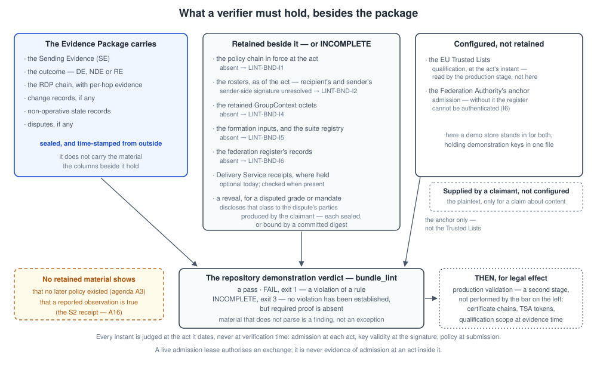

<!-- SPDX-FileCopyrightText: 2025-2026 Paolo De Rosa and contributors -->
<!-- SPDX-License-Identifier: CC-BY-4.0 -->

# Production verifier architecture (informative)

This note is the bridge from the repository to the real world: what a **production verifier** — a party granting legal effect to SM-MLS evidence — must check **beyond** what the demo validators in this repository check. The linters (`evidence_lint`, `discovery_lint`, `bundle_lint`; umbrella §9.4) establish that an artefact is well-formed, protocol-conformant and, in demo mode, cryptographically consistent with the published demo keys. None of that is qualification. The normative requirements referenced below live in the TS (clauses 5, 6 and 9) and the umbrella; this note only assembles them into one verifier-shaped picture. Throughout, a production verifier operates **decode-then-validate**: it decodes the authoritative COSE_Sign1 artefact (the deterministic-CBOR payload), consumes the stored artefact **bytes** (octet storage), and negotiates content — `application/cbor` is authoritative, any JSON a non-authoritative projection.

## What a verifier must hold, besides the package

An Evidence Package is **not** self-sufficient, and the design says so deliberately: it binds to digests, to a policy version, to a group state and to provider identities, each of which is established by material it does not carry. A verifier years later therefore holds three kinds of thing — the package, the **retained** material that must accompany it, and the **configured** anchors — and reaches one of three verdicts, never a fourth: a pass, INCOMPLETE (exit 3) where a required property could not be established, or FAIL (exit 1) where a rule is violated. Four situations are worth telling apart, because they call for different responses: **malformed material** — which is reported as a finding, never an exception, and never a pass; a **proven violation** — a rule broken by material that is otherwise readable; **missing proof** — nothing is wrong, something is absent, and the verdict says which property is unestablished; and an **external obligation** — qualification, certificate chains, timestamp tokens — which this bar does not attempt and a production verifier owes.

### Input by input

| Input | Authenticated by | Retained, live or configured | What it establishes | Judged at | Missing |
|---|---|---|---|---|---|
| The package — SE, outcome, `rdp_chain` | each issuer's seal, with its qualified timestamp | retained by the claimant | that these providers made these statements | each act's own instant | there is no claim to verify |
| The policy chain (BW-ORG versions) | the entity's seal key, pinned by the directory | retained | which policy governed this message, unbroken back to a first publication | the SE's `sent_at` | `LINT-BND-I1` — INCOMPLETE |
| The counterparty roster (BW-MEMBER) | the entity's seal key | retained | that each confirming member was active and ack-capable | the act's instant | `LINT-BND-I2` — INCOMPLETE |
| The retained GroupContext octets | nothing of their own — the evidence's `mls_state` commits to them | retained | the MLS session the evidence names, and the suite decision pinned in it | the epoch the evidence names | `LINT-BND-I4` — INCOMPLETE |
| The formation inputs, and the registry revision | the digest the decision commits to; the revision it pinned | retained | that the suite decision recomputes as it was taken | `formed_at` | `LINT-BND-I5` — INCOMPLETE |
| The federation register's records | the Federation Authority's key | retained records, **configured** anchor | that each provider was admitted when it acted | each act's own instant | `LINT-BND-I6` — INCOMPLETE |
| A Delivery Service receipt | the DS receipt key published in BW-MED, valid at `server_time` | retained where held — optional today | the acknowledged handover an availability-grade DE rests on | the receipt's `server_time` | no gap rule today; how the issuer obtains it is open (A1) |
| A reveal of a commitment | the revealing member's wallet signature | produced in the dispute | that the sealed commitment opens to that content class or mandate scope | the reveal's own instant | the class stays private, and unchecked |
| The trust anchors | the external authorities themselves | **configured** | qualification (Trusted Lists); the register's authenticity (the Authority's anchor) | each act's instant | qualification unchecked — a production duty; an unauthenticated register is `LINT-BND-I6` |
| The plaintext | held by a party, never by a provider | outside the bundle | that the digest in the evidence is the digest of this content | — | the digest binds nothing a verifier can compare |

Three sentences are worth stating plainly, because each names a fact no retained material can supply:

- **A linked policy chain is not proof that no later version existed.** A complete chain and a successor-truncated one are byte-identical from inside a bundle; that is `LINT-BND-I3`, and it is reported even when the chain is supplied and sound (review agenda A3).
- **A live admission lease is not retrospective admission evidence.** A lease authorises an exchange; admission at an act needs a record asserted after that act.
- **Current capabilities are not committed formation inputs.** A suite decision is recomputed from the inputs its `inputs_digest` names, or reported INCOMPLETE — never from what the members publish today.

### Which claims need the plaintext, and which need a reveal

Most claims need neither: seals, timestamps, admission, policy resolution, roster status, the suite decision and the chain of hops are all checkable from sealed material alone. Two kinds are different. A claim **about the content** — that `payload_hash` is the digest of this document — needs the plaintext the party holds; a verifier without it can confirm only that the evidence binds *a* digest consistently. A claim about a **committed class or mandate scope** — that an availability-grade message belonged to a class the recipient declared for that grade, or that an agent acted within its mandate — needs a **reveal**, which discloses that one message's class to the parties of the dispute and nothing else.

### The instants, in order

Formation, submission, acceptance, sealing, handover, confirmation, completion, composition — then, later, an admission assertion, a suspension or revocation, and the verification itself. [Which event dates which fact](evidence-layer-explainer.md#which-event-dates-which-fact) draws them on one line. The rule underneath is uniform: **every instant is judged at the act it dates**, never at verification time — admission at each act, credential validity at the signature, the policy at submission, the registry revision at formation. A later suspension does not unmake an earlier act, and a later assertion cannot cover an act it postdates.

## An annotated shipped bundle

The repository ships bundles so the verdicts can be read rather than described. `scripts/bundle_lint.py samples/bundle.default.manifest.json`:

- `LINT-BND-I3`, twice — once for the SE's pinned BW-ORG and once for the DE's. The chain **is** supplied, resolves back to a first publication, and shows the version in force at the act. What stays unproven is that no later version existed.
- `LINT-BND-I6` — a register is supplied, but with no Federation Authority anchor configured its authenticity cannot be established, so it is not consulted.
- Verdict: `INCOMPLETE: 0 violation(s), 3 unproven required property/properties`, exit **3**.

Add the demo anchor — `--trust-store samples/trust-store.demo.json` — and admission resolves: two unproven properties remain, both `LINT-BND-I3`, and the exit code stays **3**. That residual is not a defect in the bundle; it is the property a retained prefix cannot establish, and the repository declines to report it as a pass. For contrast, `samples/bundle.negative.manifest.json` exits **1** with six violations — an unsatisfiable quorum and a quorum acknowledger who is not an active, ack-capable member among them.

**What this does not establish.** A green or INCOMPLETE-but-clean verdict here says the retained material is internally consistent against demo trust material. It says nothing about qualification, certificate chains, TSA tokens or the legal effect of any of it — the duties listed next.

## What the demo validators do NOT check

A production verifier evaluating an Evidence Package must, in addition to the repository's structural bar (`make conformance`):

1. **QSealC chain building to the EU Trusted Lists.** Resolve the seal's signing certificate (COSE `x5chain`/`x5t`, the production-profile precheck LINT-PROD-01 only asserts its *presence*), build the chain to a trust anchor published in an EU Trusted List, and validate it — path, key usage, QSealC qualified status (TS clause 5.1).
2. **RDP qualification scope at evidence time.** The issuing RDP (`rdp_id`) must have been a **QERDS-qualified** provider, within its qualified service scope, **at the time the evidence was issued** — Trusted-List status is time-dependent, and `profile`="production" is a claim, not proof (TS clause 9).
3. **SCD/ACM assumptions.** The seal is stated as created on a certified secure cryptographic device with ACM-approved algorithms (TS clauses 5.2, 5.3); a verifier relies on the RDP's conformity assessment for this and should confirm the assessment covers the evidence period.
4. **TSA chain and token validation.** Full RFC 3161 / ETSI EN 319 422 validation of the qualified timestamp: TSA signature and chain to a Trusted List, `messageImprint` equals the hash of the sealed evidence, genTime within the token policy (the repository checks structure and the demo imprint only; umbrella §9.4).
5. **Certificate and credential validity AT EVIDENCE TIME.** All of the above — QSealC, TSA, and the wallet/device credential behind the recipient confirmation — is evaluated **as of the evidence's issuance time, not the verification time**. The wallet-compromise baseline (TS clause 6) depends on this: evidence produced before the credential's suspension/revocation is presumptively valid; evidence produced after it is invalid.
6. **Federation membership.** The RDP (and, where relied upon, the MSP) must have been an **admitted** federation member under the governance framework (umbrella §13) at evidence time — qualification and admission are distinct gates (ICS row 076, GOV-1).
7. **Discovery-signer authority.** Discovery documents (BW-MED/ORG/MEMBER) must be sealed by the **entity's** wallet-administration authority under the entity's QSealC — not by the RDP, not by an unrelated party (umbrella §8.4). *Which* key is authorised is pinned by the core registry's `DirectoryRecord.authorized_seal_keys` for the entity's UID (umbrella §5.2, §7.1.1): a production verifier resolves the seal's certificate thumbprint (`x5t#S256`) and confirms it is in that UID's pinned key-set — a valid QSealC authorised for another UID is rejected. The reference tooling enforces this pin fail-closed in the pilot layer via `LINT-TRUST-05` (against a directory-pin fixture, using the raw-key `spki_sha256`); the production step this does **not** perform is validating that the pinned key's QSealC *chains to an EU Trusted List and is qualified* (item 1). The demo linters otherwise check signer *kind* and demo keys only.

## The demo trust store is not the production trust store

[`samples/trust-store.demo.json`](../samples/trust-store.demo.json) — the input to the linters' `--trust-store` mode (LINT-TRUST-01..03) — is a **demo aid**: a flat kid→key/identity/validity map that lets the repository demonstrate fail-closed verification behaviour on its own samples. It does **not** prefigure the production trust store. A production verifier's trust material is the **EU Trusted Lists**, consumed through X.509 chain building — not a local key file. **After Batch A the demo store stands in for the Trusted List ONLY.** Federation admission is no longer folded into it: the membership register is a **separate input** with its own contract (`federation-register-openapi.yaml`), its own signer (the Federation Authority, a different key from the design authority — umbrella §13.1), and its own rules (`bundle_lint` LINT-TRUST-06, `discovery_lint` LINT-TRUST-07). The two gates are independent in the tooling because §13.1 makes them independent in the ecosystem: qualification is not admission, and neither substitutes for the other. Nothing in the demo store's format should be read as a proposed production interface.

## Where the requirements live

| Concern | Normative home |
|---|---|
| Seal, SCD, cryptography, long-term validation | TS clauses 5.1–5.4 |
| Sender/recipient authentication binding, `auth_context`, compromise baseline | TS clause 6 |
| Pilot vs production profiles; "production is a claim" | TS clause 9; umbrella §9.3 |
| Qualification + admission (two gates) | TS clause 9 / ICS 075–076; umbrella §13 |
| Discovery-signer model, accountability log | Umbrella §8.4 |
| What the repo's linters do and do not establish | Umbrella §9.4; README *Conformance* |
